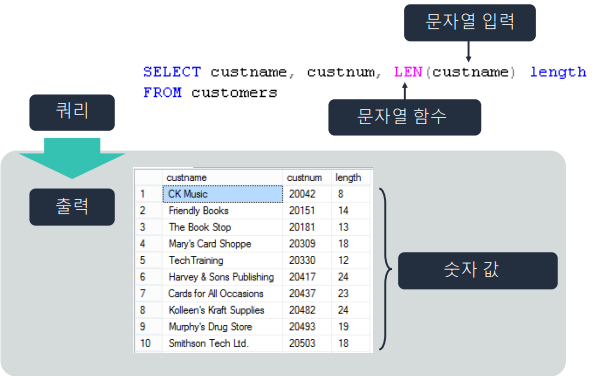

---

SQL에서 특정 작업을 수행하는 데 사용되는 일련의 스테이트먼트를 **함수**하고 합니다. SQL 함수는 입력을 인수 또는 매개변수로 받아드리고 특정 값을 반환합니다.

SQL에는 **기본 제공 함수(Built-in)**가 있습니다. 또한 사용자는 **사용자 정의 함수(UDF)**라는 함수를 생성할 수 있습니다. 


## 1. 함수

### - 기본 제공 함수

일부 일반적인 함수에는 `집계 함수`, `문자열 함수`, `날짜-시간 함수` 및 `제어 흐름 함수`가 포함됩니다.

- **집계 함수**

  여러 행이 있는 열을 사용하고 해당 열을 기반으로 숫자를 반환합니다. 

  `이 함수만 복수행 함수이고 나머지는 레코드 단위로 실행하는  단일행 함수입니다.` 

- **변환 함수**

  타이프캐스팅에 사용되는 단일 행 함수입니다.

- **날짜 함수**

  날짜를 반환하는 데 사용할 수 있습니다. 또한 이러한 함수를 통해 날짜 항목을 더하고 뺄 수 있습니다.

- **문자열 함수**

  문자열을 조작하거나 문자열에 대한 정보를 쿼리하는 데 사용됩니다.

- **수학 함수**

  다양한 산술 목적에 따라 구성된 함수입니다.

- **제어 흐름 함수**

  함수에 논리를 적용할 수 있습니다.

- **창 함수**

  파티션에 대해 계산을 수행합니다.

  

## - 함수


위의 예시는 DATE_ADD 함수를 보여줍니다. DATE_ADD 함수는 pubdate의 항목에 INTERVAL(1) MONTH 값을 추가하고 NOW() 함수는 FROM 제목에서 현재 날짜 및 시간을 반환합니다.


## - 날짜 함수

```-sql
SELECT bktitle
	, DATE_ADD(pubdate, INTERVAL 3 MONTH) AS new_pubdate
	, TIMESTAMPDIFF(YEAR, pubdate, '2017-12-31') AS diff_date
FROM titltes
```


### - 중첩 함수


## 2. 집계 함수

### - 집계 함수


### - 기타 집계 함수

- SUM: 값 또는 여러 표현식의 합계를 계산할 수 있습니다.

  - 일치하는 행을 반환하지 않는 SELECT 스테이트먼트에서 SUM() 함수는 0이 아닌 NULL로 돌아갑니다.
  - 계산에서 NULL 값은 무시합니다.
  - DISTINCT 연산자를 사용하면 집합에서 고유한 값을 계산할 수 있습니다.

- MIN: 일련의 값에서 최소값을 찾습니다.

  `제품의 가장 작은 수나 가장 낮은 비용을 찾는 데 도움이 됩니다.`

- MAX: 값 집합에서 최대값을 찾습니다.

  `제품의 가장 큰 수나 가장 높은 비용을 찾는 데 도움이 됩니다.`


## 3. DISTINCT 키워드

### - DISTINCT 키워드


### - COUNT 함수 내에 있는 DISTINCT


### - 알림: 컨텍스트 외부에서 키워드를 사용하지 않기


## 4. 문자열 및 문자열 함수

### - 문자열


### - 문자열 함수




### - 대소문자 변환 함수


## 5. TRIM 함수

### - 선행 및 후행 공백


### - TRIM 함수


## 6. SUBSTRING 및 CONCAT 함수

### - SUBSTRING 함수


### - CONCAT으로 연결


### - 열 값 및 고정 값 연결


---

### 학습 내용 확인 질문

❔ 단어의 선행 및 공백을 제거하는 문자열 함수는 무엇입니까?

💬LTRIM 및 RTRIM을 통해 선행 및 후행 공백을 재거합니다.


❔ 집계 함수란 무엇입니까?

💬 집계 함수는 여러 행이 있는 열을 사용하고 해당 열을 기반으로 숫자를 반환합니다.