docker권한 상승

sudo usermod -a -G docker $USER

하고 로그아웃하고 다시 reconnect해준다

그리고 id를 치면

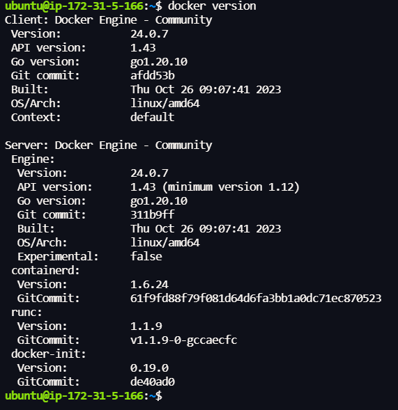

이제 관리가 권한으로 접근 가능합니다.

`nano Dockerfile`로 도커파일 생성

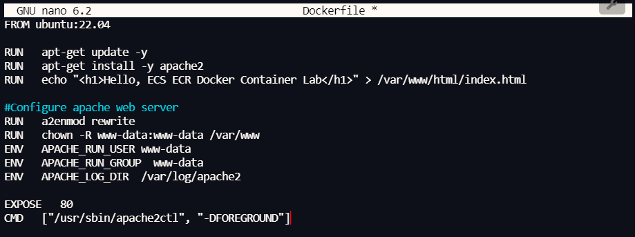

내용 작성

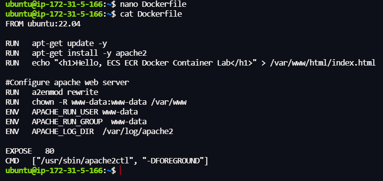

이미지 뜰때

build 사용 꼭 -t를 사용해서 태그를 준다

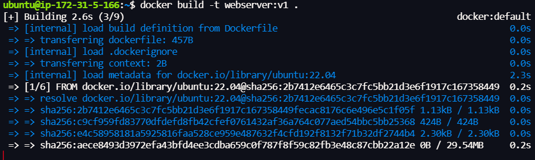

`docker build -t webserver:v1 .`

설치할 위치를 정해줘야하기 때문에 .을 사용해서 현재 위치에다가 작업해준다.

제대로 생성됐는지 확인

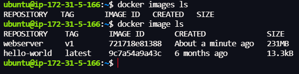

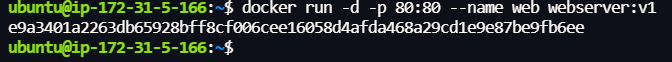

오른쪽은 못바꾼다. 

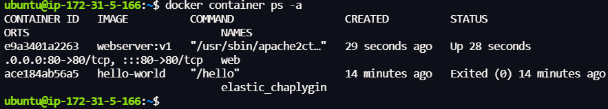

잘 실행되고 있는 지 확인해보려면~

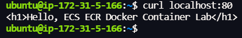

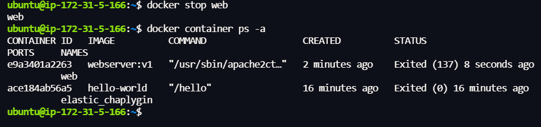

codecommit : AWS에서 만든 github

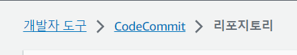

계정의 액세스키와 시크릿 액세스키 준비

IAM가서 활성화 할 계정에 AWSCodeCommitAccese 권한주고

aws cli 다운 받아줍니다.

[aws cli ubuntu 다운로드](https://docs.aws.amazon.com/ko_kr/cli/latest/userguide/getting-started-install.html)

unzip이 기본으로 깔려있지 않습니다.

`sudo apt install unzip`을 사용해서 중간에 unzip을 깔아주고 위 순서를 따라줍니다.

`aws configure`을 통해 accese 합니다.

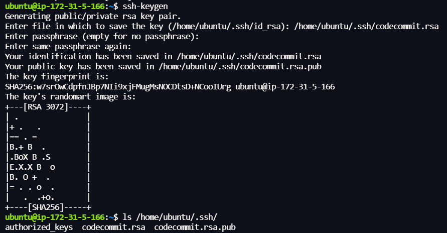

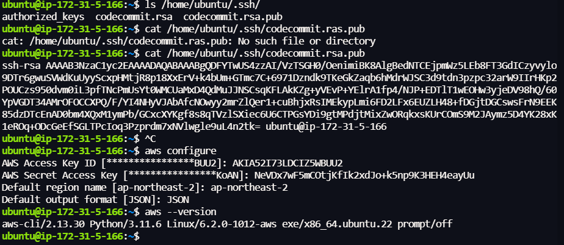

연결할 계정에  SSH퍼블릭키를 생성해줍니다.

그리고`nano ~/.ssh/config` 파일 생성해주고

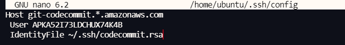

리전은 어느 리전에서 업로드 할지 모르니 * 해주고

유저는 아까 생성한 SSH퍼블릭키

identityfile은 아까 생성한 rsa키를 넣어주고 저장

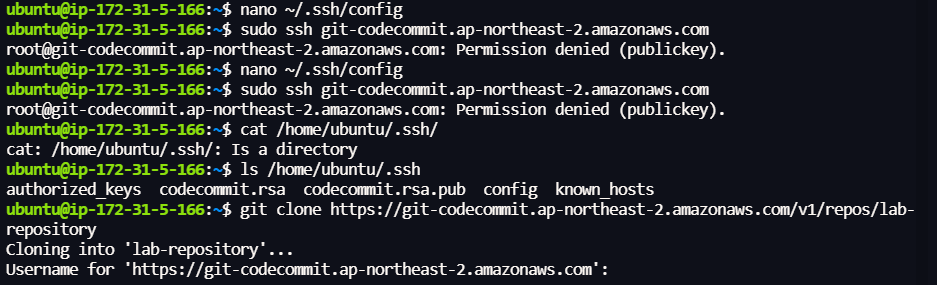

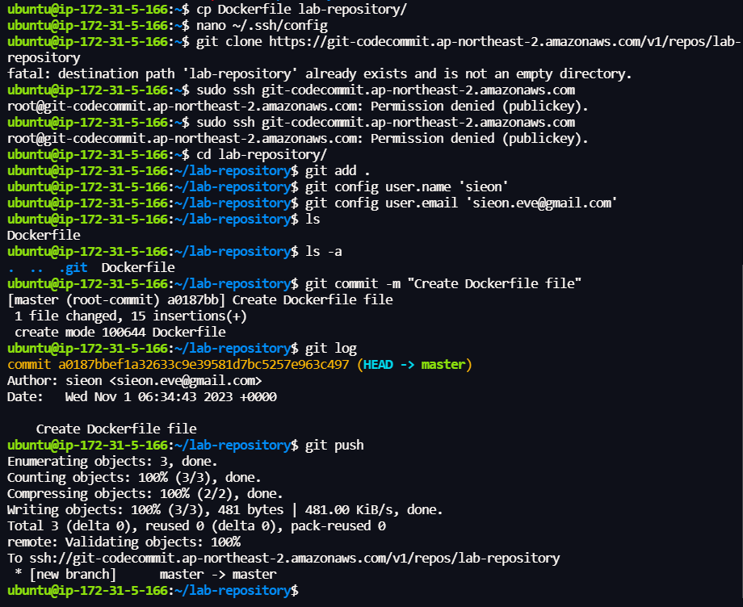

 container- ECR

리포지토리 생성 하고  생성한 레포 클릭

 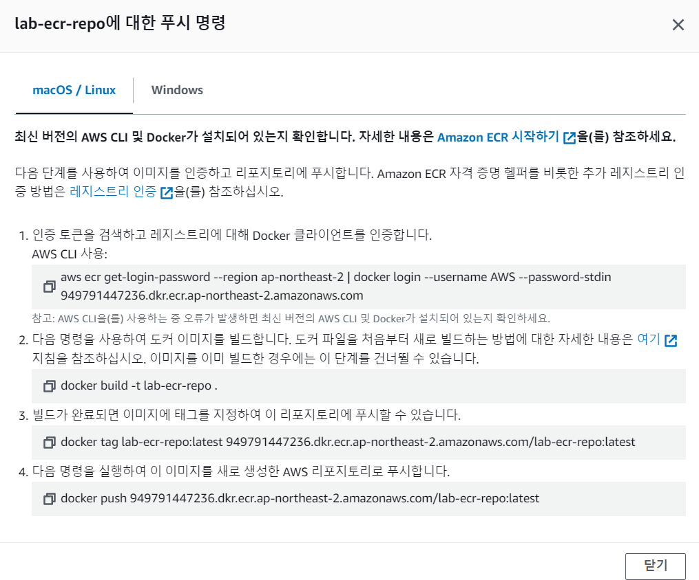

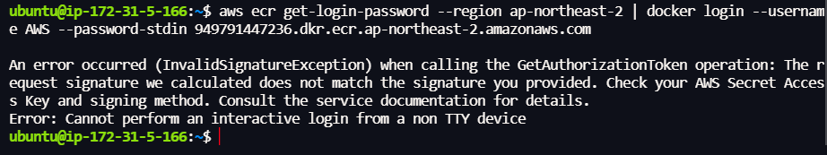

ecr pull eceese 권한을 줘야합니다.

아까 권한을 준 계정으로가서

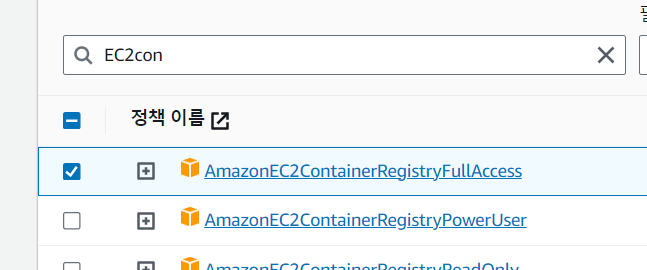

권한 추가

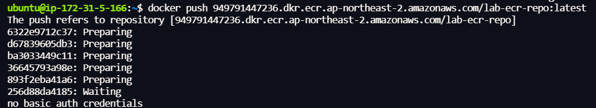

권한이 아니라고 하길래 다시 aws configure 했습니다.

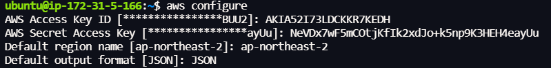

그리고 다시 진행

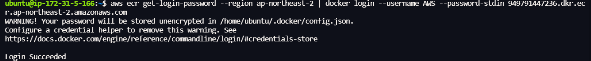

성공했습니다.

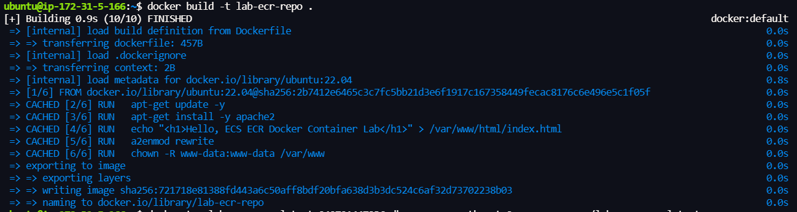

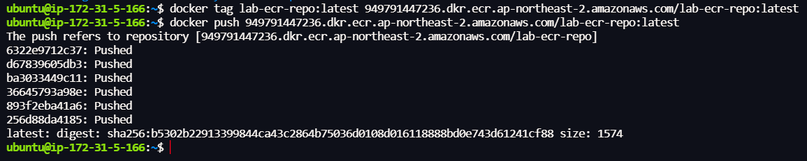

완료!

