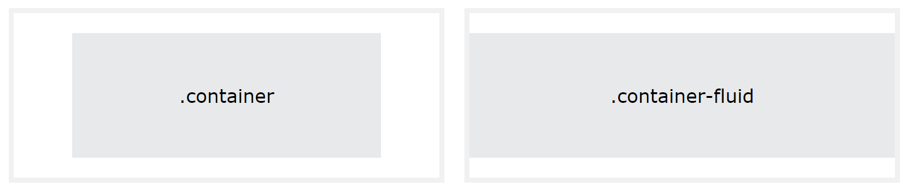
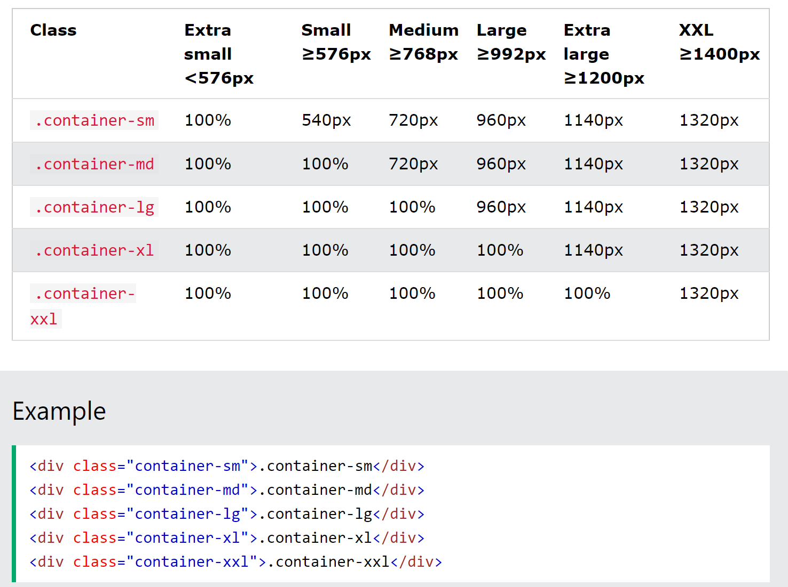
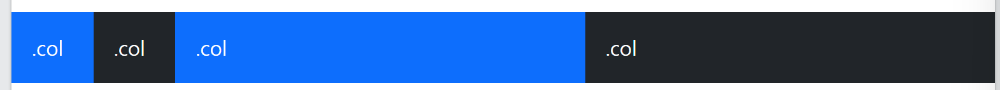
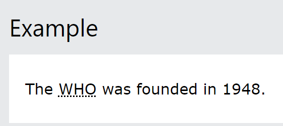
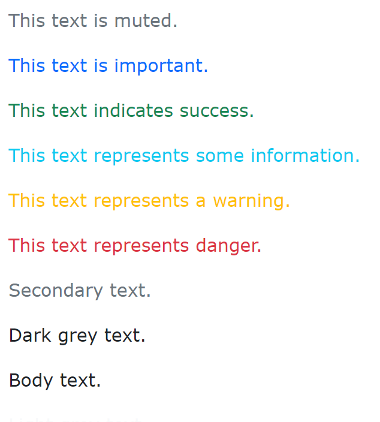

## Bootstrap

CDN: 콘텐츠 전송 네트워크

### 컨테이너

> 컨테이너와 컨테이너 플루이드 차이 문제에 나옴

사이트 콘텐츠를 래핑하는 컨테이닝 요소가 필요할 때 선택할 수 있는 컨테이너 클래스는 두가지가 있다.

1. `.container` : 반응형 **고정 너비 컨테이너를 제공**
2. `.container-fluid`: 클래스는 뷰포인트의 전체 너비에 걸쳐 **전체 너비 컨테이너를 제공**






### Bootstrap Grid

그리드시스템은flexbox를 기반으로 구축되었으며 페이지 전체에 최대 12개의 열을 허용한다.

12개의 열을 모두 개별적으로 사용하고 싶지 않으면 열을 그룹화하여 더 넓은 열을 만들 수 있다.

#### Grid Classes

Bootstrap 5 그리드 시스템에는 6개의 클래스가 있습니다.

- `.col-`(매우 작은 기기 - 화면 너비가 576px 미만)
- `.col-sm-`(소형 기기 - 화면 너비가 576px 이상)
- `.col-md-`(중간 장치 - 화면 너비가 768px 이상)
- `.col-lg-`(대형 기기 - 화면 너비가 992px 이상)
- `.col-xl-`(대형 기기 - 화면 너비가 1200px 이상)
- `.col-xxl-`(xxlarge 장치 - 화면 너비가 1400px 이상)

위의 클래스를 결합하면 더욱 역동적이고 유연한 레이아웃을 만들 수 있습니다.

한 행을 보여주는 class `row`, `col`

``` html
<!DOCTYPE html>
<html lang="en">
<head>
  <title>Bootstrap Example</title>
  <meta charset="utf-8">
  <meta name="viewport" content="width=device-width, initial-scale=1">
  <link href="https://cdn.jsdelivr.net/npm/bootstrap@5.3.3/dist/css/bootstrap.min.css" rel="stylesheet">
  <script src="https://cdn.jsdelivr.net/npm/bootstrap@5.3.3/dist/js/bootstrap.bundle.min.js"></script>
</head>
<body>
  
<div class="container-fluid mt-3">
  <h1>Responsive Columns</h1>
  <p>Resize the browser window to see the effect.</p>
  <p>The columns will automatically stack on top of each other when the screen is less than 576px wide.</p>
  <div class="row">
    <div class="col-sm-1 p-1 bg-primary text-white">.col</div>
    <div class="col-sm-1 p-1 bg-dark text-white">.col</div>
    <div class="col-sm-5 p-5 bg-primary text-white">.col</div>
    <div class="col-sm-5 p-5 bg-dark text-white">.col</div>
  </div>
</div>

</body>
</html>
```



row안에 12개를 기준으로 채울 수 있다.  `p-N`에서 N을 변경하면서 차지할 너비를 정한다.

####  타이포그래피

``` html
<!DOCTYPE html>
<html lang="en">
<head>
  <title>Bootstrap Example</title>
  <meta charset="utf-8">
  <meta name="viewport" content="width=device-width, initial-scale=1">
  <link href="https://cdn.jsdelivr.net/npm/bootstrap@5.3.3/dist/css/bootstrap.min.css" rel="stylesheet">
  <script src="https://cdn.jsdelivr.net/npm/bootstrap@5.3.3/dist/js/bootstrap.bundle.min.js"></script>
</head>
<body>

<div class="container mt-3">
  <p class="h1">h1 Bootstrap heading</p>  
  <h1>나는 h1엘리먼트 입니다.</h1>
  <p class="h2">h2 Bootstrap heading</p>
  <p class="h3">h3 Bootstrap heading</p>
  <p class="h4">h4 Bootstrap heading</p>
  <p class="h5">h5 Bootstrap heading</p>
  <p class="h6">h6 Bootstrap heading</p>
</div>

</body>
</html>

```

class ="h1"을 사용해서 h1태그의 기능을 사용하고 있다.

대부분 그렇다. 

> 마크
>
> 노란색 배경과 함께 형관펜 친것  처럼 하이라이트  주는 기능이다.
>
> 약어<small>\<dbbr></small>
>
> 
>
> 위와 같이 점선이 그어지며 마우스를 가져다 대면 이에 대한 설명이 나온다

### 색상

text 색상을 지정해서 보여주는 class들이 있다.

: `.text-muted`, `.text-primary`, `.text-success`, `.text-info`, `.text-warning`, `.text-danger`, `.text-secondary`, `.text-white`, `.text-dark`, `.text-body` (default body color/often black) and `.text-light`




