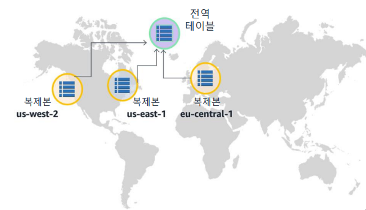

## Amazon DynamoDB

### Amazon DynamoDB

`완전관리형`, `NoSQL 데이터베이스` 서비스입니다. Amazon은 이 서비스의 모든 기반 데이터 인프라를 관리합니다.  리전에서 내 결함성 아키텍처의 일부로 여러 시설에 중복으로 데이터를 저장합니다.  테이블에 항목(item = record)을 추가할 수 있습니다. 자동으로 데이터를 `분할(partitioning)`하며 `테이블` 스토리지를 제공하여 워크로드 요구 사항을 충족합니다.

DB에 접근해서 어떻게 사용하고 데이터를 어떻게 관리할까만 신경쓰면 됩니다. 운영은 AWS가 해줍니다.

### Amazon DynamoDB  기술 이점

**빠르고 확장성이 우수한 비관계형 데이터베이스 서비스**

문서 모델과 키 값 스토어 모델을 모두 지원하는 빠르고 유연한 NoSQL 데이터베이스 서비스입니다. 

- 완전관리형

  데이터베이스 테이블을 생성하고 오토스케일링을 위한 목표 처리량을 설정하면 서비스가 자동으로 데이터베이스 관리 태스크를 수행합니다. 하드웨어나 소프트웨어 프로비저닝, 설정 밎 구성, 소프트웨어 패치, 분산형 데이터베이스 클러스터 운영, 크기 조정에 따른 여러 인스턴스의 데이터 파티셔닝을 처리합니다. 또한 모든 테이블에 대헤 시점 복구, 백업 및 복원을 제공합니다.

- 대기 시간이 짧은 쿼리

  쿼리를 실행할 때 평균 서비스 측 대기 시간은 일 반적으로 10밀리초 미만입니다. 데이터 볼륨이 증가하고 애플리케이션 성 능 요구가 늘어남에 따라 DynamoDB는 이러한 요구에 맞게 조정됩니다. 자 동 파티셔닝 및 SSD 기술을 사용하여 처리량 요구 사항을 충족하고 규모와 관계없이 짧은 대기 시간을 제공합니다.

- 세분화된 액세스 제어

  DynamoDB를 AWS Identity 및 Access Management(IAM)와 함께 사용하여 조직 내 사용자의 액세스를 세부적으 로 제어할 수 있습니다. 따라서 개별 사용자에게 고유한 보안 인증을 할당 하고 서비스 및 리소스에 대한 각 사용자의 액세스를 제어할 수 있습니다.

- 유연성

  데이터를 JSON(JavaScript Object Notation) 문서로 저장, 쿼리 및 업데이트하는 것을 지원합니다. 이러한 지원으로 인해 반정 형 데이터를 저장하고 JSON 쿼리를 사용하여 이를 조작하기에 적합합니다 . 또한 Amazon DynamoDB를 Amazon CloudWatch와 함께 사용하여 처리량과 대 기 시간 요청 통계를 확인할 수 있습니다.

### Amazon DynamoDB 이해

DynamoDB를 사용하면 테이블에 저장할 수 있는 항목 수는 실제로 제한이 없습 니다. 예를 들어 일부 고객은 프로덕션 테이블에 수십억 개의 항목이 포함되어 있습니다. 

- 일부 Amazon DynamoDB 고객은 Amazon DynamoDB에 수십억 개의 항목을 포함하는 테이블을 보유하고 있습니다. 
- 새로운 형식의 항목은 스키마 마이그레이션을 수행할 필요 없이 동일한 테이블에 이전 항목과 나란히 저장할 수 있습니다. 
- 애플리케이션이 점점 더 많이 사용되고 사용자가 이 애플리케이션과 계속 상호 작용할 경우 애플리케이션의 요구에 따라 데이터베이스가 증가할 수 있습니다.

## 핵심 개념: 테이블, 항목 및 속성

### 주요 개념

-  테이블 - 다른 데이터베이스 시스템과 유사하게 DynamoDB는 테이블에 데이터를 저장합니다. 테이블 은 데이터의 모음입니다.
  - 예를 들어 친구, 가족 또는 기타 관심 있는 사 람에 대한 개인 연락처 정보를 저장하는 데 사 용할 수 있는 People이라는 테이블이 있을 수 있습니다.

-  항목 - 각 테이블에는 0개 이상의 항목이 있습니다. 항목 은 전체 항목 중에서 고유하게 식별할 수 있는 속성의 그룹입니다. 
  - 예를 들어 예시의 People 테이블에서 각 항목 은 사람을 나타냅니다.

- 속성 - 각 항목은 하나 이상의 속성으로 구성됩니다. 속성 은 더 이상 나눌 필요가 없는 기본적인 데이터 요소입니다. 
  - 예를 들어 People 테이블의 항목에는 PersonID, LastName, FirstName 등의 속성이 있을 수 있습니다.

### Amazon DynamoDB 전역 테이블

DynamoDB 전역 테이블 기능은 여러 리전 간에서 고가용성과 확장성을 제공합니다. 

`전역테이블`은 단일 AWS계정이 소유해야 하는 한 갱 이상의 DynamoDB 테이블의 모음입니다. 모음의 테이블은 복제 테이블이라고도 합니다. 복제 테이블(복제본)은 전역 테이블의 일부로 기능하는 단일 DynamoDB테이블 입니다.

각 복제본에는 동일한 데이터 항목 집합이 저장됩니다. 전역 테이블은 AWS리전당 한 개의 복제 테이블만 가질 수 있습니다. 모든 복제본은 동일한 테이블 이름과 동일한 기본 키 정의를 가집니다.

전역 테이블을 만들 때, 테이블을 제공하고자 하는 AWS 리전을 지정해야 합니다. DynamoDB는 이러한 리전에 동일한 테이블을 만들고, 이 모든 테이블에 대한 지속적인 데이터 변경을 전파하기 위해 필요한 모든 태스크를 수행합니다.

DynamoDB 전역 테이블은 전역적으로 분산된 사용자가 있는 대규모 애플리케이션과 함께 잘 작동합니다. 이러한 환경에서 사용자는 자신과 근접한 복제본에 액세스하여 빠른 애플리케이션 성능을 기대할 수 있습니다. 또한, AWS 리전 중 하나를 임시로 사용하지 못하게 되더라도 사용자는 여전히 다른 리전에서 동일한 데이터에 액세스할 수 있습니다.

## 핵심 개념: 파티션 키, 파티션 키 및 정렬 키

### 테이블 및 데이터

**핵심 구성 요소**

- DynamoDB는 2가지 종류의 기본 키를 지원합니다.
  - 파티션 키
  - 파티션 및 정렬 키

### 키 이해

테이블을 생성할 때 테이블 이름과 더불어 테이블의 기본 키를 지정해야 합니다.

