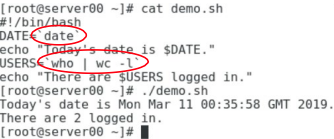

## 특수 문자, 와일드 카드, 리디렉션

### Bash에서 따옴표 사용

- Bash Shell에서 공백은 구분 기호(구분자)입니다.
  - `Ex) usermod -c devuser jdoe`
    - 이 명령은  /etc/passwd 파일의 jdoe 줄에 devuser 주석을 추가합니다.
    - 공백은  usermod 명령에 전달되는 두 인수를 구분합니다.
- Bash가 인수 안의 공백을 인식하도록 하려면 값을 따옴표(" ")로 묶습니다.
  - `Ex)usermod -c "This is a dev user" jdoe `

### Bash 메타 문자

| 메타 문자        | 설명                                                    |
| ---------------- | ------------------------------------------------------- |
| * (star)         | 임의 개수의 임의 문자(와일드카드)                       |
| ? (hook)         | 임의의 한 문자 (와일드카드)                             |
| [characters]     | 괄호 사이에 일치하는 임의 문자(와일드카드)              |
| \`cmd` 또는 $cmd | 작은 따옴표 (' ')가 아닌, 명령어를 대체하는 백틱(`)사용 |
| ;                | 명령을 함께  연결                                       |
| ~                | 사용자 홈 디렉터리 표시                                 |
| -                | 이전 작업 디렉터리 표시                                 |

`Bash에는 이 보다 많은 메타 문자가 있습니다.`

### Bash 메타문자의 예제

<span class="hlm_h">**\***</span>

```bash
[ec2-user@myLinux ~]$ ls 
Desktop	myfile	myFilesList.txt	pic.png
documents myFile myfile.txt	sales_230824.txt
[ec2-user@myLinux ~]$ ls documents/
[ec2-user@myLinux ~]$ cp *.txt documents/
[ec2-user@myLinux ~]$ ls documents/
myFilesList.txt myfile.txt sales_20230824.txt
[ec2-user@myLinux ~]$
```

<span class="hlm_h">**?**</span>

```bash
[ec2-user@myLinux ~]$ ls
customers_2020.txt Desktop		sales_2018.txt sales_2020.txt
customers_2021.txt	sales_2017.txt	sales_2019.txt	sales_2021.txt
[ec2-user@myLinux ~]$ rm sales_201?.txt
[ec2-user@myLinux ~]$ ls
customers_2020.txt customers_2021.txt Desktop sales_2020.txt sales_2021.txt
[ec2-user@myLinux ~]$
```

<span class="hlm_h">**[characters] 괄호**</span>

- 대괄호([ ]):  대괄호 사이의 문자와 일치
- 문자는 숫자, 문자, 특수 문자일 수 있습니다.
- 사용 대상
  - 문자 목록: [aef9]는  a, e, f, g와만 일치
  - 문자 집합: [a - g]는 a에서 g까지의 모든 문자와 일치

```bash
[ec2-user@myLinux ~]$ ls
Desktop	log_a.txt	log_b.txt	log_c.txt log_d.txt	log_e.txt	log_f.txt
[ec2-user@myLinux ~]$ ls log_[abc].txt
log_a.txt	log_b.txt	log_c.txt
[ec2-user@myLinux ~]$ ls log_[a-e].txt
log_a.txt	log_b.txt	log_c.txt log_d.txt	log_e.txt
[ec2-user@myLinux ~]$
```

<span class="hlm_h">**다른 예제**</span>

```bash
[ec2-user@myLinux ~]$ echo "Current path is ["$(pwd)"]"
Current path is [/home/ec2-user]
[ec2-user@myLinux ~]$ echo "Current path is ["'pwd'"]"
Current path is [/home/ec2-user]
[ec2-user@myLinux ~]$
```

```bash
[ec2-user@myLinux ~]$ pwd
/etc
[ec2-user@myLinux etc]$ cd ~/Documents/
[ec2-user@myLinux Documents]$ pwd
/home/ec2-user/Documents
[ec2-user@myLinux Documents]$ echo "command1"; echo "command2"
command1
command2
[ec2-user@myLinux Documents]$ 
```

### 리디렉션 연산자

| 연산자 | 설명                                                      |
| ------ | --------------------------------------------------------- |
| >      | 명령의 출력을 파일로 전송                                 |
| <      | 파일에서 입력된 명령 수신                                 |
| \|     | 명령을 실행하고 출력을 다른 명령에 대한 입력으로 리디렉션 |
| \>>    | 파일의 기존 내용에 명령이 출력한 값 추가                  |
| 2>     | 명령에 따라 생성된 오류를 파일로 리디렉션                 |
| 2>>    | 명령에 따라 생성된 오류를 파일의 기존 내용에 추가         |

{: .notice}

 ❕ 출력 리디렉터는 기본 값으로 경고 없이 기존 파일 내용을 덮어씁니다.

### 파이프 리디렉터 사용방법

예시

- `ps -ef | grep sshd `

- `ls -l /stc | less`


### 리디렉터 > 및 >> 사용 방법

- info.txt 파일 채우기
  - uptime \> info.txt
  - hostname >> info.txt 
  - ip addr show eth0 >> info.txt


### 리디렉션 오류

기타 예제

- myprogram 2>error.log 
  - myprogram 프로그램을 실행하고 errors.log 파일에 오류 전송 
- find ../ -name 'p*' 2>error.log 
  - ../ 폴더에서 p로 시작하는 파일 검색 
  - 오류는 errors.log 파일에 기록됨


### noclobber 변수

- 출력 리디렉션은 기본값으로 경고 없이 기존 파일을 덮어씁니다.
- 이 동작을 방지하기 위해 noclobber 변수를 설정할 수 있습니다. 대부분의 Linux 디스트리뷰션에서 기본값으로 설정되지 않았습니다.
- 예: 
  - set -o noclobber
  - echo "test1" > textfile.txt
  - echo "test2" > textfile.txt


### 파이프 리디렉터


### tee 명령

<p align = "center"></p> 

## 명령 대체, 연결, 필터링

### 명령 대체

- 명령줄이나 다른 명령 안에서 명령을 중첩할 수 있습니다. 해당 명령의 결과는 나머지 명령에 따라 표시되거나 사용됩니다.  
- 백틱(`, 이전 형식)과 함께 사용합니다.  
- $(command, 최신 형식)로 수행할 수 있습니다.



###  세미콜론으로 명령 연결

세미콜론(;)은 여러 가지 명령을 실행할 때 사용하며, 모두 같은 줄에 작성합니다.


### | grep 사용

- grep은 일반적으로 파이프(\|)와 함께 다른 명령 다음에 사용됩니다.  
- 예: 
  - `ps -ef | grep sshd `
  - `cat /var/log/secure | grep fail`


###  cut 명령

- 문자, 바이트 위치, 구분 기호로 텍스트 줄에서 섹션을 자름  
- 해당 정보를 스탠더드 출력으로 표시  
- 텍스트 파일에서 관련 정보를 가져와 해당 정보를 표시할 때 사용  
- 출력을 새 파일로 파이프 가능

## 텍스트 처리 및 검색

### sed 명령

- 비대화형 텍스트 편집기  
- 제공된 규칙에 따라 데이터 편집(삽입, 삭제, 검색, 바꾸기 가능)  
- 정규 표현식 지원

```bash
[ec2-user@myLinux ~]$ echo "example.com page" |sed 's/page/website'
example.com website
[ec2-user@myLinux ~]$ cat example.txt
example.com page
[ec2-user@myLinux ~]$ sed 's/page/website/' example.txt
example.com website
[ec2-user@myLinux ~]$
```

### sort  명령

- 파일 내용을 알파벳 순, 역순, 숫자, 월 순서로 정렬 
- sort 명령은 사용자가 지정한  파일의 내용을 정렬하거나, 정렬된 파일의 내용을 병합할때 사용

- 예:  sort file.txt: 알파벳순으로 줄 출력  
  - sort -r file.txt: 알파벳 역순으로 줄 출력  
  - sort -u file.txt: 중복 항목 제거(로그 파일에 유용)  
  - sort -M file.txt: 월순으로 줄 출력

### uniq 명령

<span class="hlm">연속으로 중복된 내용의 행</span>이 있으면 하나만 남기고 삭제합니다. 전체적으로 분산된 중복은 찾아내지 못합니다. 따라서 정렬하고 순차적으로 만들고 적용합니다.

### awk 명령

- 데이터를 변환하는 작은 프로그램을 만들 때 사용  
- 변수 정의  
- 문자열과 산술 연산자 사용  
- 제어 흐름과 루프 사용  
- 형식이 지정된 보고서 생성  
- 구문: awk를 호출하는 두 가지 방법(하나는 명시적 프로그램, 다른 하나는 파일에 있는 프로그램)
  - awk option -f program-file input-file 
  - awk option 'program' input-file  
- 옵션: 
  - -F fs 필드 구분자를 지정할 때(기본 구분자는 임의의 숫자의 공백 또는 탭) 
  - -f source-file awk 스크립트가 있는 파일을 지정할 때 
  - -v var=value 변수를 지정할 때

##  확인 질문

1. **언제 ? 와일드카드를 * 와일드카드 대신 사용합니까?**

   파일명과 확장자가 같고 하나의 문자만 다른 것들을 출력할때 사용합니다.

2. **Uniq 명령은 로그 파일을 분석하는 데 어떻게 도움을 줍니까?**

   uniq 명령은 중복된 내용의 행이 연속으로 있으면 하나만 남기고 삭제한다.

3. **명령 대체가 어떻게 Bash 스크립트를 더 빠르게 실행할 수 있습니까? 명령을 대체하는 데 또 다른 장점이 있습니까?**

   명령 대체를 사용할 경우에 해당 명령어가 먼저 실행되고 이후에 다른 명령어들이 실행되는 순서로 진행되기 때문입니다.

## 핵심 요점

- 따옴표(" ")는 공백이 있는 인수에 대한 일반적인 Bash 해석을 개별 인수 두 개로 재정의합니다. 
- 메타 문자는 출력, 와일드카드, 연결 명령을 제어하는 강력한 도구입니다. 
- Bash의 스탠더드 I/O는 키보드 입력, 모니터 출력입니다. 
- 와일드카드는 검색 시 한 개에서 여러 개의 알 수 없는 문자 또는 제한된 특정 값 집합을 지정하는 데 사용됩니다. 파이프(\|)를 사용하여 한 명령의 출력을 다른 명령으로 보낼 수 있습니다. 
- grep은 이전 명령으로 파이핑된 출력을 검색하는 데 사용될 수 있습니다. 
- sed, sort, awk 명령은 텍스트를 처리하고 검색하는 데 사용됩니다.