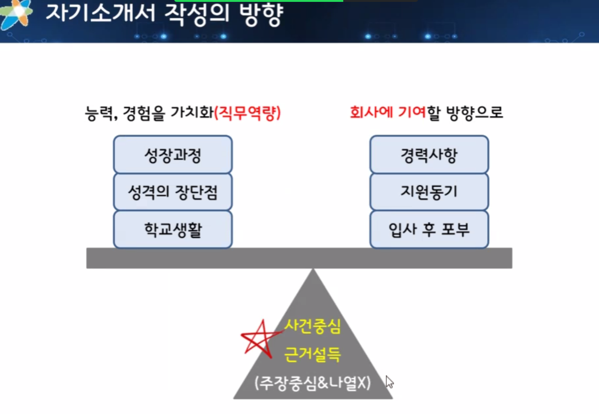
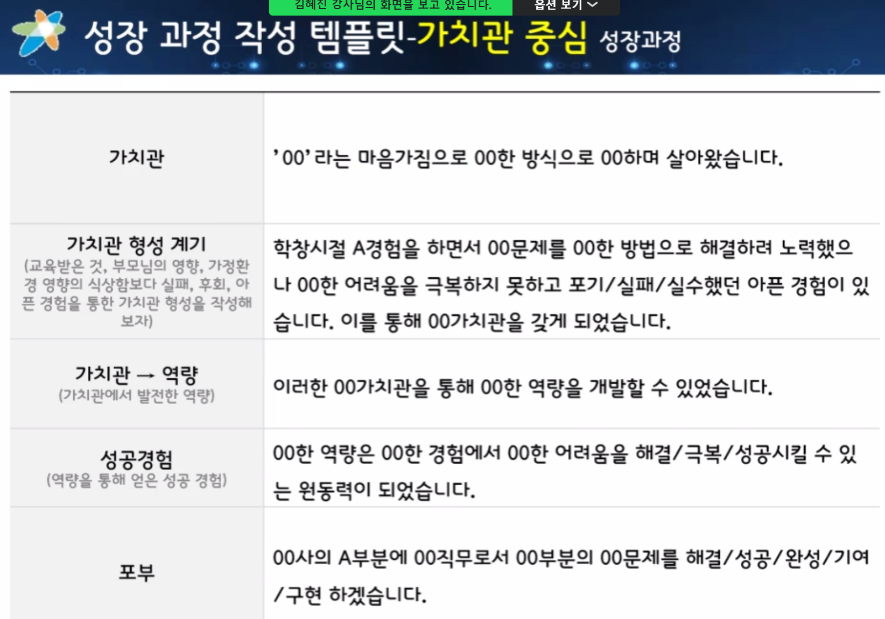
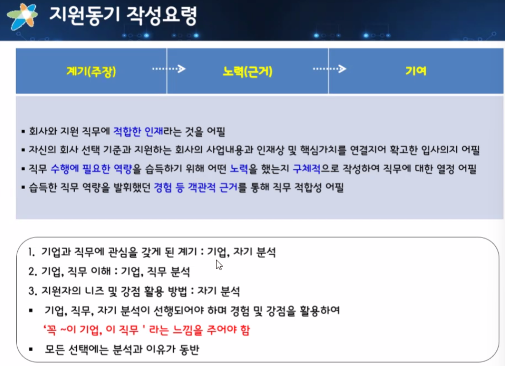

## 이력서 작성

IT: Information + Technology

임베디드 SW: 마이크 프로세서 위에 내장되어 기기의 기능을 다양화하고 부가가치를 높이는 핵심 소프트웨어

- 대표적인 예로 제조/ 판매하는 회사에서 컴퓨터의 CPU에 해당하는 OS개발
- 주로 제품을 연구개발/ 제조판매하는 대기업과 중견기업에서 필요로 하는 직무

패키지 SW: SW 패키지, 솔루션을 개발/ 판매하여 라이선스 판매에서 수익을 창출

우수하고 독특한 아이디어를 기반으로 SW를 기획/개발

- 대표적인 기업이 마이크로소프트
- 기업 전사적자원관리를 지원하는 ERP 솔루션 전문업체(SAP, 더존 등)
- 특정 기능의 솔루션을 제공하는 업체
- 이외에도 한글과 컴퓨터, 핸디소프트, 안랩 등의 패키지 소프트웨어 업체가 있음

IT 서비스: IT분야에서 프로세스를 수행하거나 구축, 전문적인 일을 수행

IT에 의해 기존 사업에 효율화와 개혁을 추구하거나 기업의 신규사업 창출을 이끄는 서비스

- LG CNS, 삼성SDK, SK C&C 등 30대에 대기업 계열사
- 일반 대기업군에서도 IT서비스 계열사를 대부분 보유

나를 세일즈 : 이력서(과거 삶의 정량화) + 자소서(과거 삶의 정성적 해석) 

=> 둘 다 수정할 수 없다.

내 실제 활용경험을 충분하게 녹여내야한다.

 저 마인드 맵을 정리하고 > 1분자기소개서를 작성하고  짧게 줄글 정리

1. 좌우명
2. 캐릭터(별명, 닮고싶은 위인)
3. 직무로 어필
4. ---프론트엔드가 될 ㅇㅇㅇ입니다.

자기소개할 때 세 가지 이야기하지 말기.

최대 두개까지!

왜 하필 우리회사인지=> 회사 분석 필요(기업 분석, 산업분석 공부하기)

산업분석 리포트(애널리스트)

 

CEO 인터뷰 꼭 보기

재무제표 볼 때 내가 지원하고자 하는 기업이 이익이 높다면 최근 무슨 사업을 했는지 분석하기

사업의 개요정도는 보고가자

강점: 장점중에 비즈니스(회사 생활)를 하면서 도움이 될만한 점

회사 생활하면서 내 강점에 대한 근거를 댈 수 있는 예시

개발자로써 노력하면서 내 강점에 대한 근거를 댈 수 있는 예시

단체 생활을 하면서 나왔던 사례

프로젝트를 하면서 나오는 에피소드 사용

마무리는 반드시 같이 강점으로 쓰기

쓸때는 만드시 STAR기법으로 쓴다.(상황, 문제,액션(내 강점으로한 행동), 결과(반드시 긍정적인 결과로, 객관적일 수 록 좋음))

글자 수가 많은 이력서는  강점을 어필 할 수 있는 글이 두개 나와도 된다.

학벌 컴플렉스라는 말보다 더 순화해서 대학에서 얻고자하는 것들을 이야기하기

역량:

제목

내가 생각하는 이 직문의 중요한 역량

해당 직군에 가장 주요한 역량은 ~~~~~ 이라고 생각합니다.

내가 왜 이 역량을 중요하게 생각을 하는지.

근거(2개, STAR 기법으로)

과거

최신순으로

맺은말 > 수미 상관으로 내가 중요하게 생각한 역량을 적어놓는다.

지원동기

1. 회사가 마음에 들어서
2. 직무가 마음에 들어서(이걸로 추천)
3. 그 회사의 그 직무가 마음에 들어서(내가 가고싶은 회사)

입사후 포부 

신입 : 배움 -> 어떻게 배우기 위해 노력할것인가? 계획을 세워야겠다.

​	내가 이렇게 배운걸로 어떻게 회사에 이익을 주겠다.

중간관리자 일때: 조율, 소통(소통을 하기 위한 노력과 계획을 작성해야한다.)

관심을 가지게 된 계기.이 직군에 내가 느낀 매력

잘 쓴글은 아님

잘 쓴 글은  아님, 제목에서 언급한 신뢰에대한 근거가 부족하고 말미에 신뢰가  없음

1. 지원동기
2. 입사후 포부
3. 역량
4. 장 단점
5. 성장과정
6. 1분자기소개

지원동기와 포부

