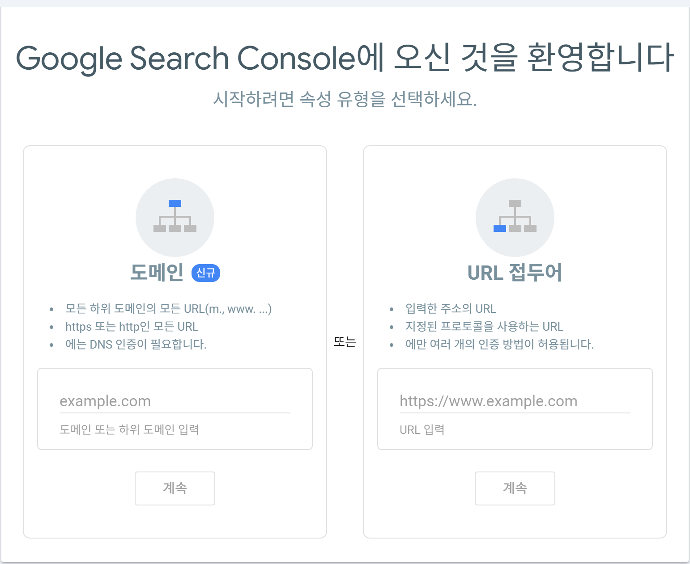

# 구글 검색 엔진 노출시키기(1)

구글 검색엔진에 블로그를 노출하고 싶어서 방치해놓고 작성만해놨던 블로그를 하나하나 고치기 시작했습니다.


제 블로그는 그저 기록용이라 유입이 필요없을 것 같아 내버려뒀었는데, 작성하면서 쌓였던 에러나 혹은 업데이트를 통해 더 이상 지원하지 않는 것들 때문에 오류가 쌓여 sitemap.xml 설정이 적용되지 않았습니다.


그래서 이를 해결하는 과정을 작성해보려고 합니다.

 

## Google search Console

우선 [여기](https://search.google.com/search-console/about)에 등록을 해야합니다. 


이는 구글에 검색했을때 저의 블로그가 검색이 되도록 등록하는 사이트 입니다.


시작하기를 눌러 등록합니다.





따로 사용하시는 도메인이 있다면 사용해도 되지만 저는 깃허브를 통해 제작한 블로그여서 `URL 접두어`에 제 블로그 URL를 입력해주고 계속을 누르면


인증을 통해서 


 위와 같이 발급이 됩니다. 이 파일을 다운로드 해줍니다.


해당 파일을 Root 위치에 넣어줍니다.


##  sitemap.xml


이 파일을 google.html과 같은 위치인 Root에 파일을 생성해줍니다.


sitemap.xml은 검색 엔진이 웹사이트의 구조를 효율적으로 크롤링하도록 도와주는 파일입니다. 이 파일은 웹사이트의 URL을 나열하며, 각 URL의 메타데이터(마지막 수정 날짜, 변경 빈도, 우선순위 등)를 포함합니다. 검색 엔진 최적화(SEO) 관점에서 매우 유용합니다.


처음에  http://127.0.0.1:4000/sitemap.xml 을 통해서 확인해 봤을때 


이런 오류가 났습니다.

`xmlParseEntityRef: no name` 에러는 XML 파일에서 잘못된 엔터티 참조 때문에 발생합니다. 이 문제는 `&` 같은 특수 문자가 제대로 이스케이프되지 않았기 때문일 가능성이 높습니다.


- 특수 문자가 제대로 이스케이프되지 않은 경우에 발생

`<loc>{{ site.url }}{{ post.url | escape }}</loc>`로 수정합니다.


이런 화면이 뜨면 성공!


### Robots.txt

`robots.txt`는 웹사이트의 루트 디렉토리에 위치하는 간단한 텍스트 파일로, **검색 엔진 크롤러(web crawlers)**에게 어떤 페이지나 파일을 크롤링할 수 있는지 또는 크롤링하면 안 되는지 지시하는 역할을 합니다.

#### **robots.txt의 주요 목적**

1. **크롤링 제한**
   - 검색 엔진이 민감한 데이터나 크롤링할 필요가 없는 페이지(예: 관리자 페이지, 내부 API 등)를 크롤링하지 않도록 지시합니다.
2. **크롤링 예산 관리**
   - 검색 엔진 크롤러가 할당된 크롤링 리소스(크롤링 예산)를 불필요한 페이지에 소모하지 않도록 제한해 더 중요한 페이지를 우선적으로 크롤링하게 합니다.
3. **SEO 최적화**
   - 중복된 콘텐츠(예: 필터 페이지, 아카이브 페이지 등)가 색인되어 SEO 점수가 분산되지 않도록 방지합니다.
   - 크롤링 및 색인 우선순위를 설정하는 데 도움을 줍니다.
4. **사이트 보안 강화**
   - 민감하거나 크롤링이 필요 없는 페이지를 검색 엔진에 표시하지 않음으로써 보안을 강화합니다.
5. **크롤링 및 색인 분리**
   - 크롤링을 허용하지만 검색 엔진 색인에 포함하지 않으려면 `noindex` 메타 태그와 함께 사용합니다.


`robots.txt`는 웹사이트의 루트 디렉토리에 위치하는 간단한 텍스트 파일로, **검색 엔진 크롤러(web crawlers)**에게 어떤 페이지나 파일을 크롤링할 수 있는지 또는 크롤링하면 안 되는지 지시하는 역할을 합니다.

------

### **robots.txt 파일 구조**

#### 기본 구조:

```
txt코드 복사User-agent: [크롤러 이름]
Disallow: [크롤링 금지 경로]
Allow: [크롤링 허용 경로]
Sitemap: [사이트맵 경로]
```

#### 예제:

```
txt코드 복사User-agent: *
Disallow: /admin/
Disallow: /private/
Allow: /public/
Sitemap: https://example.com/sitemap.xml
```

- **`User-agent`**: 특정 크롤러를 지정하거나 `*`로 모든 크롤러를 대상으로 설정.
- **`Disallow`**: 크롤링을 허용하지 않는 경로.
- **`Allow`**: 크롤링을 명시적으로 허용하는 경로(Disallow보다 우선).
- **`Sitemap`**: 사이트맵 파일의 URL을 지정하여 크롤러가 사이트의 구조를 쉽게 이해하도록 도움.


#### **robots.txt 작성 시 주의 사항**

1. **`Disallow`와 `Allow` 사용법**

   - `Disallow`는 크롤링 금지, `Allow`는 허용 경로를 의미합니다.

     `Allow`를 사용하여 특정 파일은 허용하고 나머지는 금지할 수 있습니다:

     ```
     txt코드 복사User-agent: *
     Disallow: /private/
     Allow: /private/special-allowed-file.html
     ```

2. **의도치 않은 차단 방지**

   - 중요한 페이지나 전체 사이트를 실수로 차단하지 않도록 주의하세요:

     ```
     txt
     
     
     코드 복사
     Disallow: /
     ```

3. **검색 엔진 정책**

   - `robots.txt`는 검색 엔진 크롤러에게 권고사항일 뿐이며, 일부 크롤러는 이를 무시할 수 있습니다(예: 악의적인 봇).

4. **검색 색인 방지**

   - `robots.txt`는 크롤링만 막을 뿐 색인을 막지는 않습니다. 색인을 막으려면 `noindex` 메타 태그를 사용하세요.

#### **robots.txt 생성 방법**

1. **파일 생성**

   - 프로젝트 루트 디렉토리에 `robots.txt` 파일을 생성합니다.

2. **예제 파일**

   ```
   txt코드 복사User-agent: *
   Disallow: /admin/
   Disallow: /temp/
   Allow: /public/
   Sitemap: https://example.com/sitemap.xml
   ```

3. **테스트**

   - 생성 후, Google의 robots.txt Tester에서 테스트하세요.

4. **배포**

   - `robots.txt` 파일을 웹사이트의 루트 디렉토리에 배치하여 `https://example.com/robots.txt`로 접근 가능하게 합니다.

------

### **robots.txt와 Sitemap의 차이**

- `robots.txt`는 크롤러의 접근을 제어.
- `sitemap.xml`은 크롤러가 크롤링해야 할 페이지의 목록 제공.

두 파일은 함께 사용하면 검색 엔진 크롤링과 색인을 효율적으로 관리할 수 있습니다! 🚀


### Sitemap.xml 등록


좌측 메뉴바를 들어가 sitemap 탭으로 들어갑니다.

여기서 본인의 sitemap.xml을 등록합니다.


저는 지금 에러가 뜨는데 찾아보니 기다리면 등록된다고 하니.. 기다려보겠습니다..!