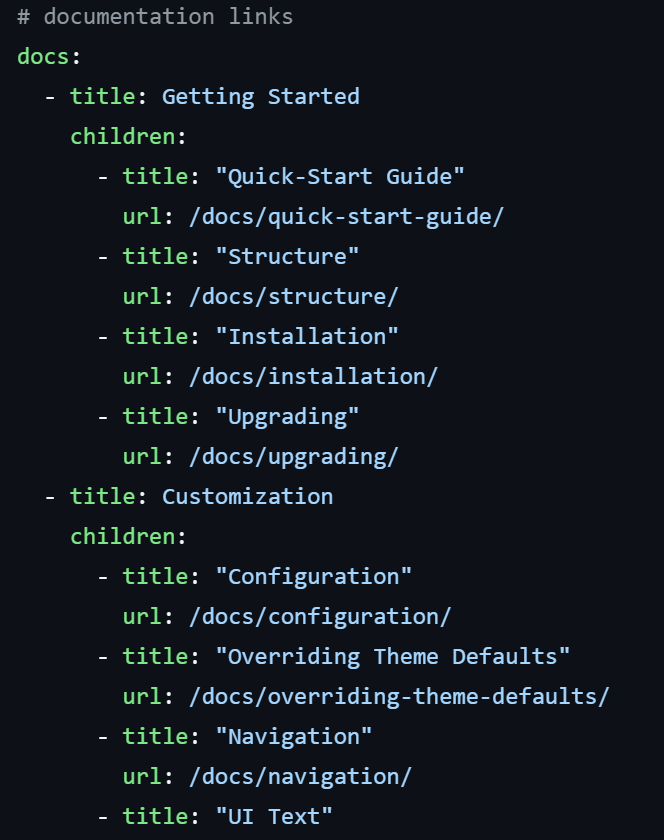
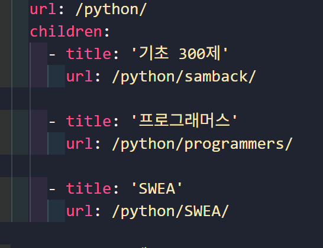

## [깃허브 블로그] 카테고리에 사이드바 추가

현재 저의 블로그는 카테고리 설정이 엉망인 상태입니다..

예를 들면 카테고리에서는


이렇지만


게시글 내부에서는 이렇게 뜹니다.


글을 작성하는데에는 문제가 없으나... 그래도 이 현상을 좀 바로 잡아보고자 합니다.


### 폴더 수정


저는 page 폴더 안에 대분류할 폴더를 생성하여 이 안에 파일을 카테고리 분류를 해주었습니다.


`category-project-phobum.md`

``` markdown
---
title: "PHOBUM"
layout: archive
category: phobum
permalink: project/phobum/
author_profile: true
---


  

<!-- 공백이 있는 카테고리 같은경우 ['카테고리명']의 형식으로 만들어주기 -->
```

이런 페이지를 만들어 둔 상태인데 특정 카테고리들만 가진 포스트들을 나열하는 것 만큼 폴더명을 변경해주겠습니다.


위 페이지에 대한 설명을 하자면

- 페이지의 이름: `PHOBUM`
- layout: archive 방식
- 페이지의 링크: `project/phobum`


### 사이드 바 추가하기


기존의 사이드 바를 모든 페이지에 추가하기 위해서 

``` markdown
sidebar:
    nav: "sidebar-category"
```

이것을 추가해 주었습니다.


## breadcrums 수정하기

`breadcrumbs`를 수정해야할 것 같은데 어디가 문제인지 잘 모르겠습니다..


그래서 우선 제가 사용하고 있는 테마인 `minimal-mistake`의 Github를 가서 폴더 구조를 보기로 했습니다.


[_data 구조](https://github.com/mmistakes/minimal-mistakes/blob/master/docs/_data/navigation.yml)



이것을 참고해서 수정해보겠습니다.

우선 메인 title의 url을 지워주겠습니다.



그에 반에 저는 두 개 씩 작성하고 있었습니다.

우선 이것을 고쳐주도록 하겠습니다.