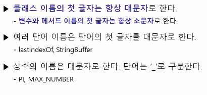

## 변수(variable)

### 변수란?

변하는 수라고 말하는데, 프로그래밍에서 변수란 물리적으로 메모리라고 생각할 수 있습니다. 

즉, 데이터를 저장하는 공간이라고 할 수 있습니다. 

## 변수의 타입

논리(boolean)는 true & false로 나뉩니다.

1byte = 8bit 
2 byte = short
4 byte = int
4byte = long

- 기본형(Primitive type)
  - 8개
  - 실제 값을 저장
- 참조형(Reference type)
  - 기본형을 제외한 것

### 기본형(Primitive type)

- 논리형

  - True와 False중 하나를 값으로 갖습니다.
  - 조건식과 노리적 계산에 사용됩니다.

- 문자형

  - 문자를 저장하는데 사용됩니다. 변수 당 하나의 문자만을 저장할 수 있습니다.

- 정수형

  - 정수 값을 저장하는데 사용됩니다. 주로 사용하는 것은 int와 long이며, byte는 이진 데이터를 다루는데 사용됩니다.
    short는 c언어와의 호환을 위해 추가되었습니다.

- 실수형

  - 실수 값을 저장하는데 사용됩니다. float와 double이 있습니다.

    ​	기본형은 `int`와 `double`입니다.

    | 종류/ 크기 | 1       | 2     | 4                            | 8                               |
    | :--------: | ------- | ----- | ---------------------------- | ------------------------------- |
    |   논리형   | boolean |       |                              |                                 |
    |   문자형   |         | char  |                              |                                 |
    |   정수형   | byte    | short | int | long                            |
    |   실수형   |         |       | float                        | double |

CPU는 연산을 할 뿐만아니라 레지스터로 CPU내에서 임시 저장을 합니다.

1바이트는 8개의 비트로 이루어져있습니다.

0 0000000

맨 앞에 비트는 양수와 음수를 나타내는데 0일 때 양수 1일때 음수 입니다.
0 0000001 = 1
0 0000010 = 2
0 0000011 = 3

음수를 표현하겠습니다. 뒤집어서 더하기 1을 해주는 겁니다.

1 000000 = -(01111111 + 1) = -(100000)

## 변수의 선언방법

타입 변수명;

int score; 

int score = 100;

score = 100;

`=`의 뜻은 오른쪽에 있는 값을 왼쪽의 변수에 넣겠다는 뜻입니다.

자바는 public에 있는 파일명과 class명이 같아야합니다. 그리고 변수는 마지막 값만 유효합니다. 위에서 선언한 변수를 또 사용할 수 있지만 그렇게 되면 기존의 변수에 들어있던 값은 사라집니다.

## 명명규칙

- **대소문자가 구분되며 길이에 제한이 없다.**

  - True와 true는 서로 다른 것으로 간주됩니다.

- **예약어(Reserved word)를 사용해서는 안 된다.**

  - true는 예약어라 사용할 수 없지만, True는 가능하다.

- **숫자로 시작해서는 안 된다.**

  - top 10은 허용하지만, 7up은 허용되지 않는다.

- **특수문자는 '_'와 '$'만을 허용한다.**

  - $harp은 허용되지만 S#arp는 허용되지 않는다.

  

  - **클래스 이름의 첫 글자는 항상 대문자**로 한다.
    - **변수와 메서드 이름의 첫 글자는 항상 소문자로 한다.**
  - 여러 단어 이름은 단어의 첫 글자를 대문자로 한다.
    - lastIndexOf, StringBuffer
  - 상수의 이름은 대문자로 한다. 단어는 '_'로 구분한다.
    - PI, MAX_NUMBER

## 변수, 상수, 리터럴

- 변수(variable)

  - 하나의 값을 저장하기 위한 공간 

- 상수(constant)

  - 한 번만 값을 저장할 수 있는 공간

- 리터럴(literal)

  - 그 자체로 값을 의미하는 것

    {: .notice}

    int score = 100; 
    score = 200; 
    char ch = 'A' 
    String str = "abc"; 
    final int MAX = 100; `final변수는 변경이 불가능합니다.` 
    MAX = 200; // 에러

## 변수의 기본값과 초기화

## 문자와 문자열

## 정수의 오버플로우

## 형변환(Casting)