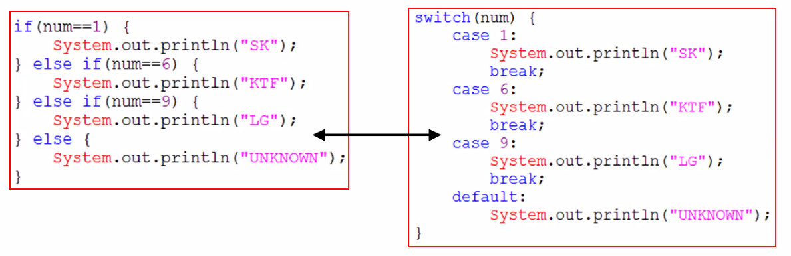

## 조건문



- 조건문은 조건식과 실행될 하나의 문장 또는 블럭{}으로 구성됩니다.
- Java에서 조건문은 if문과 switch문 두 가지 뿐입니다.
- if문이 주로 사용되며, 경우의 수가 많은 경우 switch문을 사용할 것을 고려합니다.
- 모든 switch문은 if문으로 변경이 가능하지만, if문은 switch문으로 변경할 수 없는 경우가 많습니다.

`if(조건식) {문장들}`

### if문

- if문은 if, if-else, if-else if의 세가지 형태가 있다
- 조건식의 결과는 반드시 true 또는 false 이어야 한다.


```java
public class IfTest {
	public static void main(String[] args) {
		int kor = 89;
		int eng = 90;
		int math = 95;
//		int kor = 89, eng = 90, math = 95; 위에서 변수를 선언해주는 방법과 동일합니다. 
		
		int tot = kor + eng + math; 
        //=에 오른쪽에 변수가 있으면 선언된 변수를 가져오겠다는 뜻입니다. 왼쪽에 있다면 오른쪽에 정의된 값을 왼쪽의 변수에 넣겠다는 뜻입니다.
//		double avg1 = tot/3.0;
//		float avg2 = tot/3;
		double avg = (double)tot/3;
		char grade;
		
		avg = Math.round(avg*100)/100d;
		
		if(avg>=90) {
			grade = 'A';
		} else if(avg>=80) {
			grade = 'B';
		} else if(avg>=70) {
			grade = 'C';
		} else if(avg>=60) {
			grade = 'D';
		} else {
			grade = 'F';
		}
		System.out.println(String.format("총점:%d, 평균:%.2f, 학점:%C", tot, avg, grade));
//		System.out.println(avg1);
//		System.out.println(avg2);
	}

}

```


조건식의 예


''는 캐릭터고 뒤에 널이 들어가있다 ""는 문자열이다.


### 중첩 if문

- if문 안에 또 다른 if문을 중첩해서 넣을 수 있습다.

- if문의 중첩 횟수에는 거의 제한이 없습니다.

- 

  

### switch문

- if문의 조건식과 달리, 조건식의 계산 결과가 int범위 이하의 정수만 가능합니다.

- 조건식의 계산결과와 일치하는 case문으로 이동 후 break문을 만날 때 까지 문장들을 수행합니다.(break문이 없으면 switch문의 끝까지 진행한다.)

- 일치하는 case문의 값이 없는 경우 default문으로 이동합니다.

- case문의 값으로 변수를 사용할 수 없습니다.(리터럴, 상수만 가능)

- 

  

if문보다 조건이 간결할 때 주로 사용되어집니다.


### 중첩 switch문

- switch문 안에 또 다른 switch문을 중첩해서 넣을 수 있습니다.
- 중첩횟수에는 거의 제한이 없습니다.


### if 문과 switch문의 비교

### Math.random()

- Math클래스에 정의된 난수 발생함수
- 0.0과 1.0사이의 double값(실수값)을 반환합니다.(0.0 <= Math.random() < 1.0)


## 반복문

- 문장 또는 문장들을 반복해서 수행할 때 사용합니다.
- 조건식과 수해할 블럭{} 또는 문장으로 구성합니다.
- 반복회수가 중요한 경우에 for문을 그 외에는 while문을 사용합니다.
- for문과while문은 서로 변경가능합니다.
- do-while문은 while문의 변형으로 블럭{}이 최소한 한번은 수행될 것을 보장합니다.


### for문

- 초기화, 조건식, 증감식 그리고 수행할 블럭{} 또는 문장으로 구성됩니다.


{: .notice}

for ( 초기화;조건식;증감식) \{ <br/>&nbsp; &nbsp; &nbsp;<font color="green">//조건식이 true일 때 수행될 문장들을 적는다.</font><br/>
}

`[참고] 반복하려는 문장이 단 하나일 때는 중괄호를 생략할 수 있다.`

{: .notice}

✔ **1부터 100까지의 합**<br/>


for문안에 조건식을 써주면(for(int i=1; sum>=100; i++)) 뒤에 i가 반복된 횟수를 출력해봤을 때 15가 나옵니다. 왜냐하면 ++은 계산 이후 값을 가지고 있기 때문에 출력했을때 +1되어 출력되기 때문입니다. 

구구단 2단 출력하기


{: .notice}

<br/>✔ **구구단 출력하기**<br/><br/>위의 구구단은 세로로 길게 구구단이 출력이 되었는데 <span class="hlm">한눈에 보이게 구구단을 출력</span>하고 싶습니다. 그렇다면 어떻게 해야할까요??<br/>**`dan` 과 `i`를 바꿔주면 됩니다.**<br/>

