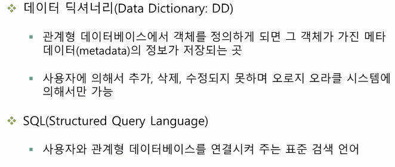

## 데이터베이스

### 데이터베이스의 정의

데이터베이스는 유용한 데이터의 집합을 말합니다.

**검색**, **수정**, **삭제**에 용이합니다.

- 데이터 종속
- 데이터 중복
  - 일관성
    - 동일성을 유지하기 위해 데이터 중복을 피합니다.
  - 보안성
    - 동일한 수준에서 보안이 유지
  - 경제성
    - 저장되는 공간에 대한 비용 절감
  - 무결성
    - 데이터가 정확성을 유지

- **통합된 데이터(integrated data)**

  데이터베이스는 똑같은 데이터가 원칙적으로 **중복되어 있지 않다**는 것을 말하며, 데이터의 중복은 일반적으로 관리상의 복잡한 부작용을 초래합니다.

- **저장된 데이터(stored data)**

  컴퓨터가 접근할 수 있는 기억장치에 저장된 데이터를 말합니다. 주로 하드디스크에 저장되어 관리됩니다.

- **운영 데이터(operarional data)**

  존재 목적이 명확하고 유용성을 지니고 있는 데이터를 말합니다. 즉, 단순하게 데이터를 모아둔 개념이 아닌 벼우언 관리를 위한 데이터 구축과 같은 **목적이 분명한 데이터**여야만 합니다.

- **공용 데이터(shared data)**

  여러 사용자들이 **서로 다른 목적으로 사용하는 공유 가능한 데이터**를 말합니다.

### 데이터베이스의 특징

1. **실시간 접근성(Real-time accessability)**

   다수의 사용자의 요구에 대해서 처리 시간이 몇 초를 넘기지 말아야한다는 의미입니다.

   ▶빨라야한다.

2. **지속적인 변화(Continuos evolution)**

   데이터베이스에 저장된 데이터는 **최신**의 정보가 정확하게 저장되어 처리되어야 합니다.

3. **동시 공유(Concurrent sharing)**

   동일 데이터를 동시에 서로 다른 목적으로 사요할 수 있어야 합니다.

4. **내용에 대한 참조**

   데이터베이스 내에 있는 데이터 레코드들은 주소나 위치에 의해 참조되는 것이 아니라 가지고 있는 **값에 따라 참조**해야 합니다.

## 데이터베이스 관리 시스템(DBMS)

- 데이터 베이스(DataBase)

### 관계형 데이터베이스 관리시스템

데이터베이스를 관리하는 방법에 따라 관계형, 망형, 트리형, 객체형 등으로 나뉘는데 **대부분이 관계형 데이터베이스 관리시스템**입니다.

- 관계형 데이터 베이스 관리시스템(RDBMS: Relational DataBase Management System)은 **가장 일반적인 형태의 DBMS**

  관계형 데이터베이스의 예로는 오라클(Oracle), 사이베이스(Sybase), 인포믹스(Infomix), MYSQL, Acess, SQL Server등이 있습니다.

#### 장점

- 작성과 이용이 비교적 쉽고 확장이 용이
- 처음 데이터베이스를 만든 후 관련되는 응용ㅇ 프로그램들을 변경하지 않고도, 새로운 데이터 항목을 데이터베이스에 추가 할 수 있습니다.

로우라고도하고 레코드라고도 합니다.

메타데이터: 테이블에 대한 정보

**데이터를 제어하는 4가지 방법**

CURD = 삽입(Create), 삭제(Delete) , 업데이트(Update), 읽기(Read) 