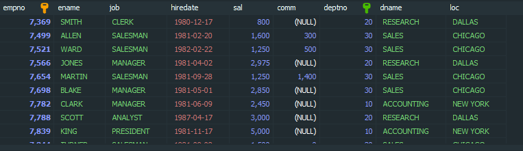

## JOIN

```mysql
select *
From emp e JOIN dept d
ON e.deptno=d.deptno;
```

**[결과]**



dept 테이블에 DEPTNO와 emp 테이블에 DEPTNO를 연결해서  emp 컬럼과 dept에 있는 컬럼들을 연결합니다.

```mysql
SELECT *
FROM emp e, dept d
WHERE e.deptno=d.deptno;
```

` , `로 조인할 경우 **WHERE**을 사용해서 join 합니다.


`-- student, professor 테이블을 이용하여 모든 학생의 정보를 조회하되, 담당 교수명을 함께 조회하시오.`

```mysql
SELECT *
FROM student s JOIN professor p
where s.profno = p.profno;
```

## sub query

{: .notice}

**SELECT colum1, cloum2,...<br/>FROM table<br/>WHERE 조건연산자 (SELECT colum1, colum2... from table where 조건);**


> **=, <>(!=), <, <=, >, >=**
>
> : 단일행 서브쿼리 연산자


**emp 테이블에서 CLARK보다 급여를 많이 받는 사원의 사번, 이름, 급여 조회**

```mysql
SELECT e.empno, e.ename, e.sla
FROM emp e
WHERE sal > (SELECT sal FROM emp WHERE ename='CLARK')
ORDER BY 3;
```


**emp 테이블에서 AWRD보다 커미션이 적은 사원의 이름과 커미션 조회**

```mysql
SELECT ename, comm
FROM emp
WHERE IFNULL(comm,0) < IFNULL(SELECT comm FROM emp WHERE ename='ADAMS'), 0);
```

-- student, department 테이브,ㄹ을 이용하여 서진수학생과 추전공이 동일한 학생들의 이름과 전공명 조회
SELECT s.name, s.deptno1, d.dname
FROM student s JOIN department d
ON s.deptno1=d.deptno
where deptno1 =(SELECT deptno FROM student WHERE NAME='서진수');

-- professor deparment 테이블에서 박의범 교수보다 나중에 입사한 교수의 이름과 입사일을 ㅎㄱ과명 조회
SELECT p.name, p.hiredate, d.dname
FROM professor p JOIN department d
ON p.deptno =d.deptno
WHERE p.hiredate > (SELECT hiredate FROM professor WHERE NAME='박원범');

-- 컴퓨터공학과 학생들의 평균 몸무게보다 많이 나가는 학생들의 학번 이름, 학과, 몸무게 조회
SELECT s.studno, s.NAME, d.dname, s.weight
FROM student s JOIN department d
ON s.deptno1=d.deptno
WHERE s.weight > (SELECT avg(weight)
				FROM student
				WHERE deptno1 = (SELECT deptno FROM department
				WHERE dname = '컴퓨터공학과'))
ORDER BY 4;

-- gogak, gift 테이블을 이용하여 노트북 상품을탈수 있는 고객의 번호, 이름 포인트를 조회하시오.
SELECT go.gno, go.gname, go.point
FROM gogak go JOIN gift gi
ON go.point>=gi.g_start
WHERE gi.gname='노트북';

SELECT go.gno, go.gname, go.point 
FROM gogak go  
WHERE POINT >(SELECT g_start FROM gift WHERE gname='노트북')
ORDER BY 3;

-- emp, dept테이블을 이용하여
-- Neww York에서 근무하는 직원 목록 조회

SELECT *
FROM emp e
WHERE e.DEPTNO = (SELECT d.DEPTNO
FROM dept d
WHERE d.LOC='NEW YORK');

-- student, professor: 박원범 교수가 담당하는 학생 목록 조회

SELECT *
FROM student s
WHERE s.deptno1 = (SELECT p.deptno
FROM professor p  
WHERE p.name='박원범');

-- gogak,gift 안광훈 고객이 포인트로 받을 수 있는 상품목록 조회
SELECT gi.gname
FROM gift gi
WHERE gi.g_start < (SELECT point
FROM gogak go WHERE go.gname='안광훈' );
-- (emp. dept):sales부서를 제외한 나머지 부서에 속한 직원의 사번, 이름, 부서명 조회

SELECT e.EMPNO,e.ENAME, e.JOB
FROM emp e
WHERE e.deptno <> (SELECT d.DEPTNO
FROM dept d
WHERE d.DNAME='SALES');


SELECT e.empno, e.ename, d.DNAME
FROM emp e JOIN dept d
ON e.DEPTNO=d.DEPTNO
WHERE e.deptno <> (SELECT deptno FROM dept WHERE dname='SALES');

-- student, exom_01,hakjum: 학점이 B0미만인 학생의 학번, 이름, 점수 조회
SELECT s.studno, s.name, e.total
FROM exam_01 e JOIN student s
USING (studno)
WHERE e.total < (SELECT h.min_point FROM hakjum h WHERE grade='B0')
ORDER BY 3;


-- (student, exam_01_hakjum): 학점이 A0인 학생의 학번, 이름 점수 조회

SELECT e.studno, s.name, e.total
FROM exam_01 e JOIN student s
USING (studno)
WHERE e.total BETWEEN (SELECT min_point FROM hakjum WHERE grade='A0')
							AND (SELECT max_point FROM hakjum WHERE grade='A0')
ORDER BY 3;

-- in, exitst > any, <any, >all, <all: 다중 서브쿼리 연산자

-- (emp2, dept2):포항 본사에서 근무하는 직원들의 사번, 이름, 직급, 부서명 조회
SELECT e.EMPNO, e.NAME,e.POSITION, d.DNAME
FROM emp2 e JOIN dept2 d
ON e.DEPTNO= d.DCODE
WHERE e.DEPTNO IN (SELECT dcode FROM dept2 WHERE AREA = '포항본사');

-- (student, department): 공과대학 학생들의 학번, 이름 학년 주전공 조회
-- 1. 공과대학에 해당하는 학부 조회
SELECT deptno
FROM department
WHERE part IN(SELECT deptno FROM department WHERE dname='공과대학');
-- 2. 공과대학 학부에 해당하는 학과조회
SELECT deptno
FROM department
WHERE part IN (SELECT deptno FROM department
WHERE ppart IN (SELECT deptno FROM department WHERE dname='공과대학'));
-- 3. 공과대학 학과에 해당하는 학생조회
SELECT studno, NAME, grade, deptno1
FROM student
WHERE deptno1 IN (SELECT deptno 
						FROM department
						WHERE part IN (SELECT deptno FROM department 
											WHERE part IN(SELECT deptno
																FROM department
																where dname='공과대학'
																)
											)
						);
						
-- (emp2): 과장 직급의 최소연봉자보다 연봉이 높은 직원의 사번, 이름, 연봉, 직급, 조회
SELECT empno, NAME, pay, position
FROM emp2
-- WHERE pay > (SELECT MIN(pay) FROM emp2 WHERE POSITION='과장')
WHERE pay > ANY (SELECT pay FROM emp2 WHERE POSITION='과장')
ORDER BY 3;

-- (student): 각 학년별 가장 큰 학생의 이름과 학년 키 조회
SELECT NAME, grade, height
FROM student
WHERE (grade,hight) IN (SELECT grade, MAX(height) FROM student GROUP BY grade)
ORDER BY grade;

-- SELECT grade, NAME, MAX(height) FROM student GROUP BY grade ORDER BY 2 : 비추천

-- (student) :2학녀 학생들 중 몸무게가 가장 적게 나가는 학생보다 적은 학생의 이읆, 학년, 몸무게 조회
SELECT NAME, grade, weight
FROM student
WHERE weight < (SELECT MIN(weight) FROM student WHERE grade=2);

SELECT NAME, grade, weight
FROM student
where weight < ALL(SELECT weight FROM student WHERE grade=2);

-- (emp2): 본인이 속한 부서의 평균 연봉보다 적게 바는 직원의 이름, 연봉, 부서명 조회
SELECT e1.NAME, e1.PAY, d.dname
FROM emp2 e1 JOIN dept2 d
ON e1.deptno=d.DCODE
WHERE e1.PAY <all(SELECT AVG(e2.pay) FROM emp2 e2 WgiftHERE e2.deptno= e1.DEPTNO ) ;