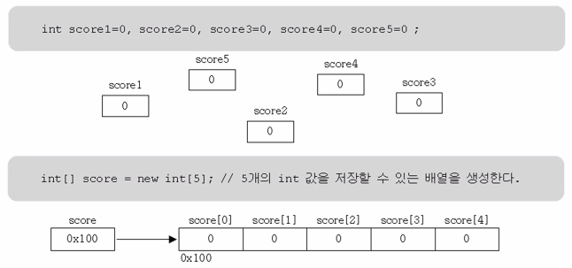
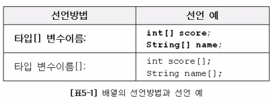

## 배열이란?

- 같은 타입의 여러 변수를 하나의 묶음으로 다루는 것입니다.
- 많은 양의 값(데이터)을 다룰때 유용합니다.
- 배열의 각 요소는 서로 연속적입니다.

new라는 연산자는  뒤에잇는 애들 생성하고 그 아이의 시작 주소를 반납하여 스코어에 반납합니다.

배열은 값을 넣지 않아도 자동으로 

## 배열의 선언과 생성

- 타입 또는 변수 이름 뒤에 대괄호[]를 붙여서 배열을 선업합니다.

## 배열의 초기화

## 배열의 활용

## 다차원 배열의 선언과 생성

## 가변배열

## 배열의 복사

## 사용자 입력받기 - 커먼드라인, InputDialog

