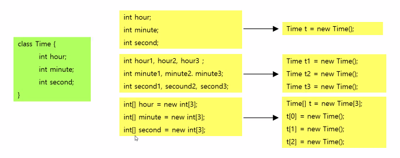
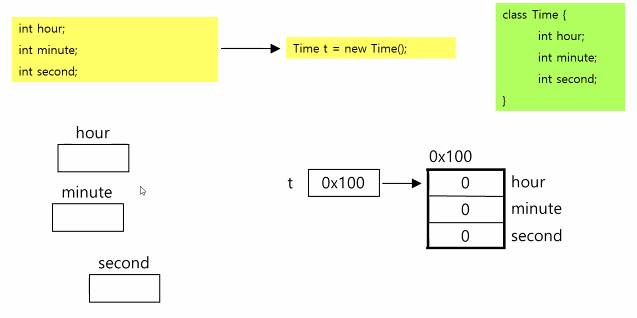
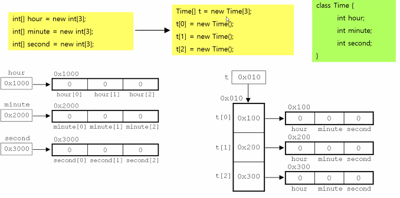

## 객체지향 언어란?

### 객체지향언어의 역사

- 과학, 군사적 모의시험을 위해 컴퓨터를 이용한 가상세계를 구현하려는 노력으로부터 객체지향이론이 시작됐습니다.
- 1960년대 최초의 객체지향언어 Simula 탄생
- 1980년대 절차방식의 프로그래밍의 한계를 객체지향 방식으로 극복하려고 노력합니다.
- 1995년 말 Java가 탄생했습니다. 객체지향언어가 프로그래밍언어의 주류가 됐습니다.

### 객체지향언어의 특징

- 기존의 프로그래밍언어와 크게 다르지 않습니다.
  - 기존의 프로그래밍 언어에 몇가지 규칙을 추가한 것 일 뿐입니다.
- 코드의 **재 사용성**이 높습니다.
  - 새로운 코드를 작성하 때 기존의 코드를 이용해서 쉽게 작성할 수 있습니다.
- 코드의 **관리가 쉬워졌습니다.**
  - 코드간의 관계를 맺어줌으로써 보다 적은 노력으로 변경이 가능합니다.
- 신뢰성이 높은 프로그램의 개발을 기능하게 합니다.
  - 제어자와 메소드를 이용해서 데이터를 보호하고, 코드의 중복을 제거하여 코드의 불일치로 인한 오류를 방지할 수 있습니다.

## 클래스와 객체

### 클래스와 객체의 정의와 용도

- **클래스의 정의**

  - **클래스란** `객체를 정의해 놓은 것`입니다.

- **클래스의 용도**

  - 클래스는 **객체를 생성**하는 데 사용됩니다.

- **객체의 정의**

  - 실제로 존재하는 것으로 사물 또는 개념을 말합니다.

- 객체의 용도

  - 객체의 속성과 기능에 따라 다릅니다.

    | 클래스      | 객체   |
    | ----------- | ------ |
    | 제품 설계도 | 제품   |
    | TV 설계도   | TV     |
    | 붕어빵가게  | 붕어빵 |

    

### 객체와 인스턴스

- 객체 는 인스턴스와 유사합니다. `같은 것이 아닙니다. `

  - 객체는 인스턴스를 포함하는 일반적인 의미입니다.
    - `책상은 인스턴스다. 책상은 객체다`
    - `책상은 책상 클래스의 객체다. 책상은 책상 클래스의 인스턴스이다.`

  - 객체는 **heap영역**에 **실제 생성되는 데이터**입니다.

- 인스턴스화(instantiate)

  - 클래스로부터 인스턴스를 생성하는 것입니다.

### 객체의 구성요소 - 속성과 기능

- 객체는 속성과 기능으로 이루어져 있습니다.
  - 객체는 속성과 기능의 집합이며, 속성과 기능을 객체의 멤버(member, 구성요소)라고 합니다.
- 속성은 변수로, 기능은 메서드로 정의합니다.
  - 클래스를 정의할 때 객체의 속성은 변수로, 기능은 메서드로 정의합니다.

### 인스턴스의 생성과 사용

- **인스턴스의 생성방법**

  클래스명 참조변수명;`//객체를 다루기 위한 참조변수 선언 `

  참조변수명 = new 클래스명(); `//객체생성 후, 생성된 객체의 주소를 참조변수에 저장`

### 클래스의 또 다른 정의

#### 1. 클래스 -데이터와 함수의 결합

- 변수 - 하나의 데이터를 저장할 수 있는 공간
- 배열 -  같은 타입의 여러 데이터를 저장할 수 있는 공간
- 구조체 - 타입에 관계없이 서로 관련된 데이터들을 저장할 수 있는 공간
- 클래스- 데이터와 함수의 결합(구조체 + 함수)

#### 2. 클래스 - 사용자 정의 타입

- 프로그래머가 직접 새로운 타입을 정의할 수 있습니다.
- 서로 관련된 값을 묶어서 하나의 타입으로 정의 합니다.

클래스에 선언된 메모리는=> heap

method는 