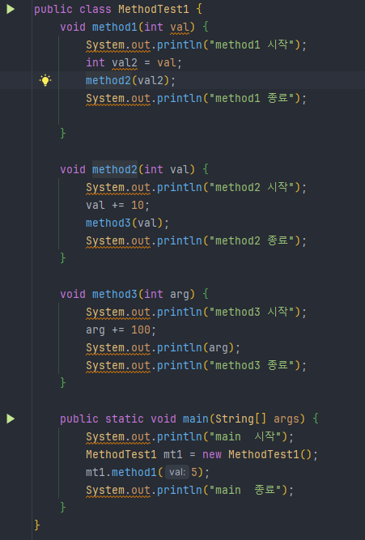
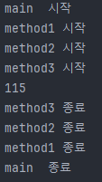
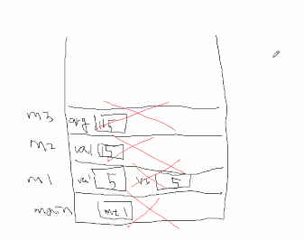
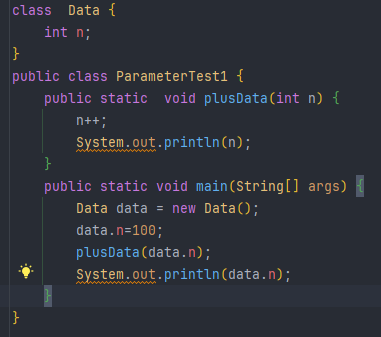
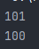
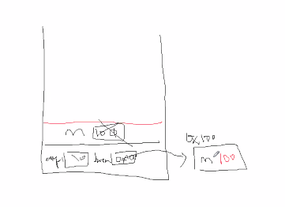

## 변수와 메서드

### 선언 위치에 따른 변수의 종류

**" 변수의 선언위치가 변수의 종류와 범위를 결정한다."**

| 변수의 종류  | 선언 위치   | 생성 시기                   |
| ------------ | ----------- | --------------------------- |
| 클래스변수   | 클래스영역  | 클래스가 메모리에 올라갈 때 |
| 인스턴스변수 | 클래스영역  | 인스턴스 생성시             |
| 지역변수     | 메서드 영역 | 변수 선언문 수행시          |

- **인스턴스변수**
  - 각 인스턴스의 개별적인 저장공간, 인스턴스마다 다른 값 저장가능
  - 인스턴스 생성 후, `참조변수.인스턴스변수명` 으로 접근
  - 인스턴스를 생성할 때 생성되고, 참조변수가 없을 때 가비지컬렉터에 의해 자동제거됨
- **클래스변수**
  - 같은 클래스의 모든 인스턴스들이 공유하는 변수
  - 인스턴스 생성없이 `클래스이름.클래스 변수명`으로 접근
  - 클래스가 로딩돌 때 생성되고 프로그램이 종료될 때 소멸
- **지역변수**
  - 메서드 내에 선언되며, 메서드의 종료와 함께 소멸
  - 조건문, 반복문의 블럭{} 내에 선언된 지역변수는 블럭을 벗어나면 소멸

### 클래스 변수와 인스턴스 변수

"**인스턴스 변수**는 **인스턴스가 생성될 때마다 생성**되므로 **인스턴스마다 각기 다른 값을 유지**할 수 있지만, **클래스 변수는 모든 인스턴스가 하나의 저장공간을 공유**하므로 **항상 공통된 값**을 갖는다."

### 메서드

#### 메서드란?

- **작업을 수행하기 위한 명령문의 집합**입니다.

- **어떤 값을 입력받아서 처리**하고 **그 결과를 돌려줍니다.**

  `입력받는 값이 없을 수도 있고 결과를 돌려주지 않을 수도 있습니다.`

#### 메서드의 장점과 작성지침

- 반복적인 코드를 줄이고 코드의 관리가 용이합니다.
- 반복적으로 수행되는 여러 문장을 메서드로 작성합니다.
- **하나의 메서드**는 **한 가지 기능만 수행**하도록 작성하는 것이 좋습니다.
- 관련된 여러 문장을 메서드로 작성합니다.

#### 메서드를 정의하는 방법

- 클래스 영역에만 정의할 수 있습니다.

`메서드의 정의`  = `선언부` + `구현부`

### return문

- **메서드가 정상적으로 종료되는경우**
  - 메서드의 블럭{}의 끝에 도달했을 때
  - 메서드의 블럭{}을 수행 도중 return 문을 만났을 때
- **return문**
  - 현재 실행 중인 메서드를 종료하고 호출한 메서드로 되돌아갑니다.

### return문 - 주의 사항

- 반환 값이 있는 메서드는 모든 경우에 return문이 있어야 합니다.

- return문의 개수는 최소화하는 것이 좋습니다.

### 메서드의 호출

- 메서드의 호출방법

  

### JVM의 메모리 구조

- **메서드 영역**
  - 클래스 정보와 클래스 변수가 저장되는 곳
- **호출 스택**
  - 메서드의 작업공간, 메서드가 호출되면 메서드 수행에 필요한 메모리공간을 할당받고 메서드가 종료되면 사용하던 메모리를 반환한다.
- **힙(Heap)**
  - 인스턴스가 생성되는 공간.
  -  new연산자에 의해서 생성되는 배열과 객체는 모두 여기에 생성된다.

#### 호출스택

- **호출스택의 특징**
  - 매서드가 호출되면 수행에 필요한 메모리를 스택에 할당받습니다.
  - 메서드가 수행을 마치면 사용했던 메모리를 반환합니다.
  - 호출스택의 제일 위에 있는 메서드가 현재 실행중인 메서드 입니다.
  - 아래에 있는 메서드가 바로 위의 메서드를 호출한 메서드입니다.

### 기본형 매개변수와 참조형 매개변수

- **기본형 매개변수**
  - 변수의 값을 읽기만 할 수 있습니다.
- **참조형 매개변수**
  - 변수의 값을 읽고 변경할 수 있습니다.

---

### 재귀호출(recursive call)

- **재귀호출이란?**

  - 메서드 내에서 **자기자신을 반복적으로 호출**하는 것
  - 재귀호출은 반복문으로 바꿀 수 있으며 반복문보다 성능이 나쁩니다.
  - 이해하기 쉽고 간결한 코드를 작성할 수 있습니다.

- 재귀호출의 예

  - 팩토리얼, 제곱, 트리운행, 폴더목록표시 등

  

  

### 클래스메서드(static메서드)와 인스턴스메서드

- **인스턴스메서드**
  - 인스턴스 생성 후, `참조변수.메서드이름()`으로 호출
  - 인스턴스변수나 인스턴스메서드와 관련된 작업을 하는 메서드
  - 메서드 내에서 인스턴스변수 사용가능
- **클래스메서드(static메서드)**
  - 객체생성 없이 `클래스이름.메서드이름()`으로 호출
  - 인스턴스변수나 인스턴스메서드와 관련없는 작업을 하는 메서드
  - 메서드 내에서 인스턴스변수 사용불가
  - 메서드 내에서 인스턴스 변수를 사용하지 않는다면 static을 붙이는 것을 고려합니다.

### 멤버간의 참조와 호출

같은 클래스의 멤버간에는 객체생성이나 참조변수 없이 참조를 할 수 있습니다. 그러나 static멤버들은 인스턴스멤버들을 참조할 수 없습니다.

## 메서드 오버로딩

 

**"하나의 클래스에 같은 이름의 메서드를 여러 개 정의하는 것을 메서드 오버로딩, 간단히 오버로딩이라고 합니다."**

 

### 오버로딩 조건

- 메서드의 이름이 같아야 합니다.

- 매개변수의 개수 또는 타입이 달라야 합니다.

- 매개변수는 같고 리턴타입이 다른 경우는 오버로딩이 성립되지 않습니다.

  `(리턴타입은 오버로딩을 구현하는데 아무런 영향을 주지 못합니다.)`

### 오버로딩의 예

