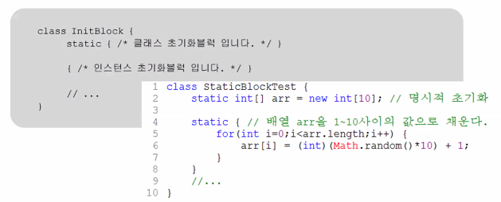
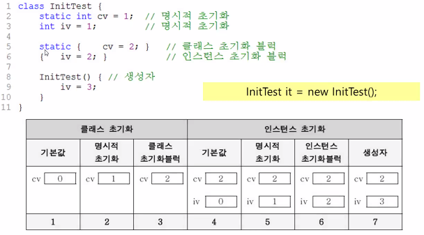
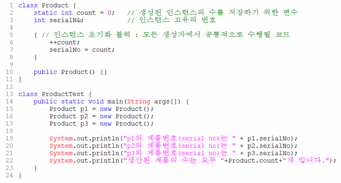

## 생성자

### 생성자란?

- 인스턴스가 생성될 때마다 호출되는 `인스턴스 초기화 메서드`
- 인스턴스 변수의 초기화 또는 인스턴스 생성시 수행할 작업에 사용합니다.
- 몇가지 조건을 제외하고는 메서드와 같습니다.
- 모든 클래스에는 반드시 하나 이상의 생성자가 있어야 합니다.

`인스턴스 초기화 - 인스턴스 변수에 적잘한 값을 저장하는 것`

{: .notice}

**Card c=  new card();**<br/><br/>1. 연산자 new에 의해서 메모리(heap)에 Card클래스의 인스턴스가 생성됩니다.<br/>2. 생성자 Card()가 호출되어 수행됩니다.<br/>3. 연산자 new의 결과로, 생성된 Card인스턴스의 주소가 반환되어 참조변수 c에 저장됩니다.

### 생성자의 조건 

- 생성자의 이름은 클래스의 이름과 같아야합니다.
- 생성자는 리턴값이 없습니다.`(But, void를 쓰지 않습니다.)`

{: .notice}

<br/>**클래스 이름**(타입 변수명, 타입 변수명, ...) {<br/><font color="green">//인스턴스 생성시 수행될 코드<br/>//주로 인스턴스 변수의 초기화 코드를 적는다.<br/></font>}

### 기본 생성자

- **기본 생성자란?**

  매개변수가 없는 생성자를 말합니다.

  <span class="hlm">**클래스에 생성자가 하나도 없으면 컴파일러가 기본 생성자를 자동으로 추가합니다.**</span>`(보이지 않아도)`

  생성자가 하나라도 있으면 컴파일러는 기본 생성자를 추가하지 않습니다.

**"모든 클래스에는 반드시 하나 이상의 생성자가 있어야합니다."**

### 매개변수가 있는 생성자

{: .notice}

class Car {<br>&nbsp;&nbsp;&nbsp;String color;&nbsp;&nbsp;&nbsp;//색상<br/>&nbsp;&nbsp;&nbsp;String grearType;&nbsp;&nbsp;&nbsp;//변속기 종류 - auto(자동), manual(수동)<br/>&nbsp;&nbsp;&nbsp;int door;&nbsp;&nbsp;&nbsp;//문의 개수<br/><br/>&nbsp;&nbsp;&nbsp;Car( ) {}&nbsp;&nbsp;&nbsp;//생성자<br/>&nbsp;&nbsp;&nbsp;car(String c, String g, int d) {&nbsp;&nbsp;&nbsp;//생성자<br/>&nbsp;&nbsp;&nbsp;&nbsp;&nbsp;&nbsp;color = c;<br/>&nbsp;&nbsp;&nbsp;&nbsp;&nbsp;&nbsp;gearType = g;<br/>&nbsp;&nbsp;&nbsp;&nbsp;&nbsp;door = d;<br/>&nbsp;&nbsp;&nbsp;}<br/>}

### 생성자에서 다른 생성자 호출하기 -  this()

- this() 생성자, 같은 클래스의 다른 생성자를 호출할 때 사용합니다. 
  다른 생성자 호출은 생성자의 첫 문장에서만 가능합니다.

#### this()란?

자바에서는 보통 `객체, 자기 자신`을 말합니다.

```java
public class Calculator {
 
    private int x1 = 0;
    private int y1 = 0;
    
    public Calculator(int x1, int y1){
        this.x1 = x1;
        this.y1 = y1;
    }
    
    public static void main(String[] args){
        Calculator cal = new Calculator(10, 20);
        
        System.out.println("x1 : " + cal.x1);
        System.out.println("y1 : " + cal.y1);
    }
}
```

main 함수에서 Calculator 객체를 생성자를 이용해서 생성했습니다.

`Calculator cal = new Calculator(10, 20);`

생성과 동시에 10과 20이라는 매개변수 값에 해당하는 데이터를 넣어서 초기화 했습니다.  Calculator는 입력받은 값

## 변수의 초기화

### 변수의 초기화


### 멤버변수의 초기화


### 초기화 블럭(initialization block)

- 클래스 초기화 블럭
  - 클래스변수의 복잡한 초기화에 사용되며 클래스가 로딩될 때 실행됩니다.
- 인스턴스 초기화 블럭
  - 생성자에 공통적으로 수행되는 작성베 사용되며 인스턴스가 생성될 때 마다(생성자보다 먼저) 실행됩니다.



### 멤버변수의 초기화 시기와 순서

- 클래스 변수 초기화 시점: 클래스가 처음 로딩될 때 단 한번
- 인스턴스변수 초기화 시점: 인스턴스가 생성될 때 마다





---

**Account.java**

```java
public class Account {
    String id;
    String name;
    int balance;

//    String info() { //호출한 애한테 주는 데이터 타입 > 호출한 애한테 문자열을 주겠다,
//        return "계좌번호: " + id + ", 이름: " + name + ", 잔액: " + balance;
//    }
    String info() {
        return String.format("계좌번호: %s, 이름: %s, 잔액: %d", id, name, balance);
    }

    //리턴하지 않아도 되는 값
    void deposit(int money) {
        if(money>0) balance += money;
    }
    void withdraw(int money) {
        if(balance>=money)
            balance -= money;
    }

Account() {
}

Account(String id, String name, int balance) {
    this.id = id;
    this.name = name;
    this.balance = balance;
}

Account(String id, String name) {
    this(id, name, 0);

}

public static void main(String[] args) {
    Account acc1 = new Account();
    acc1.id = "1001";
    acc1.name = "김길동";
    acc1.balance = 200000;
    Account acc2 = new Account("1002", "홀길동", 100000);
    Account acc3 = new Account("1003", "강길동");
    System.out.println(acc1.info());
    acc1.deposit(10000);
    System.out.println(acc1.info());
    acc1.withdraw(5000);
    System.out.println(acc1.info());
}
}

```


변수 여덟개의 타입

--세가지 메모리영역
-메소드 영역
-스택(스택에 쌓이는 변수는 초기화 되지 않는다.)
-힙

메모리 먼저 로드되는게 static