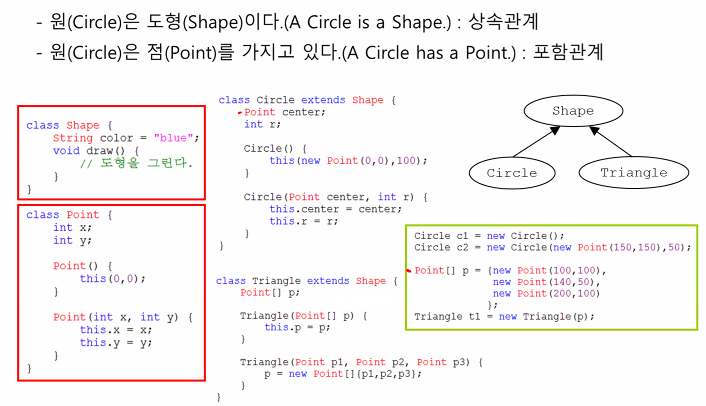
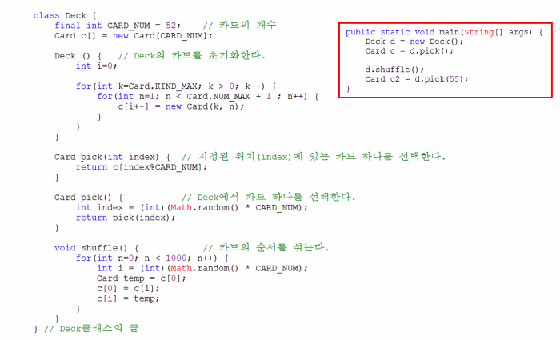
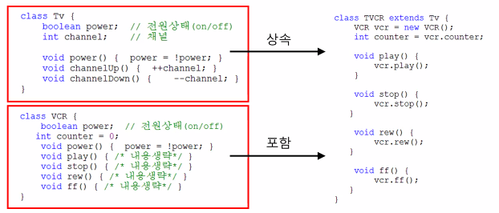
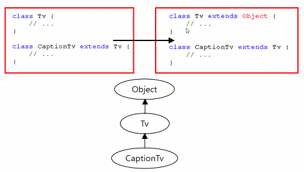

## 상속(inheritance)

### 상속(inheritance)의 정의와 장점

#### - 상속이란?

- 기존의 클래스를 재사용해서 새로운 클래스를 작성하는것
- 두 클래스를 조상과 자손으로 관계를 맺어주는 것
- 자손의 조상의 모든 멤버를 상속받습니다.(생성자, 초기화블럭 제외)
- **자손의 멤버개수는조상보다 적을 수 없습니다.(같거나 많음)**

### 클래스간의 관계

#### -  상속관계

- 공통부분은 조상에서 관리하고 개별부분은 자손에서 관리합니다.

- 조상의 변경은 자손에 영향을 미치지만, 자손의 변경은 조상에 아무런 영향을 미치지 않습니다.

  

  `extends`를 통해서 상속 받습니다.

  자식은 부모의 모든것을 가지고 있습니다. (`메모리가 포함되고 있다. 메모리를 포함한다.` 라고 말할 수 있습니다.)

  **상속**은 부모의 것을 상속을 받아 일부를 변경하거나 추가하는 것입니다. 

#### - 포함관계

- **포함이란?**

  - 한 클래스의 멤버변수로 다른 클래스를 선언하는 것
  - 작은 단위의 클래스를 먼저 만들고, 이 들을 조합해서 하나의 커다란 클래스를 만듭니다.

  

  자바는 단일 상속만 가능하며, 멀티상속은 불가능 합니다.

### 클래스간의 관계결정하기

#### 상속 vs 포함

- 가능한 많은 관계를 맺어주어 재사용성을 높이고 관리하기 쉽게 합니다.
- is-a와 has-a를 가지고 문장을 만들어 봅니다.

#### - 예제

### 단일상속(single inheritance)

- Java는 단일상속만을 허용합니다.

  `C++은 다중상속 허용`

  {: .notice}

  class TVCR **extends TV, VCR** {&nbsp;&nbsp;&nbsp;**&nbsp;//이와 같은 표현은 허용하지 않습니다.** ... }

- 비중이 높은 클래스 하나만 상속관계로, 나머지는 포함관계로 합니다.

### Object클래스

#### - 모든 클래스의 최고 조상

- 조상이 없는 클래스는 자동적으로 Object클래스를 상속받게 됩니다.

- 상속계층도의 최상위에는 Object클래스가 위치합니다.

- 모든 클래스는 Object클래스에 정의된 11개의 메서드를 상속받습니다.

  `toString(), equals(Object obj), hashCode(), ...`

  

## 오버라이딩(overriding)

### 오버라이딩이란?

조상클래스로부터 **상속받은 메서드의 내용**을 상속받는 클래스에 맞게 **변경하는 것**을 오버라이딩이라고 합니다.

### 오버라이딩의 조건

1. 선업부가 같아야 합니다.(이름, 매개변수, 리턴타입)

2. 접근제어자를 좁은 범위로 변경할 수 없습니다.

   - 조상의 메서드가 protexted라면, 범위가 같거나 넓은 protected나 public으로만 변경할 수 있습니다.

3. 조상클래스의 메서드보다 많은 수의 예외를 선언할 수 없습니다.

   ​	

### 오버로딩 vs 오버라이딩

**오버로딩(over loading)**

- 기존에 없는 새로운 메서드를 정의하는 것(new)

**오버라이딩(overriding)**

- 상속받은 메서드의 내용을 변경하는 것(change, modify)

  

### super

#### - 참조변수

- **this** 

  - 인스턴스 자신을 가리키는 참조변수로 인스턴스의 주소가 저장되어있습니다.
  - 모든 인스턴스 메서드에 지역변수로 숨겨진 채로 존재합니다.

- **super**

  - this와 같으며, 조상의 멤버와 자신의 멤버를 구별하는 데 사용합니다.

    

    

---

#### SpecialAccount

1. Account의 모든 속성과 기능을 가지고 있음.
2. 등급(grade)에 따라 차등 추가지급됨.

## package와 import

### 패키지

- 서로 관련된 클래스와 인터페이스의 묶음

- 클래스가 물리적으로 클래스파일(*.class)인 것처럼, 패키지는 물리적으로 폴더입니다. 패키지는 서브패키지를 가질 수 있으며, `  . `으로 구분합니다.

- 클래스의 실제 이름(full name)은 패키지명이 포함된 것입니다.

  (String클래스의 full name은 java.lang.String)

- 원래는 밖에서 클래스안에 있는 변수 등을 가져다 쓰려면 권한을 설정해줘야합니다. 그러나 자바는 **같은 그 권한을 같은 패키지에 있는 애들까지는 허용**을 해줍니다.

- rt.jar는 Java API의 기본 클래스들은 압축한 파일입니다.

  (JDK설치경로 \jre\lib에 위치)

  

### 패키지의 선언

- 패키지는 소스파일에 첫 번째 문장(주석 제외)으로 단 한번 선업합니다.

- 하나의 소스파일에 둘 이상의 클래스가 포함된 경우, 모두 같은 패키지에 속하게 됩니다.

  (하나의 소스파일에 단 하나의 public클래스만 허용합니다.)

- 모든 클래스는 하나의 패키지에 속하며, 패키지가 선언되지 않은 클래스는 자동적으로 이름없는(default) 패키지에 속하게 됩니다.

### import문의 선언

- import문은 패키지문과 클래스선언의 사이에 선업합니다.

  {: .notice}

  일반적인 소스파일(*.java)의 구성은 다음의 순서로 되어 있습니다. 1. package문	2. import문	3. 클래스 선언

- import문을 선언하는 방법은 다음과 같습니다.

  `import 패키지명.클래스명;`
  `import 패키지명.*;`

  