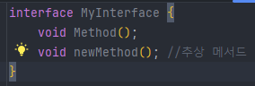
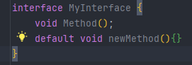

## 추상클래스

### 추상클래스란?

- 클래스가 설계도라면 추상클래스는 `미완성 설계도`입니다.

- 추상메서드(`미완성 메서드`)를 포함하고 있는 클래스입니다.

  `💚 추상메서드: 선언부만 있고 구현부(몸통, body)가 없는 메서드`

  ```java
  abstract class Player { 
      int currentPos; //현재 play되고 있는 위치를 저장하기 위한 변수ㅗ
      Player() { //추상클래스도 생성자가 있어야함
          currentPos = 0;
      }
      
      abstract void play(int pos); //추상메서드
      abstract void stop(); //추상메서드
      
      void play() {
          play(currnetPos); //추상메서드를 사용할 수 있음
      }
      ...
  }
  ```

- 일반메서드가 추상메서드를 호출할 수 있습니다.(호출할 때 필요한 건 선언부)
- 완성된 설계도가 아니므로 인스턴스를 생성할 수 없습니다.
- 다른 클래스를 작성하는 데 도움을 줄 목적으로 작성됩니다.


### 추상메서드란?

- 선언부만 있고 구현부(몸통, bopdy)가 없는 메서드

  `abstract 리턴타입 메서드이름();` 

  `EX) abstract void play(int pos);`

- **꼭 필요하지만 자손마다 다르게 구현될 것으로 예상되는 경우**에 사용합니다.

- 추상클래스를 상속받는 자손클래스에서 추상메서드의 구현부를 완성해야 합니다.

### 추상클래스의 작성

여러 클래스에 **공통적으로 사용될 수 있는 추상클래스를 바로 작성**하거나 **기존클래스의 공통 부분**을 뽑아서 추상클래스를 만듭니다.


## 인터페이스

### 인터페이스란?

- 일종의 추상클래스로 추상클래스보다 추상화 정도가 높습니다.
- 실제 구현된 것이 전혀 없는 기본 설계도 입니다.
- **추상메서드**와 **상수**만을 멤버로 가질 수 있습니다.
- 인스턴스를 생성할 수 없고, 클래스 작성에 도움을 줄 목적으로 사용됩니다.
- 미리 정해진 규칙에 맞게 구현하도록 표준을 제시하는 데 사용됩니다.

### 인터페이스의 작성

- `class`대신 `interface`를 사용한다는 것 외에는 클래스 작성과 동일합니다.

  ```java
  interface 인터페이스이름 {
      public static final 타입 상수이름 = 값;
      public abstract 메서드이름(매개변수목록);
  }
  ```

- 구성요소(멤버)는 추상메서드와 상수만 가능합니다.

  - 모든 멤버변수는 **[ public static final ]** 이어야 하며, 이를 생략할 수 있습니다.
  - 모든 메서드는  **[ public abstract ]** 이어야하며, 이를 생략할 수 있습니다.

### 인터페이스의 상속

- 인터페이스도 클래스처럼 상속이 가능합니다(클래스와 달리 다중상속 허용합니다.)

  ```java
  interface Movable {
      //지정된 위치(x,y)로 이동하는 기능의 메서드
      void move(int x, int y);
  }
  interface Attackable {
      //지정된 대상을 공격하는 기능의 메서드
       void attac(Unit u);
  }
  interface Fightable extends Movable, Attackable {
  }
  ```

- 인터페이스는 Object클래스와 같은 최고 조상이 없습니다.

### 인터페이스의 구현

- 인터페이스를 구현하는 것은 클래스를 상속받는 것과 같습니다.

  But, `extends`대신 `implements`를 사용합니다.

  ```java
  class 클래스이름 implements 인터페이스이름{
      //인터페이스에 정의된 추상메서드를 구현해야합니다.
  }
  ```

- 인터페이스에 정의된 추상메서드를 완성해야합니다.

  ```java
  class Fighter implements Fightable {
      public void move(int x, int y) {
          ...
          }
      public void attack() {
          ... 
      }
  interface Fighterable {
      void move(int x, int y);
      void attack(Unit u);
  }   
  ```

  ```java
  sbstract class Fighter implements Fightable {
      public void move(int x, int y){
          ...
      }
  }
  ```

  

- 상속과 구현이 동시에 가능합니다.

  ```java
  class Fighter extends Unit implements Fightable {
      public void move(int x, int y){
          ,,,
      }
      public void attack(Unit u){
          ...
      }
  }
  ```

### 인터페이스를 이용한 다형성

- 인터페이스 타입의 변수로 인터페이스를 구현한 클래스의 인스턴스를 참조할 수 있습니다.

  ```java
  class Fighter extends Unit implements Fightables {
      public void move(int x, int y){
          ...
      }
      public void attack(Fightable f) {
          ...
      }
  }
  ```

  ```java
  Fighter f = new Fighter();
  Fightable f = new Fighter();
  ```

- 인터페이스를 메서드의 매개변수 타입으로 지정할 수 있습니다.

  ```java
  void attack(Fightable f){ //Fightable인터페이스를 구현한 클래스의 인스턴스를 매개변수로 받는 메서드  
     ...
  }
  ```

- 인터페이스를 메서드의 리턴타입으로 지정할 수 있습니다.

  ```java
  Fightable method() { //Fightable인터페이스를 구현한 클래스의 인스턴스를 반환
      ...
      return new Fighter();
  }
  ```

### 인터페이스의 장점

1. **개발시간을 단축시킬 수 있습니다.**

   일단 인터페이스가 작성되면, 이를 사용해서 츠로그램을 작성하는 것이 가능합니다. 메서드 호출하는 쪽에서는 선언부만 알면 되기 때문입니다.

   동시에 다른 한 쪽에서는 인터페이스를 구현하는 클래스를 작성라도록 하여, 인터페이스를 구현하여 프로그램을 작성하도록 함으로써 보다 일관되고 정형화된 프로그램의 개발이 가능합니다. 

2. **표준화가 가능합니다.**

   프로젝트에 사용되는 기본 츨을 인터페이스로 작성한 다음, 개발자들에게 인터페이스를 구현하여 프로그램을 작성하도록 함으로써 보다 일관되고 정형화도니 프로그램의 개발이 가능합니다.

3. **서로 관계없는 클래스들에게 관계를 맺어 줄 수 있습니다.**

   서로 상속관계에 있지도 않고, 같은 조상클래스를 가지고 있지 않은 서로 아무런 관계도 없는 클래스들에게 하나의 인터페이스를 공통적으로 구현하도록 함으로써 관계를 맺어 줄 수 있습니다.

4. **독립적인 프로그래밍이 가능합니다.**

   인터페이스를 이용하면 클래스의 선언과 구현을 분리시킬 수 있기 때문에 실제 구현에 독립적인 프로그램을 작성하는 것이 가능합니다.

   클래스와 클래스간의 직접적인 관계를 인터페이스를 이용해서 간접적인 관계로 변경하면, 한 클래스의 변경이 관련된 다른 클래스에 영향을 미치지 않는 독립적인 프로그래밍이 가능합니다.

### 인터페이스의 이해

- 인터페이스는 두 대상(객체) 간의 `연결`, `대화`, `소통`을 돕는 `중간 역할`을 합니다.
- 선언(설계)와 구현을 분리시키는 것을 가능하게 합니다.

인터페이스를 이해하려면 먼저 두 가지를 기억해야 합니다.

1. 클래스를 사용하는 쪽(User)과 클래스를 제공하는 쪽(Provider)이 있습니다.
2. 메서드를 사용(호출)하는 쪽(User)에서는 사용하려는 메서드(Provider)의 선언부만 알면 됩니다.

### 디폴트 메서드(default method)

인터페이스에 새로운 메서드(추상 메서드)를 추가하면, 이 인터페이스를 구현한 기존의 모든 클래스가 이 메서드를 구현해야합니다.

이러한 문제를 해결하기 위해서 **디폴트 메서드**를 고안했습니다.

디폴트 메서드는 추상 메서드의 기본 구현을 제공합니다. 그래서 몸통{}을 가지고 있으며, 앞에 `default`를 붙이고 항상 public입니다. (생략가능)



{: .notice}

**1. 여러 인터페이스의 디폴트 메서드 간의 충돌**<br/>- 인터페이스를 구현한 클래스에서 디폴트 메서드를 오버라이딩해야 합니다.<br/>**2. 디폴트 메서드와 조상 클래스의 메서드 간의 충돌**<br/>- 조상 클래스의 메서드가 상속되고, 디폴트 메서드는 무시됩니다.