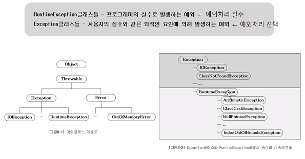

## 예외처리

### 프로그램 오류

- 컴파일 에러와 런타임 에러
  - 컴파일 에러
    - 컴파일할 때 발생하는 에러
  - 런타임 에러
    - 실행할 떼 발생하는 에러
  - 논리적 에러
    - 의도와 다르게 동작(실행시)

- Java의 런타임 에러 - 에러와 예외

  {: .notice}

  **에러**  프로그램 코드에 의해서 수습될 수 없는 심각한 오류 **예외** - 프로그램 코드에 의해서 수습될 수 잇는 다소 미약한 오류

### 예외처리의 정의와 목적

- 에러(error)는 어쩔 수 없지만, 예외(exception)는 처리해야 합니다.

  - 에러: 프로그램 코드에 의해서 수습될 수 없는 심각한 오류
  - 예외: 프로그램 코드에 의해서 수습될 수 있는 다소 미약한 오류

- 예외처리 정의와 목적

  예외처리

  	- 정의: 프로그램 실행 시 발생할 수 잇는 예외의 발생에 대비한 코드를 작성하는 것
  	- 목적: 프로그램의 비정상 종료를 막고, 정상적인 실행상태를 유지하는 것

  

### 예외처리구문 - try-catch

- 예외를 처리하려면 try-catch문을 사용해야합니다.

### try-catch문에서의 흐름

- try블럭 내에서 예외가 발생한 경우
  1. 발생한 예외와 일치하는 catch블럭이 있는지 확인합니다.
  2. 일치하는 catch블럭을 찾게되면, 그 catch블럭 내의 문장들을 수행하고 전체 try-catch문을 빠져나가서 그 다음 문장을 계속해서 수행합니다. 만일 일치하는 catch블럭을 찾지 못하면, 예외는 처리되지 못합니다.
- try블럭 내에서 예외가 발생하지 않은 경우
  1. catch블럭을 거치지 않고 전체 try-catch문을 빠져나가서 수행을계속합니다.

### 예외 발생시키기

1.  먼저, 연산자 new를 이용해서 발생시키려는 예외 클래스의 객체를 만든 다음 

   `Exception e = new Exceprion("고의로 발생시켰음");`

2.  키워드 throw를 이용해서 예외를 발생시킵니다.

   `trhow a;`

### 예외 클래스의 계층 구조

- 예외 클래스는 크게 두 그룹으로 나뉩니다.

### 예외의 발생과 catch블럭

- try블럭에서 예외가 발생하면, 발생한 예외를 처리할  catch블럭을 찾습니다.

- 첫번째 catch블럭부터 순서대로 찾아 내려가며, 일치하는 catch블럭이 없으면 예외는 처리되지 않습니다.

- 예외의 최고 조상인 Exception을 처리하는 catch블럭은 모든 종류의 예외를 처리할 수 있습니다.

  `반드시 마지막 catch블럭이어야 합니다.`

- 발생한 예외 객체를 catch블럭의참소변수로 접근할 수 있습니다.

  {: .notice}

  **printStackTrace()** - 예외발생 당시의 호출스택(Call Stack)에 있었던 메서드의 정보와 예외 메시지를 화면에 출력합니다. **getMessage()** - 발생한 예외클래스의 인스턴스에 저장된 메시지를 얻을 수 있습니다.