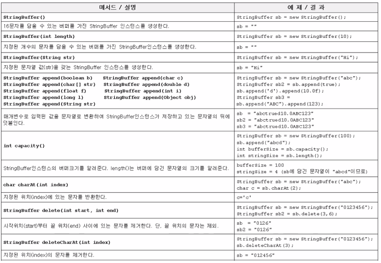
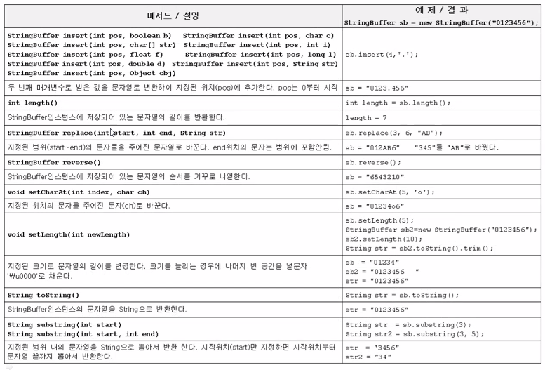
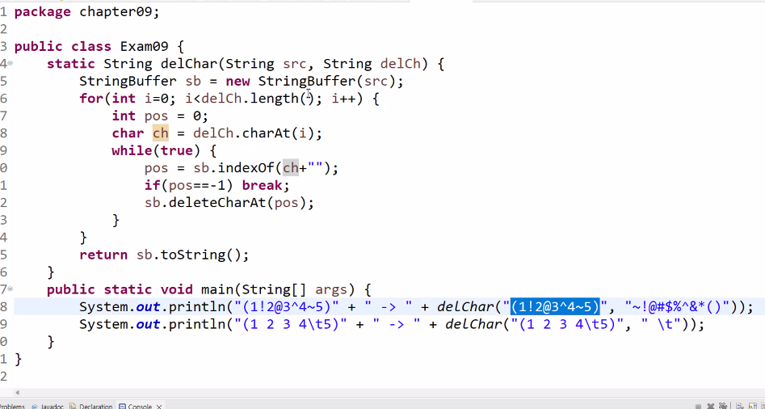

## Object클래스

### Object클래스의 메서드

**모든 클래스의 최고 조상**으로 오직 11개의 메서드만을 가지고 있습니다.

`equals()`, `hashCode()`, `toString()`은 적절히 오버라이딩해야합니다.

`notify()`, `wait()` 등은 쓰레드와 관련된 메서드 입니다.

| Object클래스의 메서드                     | 설 명                                                        |
| ----------------------------------------- | ------------------------------------------------------------ |
| protected Object clone()                  | 객체 자신의 복사본을 반환한다.                               |
| public boolean equals(Object obj)         | 객체 자신과 객체  obj가 같은 객체인지 알려준다(같으면 true)  |
| protected void finalize()                 | 객체가 소멸될 때 가비지 컬렉터에 의해 자동적으로 호출된다.  이 때 수행되어야하는 코드가 있는 경우에만 오버라이딩한다. |
| public class getClass()                   | 객체 자신의 클래스 정보를 담고 있는  Class인스턴스를 반환한다. |
| public int hashCode()                     | 객체 자신의 해시코드를 반환한다.                             |
| public String toString()                  | 객체 자신의 정보를 문자열로 반환한다.                        |
| public void notify()                      | 객체 자신을 사용하려고 기다리는 쓰레드를 하나만 깨운다.      |
| public void notifyAll()                   | 객체 자신을 사용하려고 기다리는 모든 쓰레드를 깨운다.        |
| public void wait()                        | 다른 쓰레드가 notify()나 notifyAll()을 호출할 때까지 현재 쓰레드를 무한히 또는 지정된 시간(timeout, nanos)동안 기다리게 한다.(timeout은 천 분의1초, nanos는 109분의 1초) |
| publiv void wait(long timeout)            | „                                                            |
| public void wait(long timeout, int nanos) | „                                                            |

### equals(Object obj)

객체 자신과 주어진 객체를 비교합니다. 같으면 true이고 다르면 false입니다.

Object클래스에 정의된 equals()는 참조변수 값(객체의 주소)을 비교합니다.

{: .notice}

public boolean equals(object obj) { &nbsp;&nbsp;&nbsp;&nbsp;return (this==obj); }

equals()를 오버라이딩해서 인스턴스변수의 값을 비교하도록 바꿉니다.

### hashCode()

객체의 **해시코드**를 반환하는 해시 함수 입니다.

**해시코드**는 데이터를 저장하고 검색하는 방법중의 하나인 해싱을 구현한 컬렉션 클래스에서 객체를 저장하고 읽어올 때 사용하는 키입니다.

동일한 실행에서 한 객체에 대해 hashCode()를 반복해서 호출했을 때 얻어지는 해시코드는 동일해야 합니다. 
`호출할 때마다 값이 달라지면 안됩니다.`

일반적으로 해시코드가 같은 인스턴스들이 존재하는 것은 가능하지만 Object클래스에 정의된 hashCode()는 객체의 주소값으로 해시코드를 생성하므로 두 인스턴스의 해시코드는 같을 수 없습니다.

equal()를 오버라이딩하면, hashCode()도 적절히 오버라이딩 해야합니다.

### toString()

객체의 정보를 문자열로 제공할 목정으로 정의된 메서드 입니다.

### getClass()

자신이 속한 클래스의 Class객체를 반환하는 메서드입니다.

Class객체는 클래스이 모든 정보를 담고 있으며, 클래스당 단 1개만 존재합니다. 클래스 파일(*.class)이 메모리에 로드될때 생성됩니다.

### clone()

## String클래스

### String클래스의 특징

문자형 배열(char[])과 그에 관련된 메서드들이 정의되어 있습니다.

String인스턴스의 내용은 바꿀 수 없습니다.

### String str = "abc";와 String str = new  String("abc");의 비교

{: .notice}

String str1 = "abc"; String str2 = "abc";

이것은 str1가 먼저 "abc"로 초기화했고,  str2가 "abc"라는 값이 있는 주소를 같이 공유합니다.

{: .notice}

String str3 = new String("abc"); String str4 = new String("abc")

위의 소스코드는 생성자로 각각 "abc"라는 값을 다른 주소에 저장합니다.

### 빈 문자열("", empty string)

내용이 없는 문자열, 크기가 0인 char형 배열을 저장하는 문자열입니다.

크기가 0인 배열을 생성하는 것은 어느 타입이나 가능합니다.

### String클래스의 생성자와 메서드

### 문자열과 기본행간의 변환

## StringBuffer클래스

### StringBuffer클래스의 특징

### StringBuffer클레스의 생성자와 메서드

### Math클래스

### wrapper클래스

### Number클래스

숫자를 멤버변수로 갖는 클래스의 조상(추상클래스)