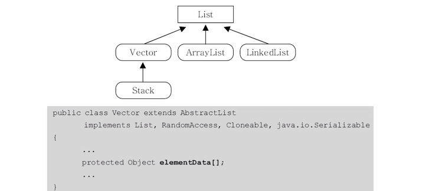
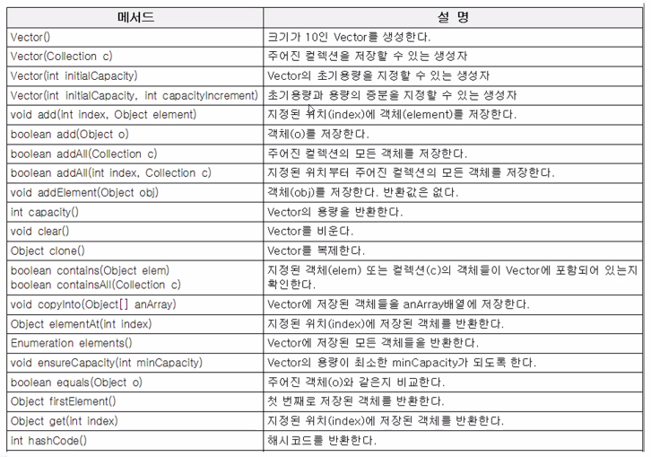

`10은 건너 뛰셨음¯\_(ツ)_/¯`

## 컬렉션 프레임웍

### 컬렉션 프레임웍(collrections framework )이란?

-  **컬렉션(collection)**

  여러 객체(데이터)를 모아 놓은 것을 의미

- **프레임웍(framework)**

  표준화, 정형화된 체계적인 프로그래밍 방식

- **컬렉션 프레임웍(collrection framework)**

  컬레션을 다루기 위한 표준화된 프로그래밍 방식

  컬렉션을 쉽고 편리하게 다룰 수 있는 다양한 클래스를 제공

  java.util패키지에 포함

- **컬렉션 클래스(collection class)**

  다수의 데이터를 저장할 수 있는 클래스

  `Vertor, ArrayList, HashSet`

###  컬렉션 프레임웍의 핵심 인터페이스

- **List**는 **순서에 의미**를 부여했기 때문에 **중복 데이터를 허용**하며 중요합니다. 

- **Set**은 중복데이터를 허용하지 않습니다. 그 대신 순서에 의미를 부여하지 않습니다.

- **Map**은 **키와 값**의 **쌍으로 구성**되었습니다.**키는 중복을 허용하지 않으며** **값은 중복을 허용**합니다. 키가 중복이 없어 정보를 찾을 때 유리합니다.

### 컬렉션 프레임웍의 동기화

- 멀티쓰레드 프로그래밍에서는 컬렉션 클래스에 동기화 처리가 필요합니다.

- Vector와 같은 구버전 클래스들은 자체적으로 동기화처리가 되어 있다.

- ArrayList와 같은 신버전 클래스들은 별도의 동기화처리가 필요합니다.

- Collection클래스는 다음과 같은 동기화 처리 메서드를 제공합니다.

  `[주의] java.Collection은 인터페이스고 java.util.Collections는 클래스이다.`

  

  > **동기화**
  >
  > 흔히 서로가 알고 있는 정보를 일치시키는 것을 말합니다. 컴퓨터 영역에서 보면 데이터를 일치시키는 겁니다. 이렇게 데이터를 일치시키고 일치하지 않는 오류를 피하기 위해서는 프로세스가 순차적으로 처리 되어야합니다.
  >
  > 즉, 다양한 작업이 동시에 실시되는 게 아닌 요청을 보내고 응답을 받은 후 다음 동작을 실시하는 겁니다. 이러한 것을 **동기화 방식**이라고 합니다.
  >
  > 무언가가 사용되거나 실행될 때 마구잡이로 실행되지 못하게 **순서를 정해주는 역할**입니다.

### Vector와 ArrayList

- ArrayList는 기존의 Vector를 개선한 것으로 구현원리와 기능적으로 등일합니다.
- List 인터페이스를 구현하므로, 저장순서가 유지되고 중복을 허용합니다.
- 데이터의 저장공간으로 배열을 사용합니다.(배열기반)
- Vector는 자체적으로 동기화처리가 되어 있으나 ArrayList는 그렇지 않습니다.

### Vector

### LinkedList - 배열의 단점을 보안

