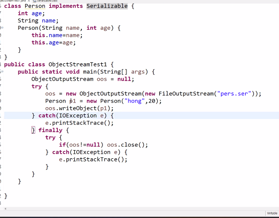

## 입출력

### 입출력과 스트림

#### 입출력이란?

입력과 출력을 줄여부르는 말로 두 대상 간의 데이터를 주고 받는 것을 말합니다.

#### 스트림이란? 

데이터를 운반(입출력)하는데 사용되는 연결통로로 연속적인 데이터의 흐름을 계곡(stream)에 비유해서 붙여진 이름입니다.

하나의 스트림으로 입출력을 동시에 수행할 수 없습니다.`단방향 통신`

입출력을 동시에 수행하려면, 2개의 스트림이 필요합니다.

### 바이트기반 스트림 - InputStream, OutputStream

데이터를 바이트(byte)단위로 주고 받습니다.

### 보조스트림

스트림의 기능을 향상시키거나 새로운 기능을 추가하기 위해 사용합니다.

독립적으로 입출력을 수행할 수 없습니다.

{: .notice}

//  먼저 기반스트림을 생성한다. FileInputStream fis = new FileInpitStream("test.txt"); //기반스트림을 이요해서 보조스트림을 생성한다. **BufferedInputStream bis = new BufferedInputStream(fis);**  bis.read();&nbsp;&nbsp;&nbsp;//보조스트림인 BufferedInputStream으로부터 데이터를 읽는다.

| 입력                | 출력                 | 설명                                                         |
| ------------------- | -------------------- | ------------------------------------------------------------ |
| FileInPutStream     | FileOutPutStream     | 필터를 이용한 입출력 처리                                    |
| BufferedInputStream | BufferedOutPutStream | 버퍼를 이용한 입출력 성능향상                                |
| DataInputStream     | DataOutputStream     | int, float와 같은 기본형 단위(Primitive type)로 데이터를 처리하는 기능 |
| SequenceInputStream | 없음                 | 두 새의 스트림을 하나로 연결                                 |
| ObjectInputStream   | ObjectOutputStream   | 데이터를 객체단위로 읽고 쓰는데 사용. 주로 파일을 이용하며 객체 직렬화와 관련있음 |
| 없음                | PrintStream          | 버퍼를 이용하며 추가적인 print관련 기능(print, printf, println 메서드) |

### 문자기반 스트림 - Reader, Writer

입출력 단위가 문자(char, 2byte)인 스트림으로 문자기반 스트림의 최고 조상입니다.

| 바이트기반                                           | 문자기반 스트림                     | 대상     |
| ---------------------------------------------------- | ----------------------------------- | -------- |
| FileInputStream FileOutputStream                 | FileReader FileWriter           | 파일     |
| ByteArrayInputStream ByteArrayOutputStream       | CharArrayReader CharArrayWriter | 메모리   |
| PioedInputStream PipedOutputStream               | PipedReader PipedWriter         | 프로세스 |
| StringBufferInputStream StringBufferOutputStream | StringReader StringWriter       | 메모리   |

| 바이트기반 보조스트림                        | 문자기반 보조스트림               |
| -------------------------------------------- | --------------------------------- |
| BufferedInputStream BufferedOutputStream | BufferedReader BufferedWriter |
| FilterInputStream FilterOutputStream     | FilterReader FilterWriter     |
| PrintStream                                  | PrintWriter                       |
| PushbackInputStream                          | PushbackReader                    |

{: .notice}

InputStream -> Reader OutputStream -> Writer

| InputStream                                                  | Reader                                                       | OuputStream                                                  | Writer                                                       |
| ------------------------------------------------------------ | ------------------------------------------------------------ | ------------------------------------------------------------ | ------------------------------------------------------------ |
| **abstract** int read() int read(**byte[] b**) int read**(byte[] b**, int off, int len) | int read() int read(**char[]** cbuf) **abstract** int read(**char[]** cbuf, int offm int len) | **abstract** void write(int b) void write(**byte[]** b) void write(**byte[]** b, int offm int len) | void write(int c) void write(**char[]** cbuf) **abstract** void write(**char[]** cbuf, int off, int len) void write(String str) void write(String str, int off, int len) |

## 바이트기반 스트림

### ByteArrayInputStream과 ByteArrayOutputStream

바이트배열(byte[])에 데이터를 입출력하는 바이트기반 스트림

## 바이트기반 보조스트림

### FilterInputStream과 FilterOutputStream

- 모든 바이트기반 보조스트림의 최고조상입니다.

- 보조스트림은 자체적으로 입출려을 수행할 수 없습니다.

  {: .notice}

  protected FilterInputStream(InputStream in) public FilterOutputStream(OutputStream out)

- 상속을 통해 FilterInputStream/FilterOutputStream의 read()와 write()를 원하는 기능대로 오버라이딩 해야합니다.

## 문자기반 스트림

### Reader와 Writer

## 문자기반 보조스트림

### InputStreamReader와 OutputStreamWriter

- 바이트기반스트림을 문자기반스트림처럼 쓸 수 있게 해줍니다.
- 인코딩(encoding)을 반환하여 입출력할 수 있게 해줍니다.

## 표준입출력과 File

### File - 파일의 속성, 생성, 삭제, 목록

## 직렬화

### 직렬화(serialization)란?

**객체**를 **연속적인 데이터로 변환**하는것. 반대과정은 `역직렬화`라고 합니다.

객체의 인스턴스들의 값을 일렬로 나열하는 것입니다.

