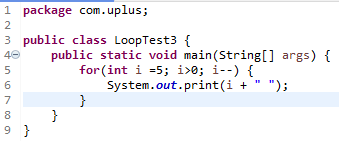

- 건강관리!!!
  - 과정을 듣거나 독학을 하면서 가장 중요했던 것이 나의 건강이
- 게임, 금주
- 하루에 알고리즘 문제 1개 이상 풀기
  -  JAVA, 파이썬
    - 백준, 정올
- 일정에 대한 문의 => 프로님께 문의


유레카 프론트앤드 개발 드라이브

https://drive.google.com/drive/folders/1sIlPHK_3CCyw_ZA7BOcqteQ6Tmp3RMJm


## JAVA 세팅

JDK 17LTS버전

[bell-sw]https://bell-sw.com에서 Download >  JDK 17 LTS 다운로드


CRUD
Create
Read
Update
Delete

**대부분의 컴퓨터 소프트웨어가 가지는 기본적인 데이터 처리 기능인 Create(생성), Read(읽기), Update(갱신), Delete(삭제)를 묶어서 일컫는 말이다**


---


강사님이 주신 자료 0610

## 유레카SW교육과정 프론트엔드 개발자 과정
이길재
jaelee1004@naver.com
010-2787-1825

### 1주차 수업
-자바특징, 활용, 실습 환경 설정, 자바 기본 문법
-1,2 차원 배열, 배열탐색

- 객체지향의 개념, 클래스와 객체 패키지(package)와 임포트(import),제어자(modifier) interface"

- java.lang : String, StringBuilder 차이점  Integer 메서드, Comparable-compareTo()

- 컬렉션 API (ArrayList, HashSet, TreeSet, HashMap) 재귀 개념 및 실습

  

0. 건강관리

1. 소통(SLACK)

2. 출석체크 (개인스케줄 지양)

3. 게임, 금주

4. 하루에 알고리즘문제 1개 이상 풀기
   ==> sw검정, 코딩테스트
   ==> Java, 파이썬, C++

일정에 대한 문의 ==> 프로님께 문의


\<백준>
[https://www.acmicpc.net](https://www.acmicpc.net)

\<정올>
[http://jungol.co.kr](http://jungol.co.kr)

==> 회원가입해 주세요^^

SW Expert  ==>  Solution.java
백준/정올    ==> Main.java
==> 패키지는 default패키지 작성!! 


### 자료공유
[https://drive.google.com/drive/folders/1sIlPHK_3CCyw_ZA7BOcqteQ6Tmp3RMJm?usp=sharing](https://drive.google.com/drive/folders/1sIlPHK_3CCyw_ZA7BOcqteQ6Tmp3RMJm?usp=sharing)

--------------------------------------------------------------------------------------------------------------------

### 자바API
[https://docs.oracle.com/javase/8/docs/api/](https://docs.oracle.com/javase/8/docs/api/)<br/>
[https://docs.oracle.com/en/java/javase/17/docs/api/](https://docs.oracle.com/en/java/javase/17/docs/api/)

--------------------------------------------------------------------------------------------------------------------

### 환경변수설정(JDK17버전)

- JDK 인스톨후 PC가 JDK의 위치를 인식하게 한다.
- JDK위치설정(bin, lib)

[https://bell-sw.com](https://bell-sw.com)

1. 자바경로
   ---> 제어판
         ---> 시스템 환경변수 편집
         ---> 고급탭
         ---> 환경변수 버튼 클릭

   변수이름:  JAVA_HOME
   변수값: C:\Program Files\BellSoft\LibericaJDK-17\

2. path 경로추가 (자바 명령어들의 위치 설정)
   %JAVA_HOME%\bin
   
3. classpath 경로추가 (새로 추가될 클래스 파일들의 위치 설정)
   .

--------------------------------------------------------------------------------------------------------------------

### 설정확인법
<span style="color: red">※ 주의: 위의 설정이 끝난후 cmd창을 새롭게 열어서 확인하여야 함.</span>

1. cmd(command)창열기

2. C:\Users>javac -version    ==> 컴파일 명령어
    javac 17.11

    


3. C:\Users>java -version   ==> 인터프리터 명령어
    openjdk version "1.8.0_192"

    openjdk version "17.0.9" 2023-10-17 LTS
    OpenJDK Runtime Environment (build 17.0.9+11-LTS)
    OpenJDK 64-Bit Server VM (build 17.0.9+11-LTS, mixed mode, sharing)

--------------------------------------------------------------------------------------------------------------------

### 프로그램 작성

1. 메모장 열기 
   
- 좌측하단 윈도우 버튼에서 notepad 입력
  
2. 프로그램 작성 
    소스코드(HelloTest.java) 작성
    ----> 사람이 읽을 수 있는 파일을 Source File이라고 함.

  ``` java
   public class HelloTest
   {
      public static void main(String args[])
       {
          System.out.println("안녕, 자바~!!"); //실행할 일 정의
       }
   }
  ```

  {: .notice}

   ===> 저장파일명은 반드시 첫줄의 class 뒤에 있는 단어와 일치!!(대소문자까지)<br/> ===> HelloTest.java (O)<br/>&nbsp;&nbsp;&nbsp;&nbsp;&nbsp;&nbsp;&nbsp;&nbsp;&nbsp;&nbsp;&nbsp;&nbsp;helloTest.java (X)<br/>&nbsp;&nbsp;&nbsp;&nbsp;&nbsp;&nbsp;&nbsp;&nbsp;&nbsp;&nbsp;&nbsp;&nbsp;Hellotest.java (X)

   컴파일) 
     HelloTest.java   ------Compile(javac.exe)------->  HelloTest.class

   명령어 실행)
     javac 컴파일하고자 하는 자바파일명(.java확장자 포함)
     ----> javac HelloTest.java

  {: .notice}

  <br>이거를 하면 작성한 java의 class 파일을 생성하라는 이야기고<br/><br/>그렇게 생성된 class 파일을<br/><br/>java HelloTest를 통해서 분해 분석하여 실행하도록 한다.

3. 바이트코드(HelloTest.class)실행
    ---> Source File은 자바JVM(자바가상머신)이 읽을 수 없으므로
      반드시 컴파일 과정을 거쳐 ByteCode File로 변환시켜야 함.
    
     인터프리터)
    
     HelloTest.class   ------Interpreter(java.exe)------->  JVM(OS)위에서 실행
    
      명령어 실행)
    
     java 실행하고자 하는 자바파일명`(.class확장자 포함하지 않음!!)`
    
     ----> java HelloTest


-------------------------------------------------------------------------
### ※ (자바)프로그램을 잘 하려면?

#### 1. 프로그램의 구성요소

- 필드(field, 변수) : 데이터 속성, 자료구조, 데이터를 담는 그릇`(변수 2번이상 사용되면) 또한 어떤 값이 2번이상 사용되면 변수로 사용할 것인가를 고민해보는 것이 좋다. `
- 메서드(method, 함수) : 기능, 행위
- 클래스(class) : 자바프로그램 기본단위(파일) 
                    필드와 메서드를 담는 울타리(template)

#### 2. 구성요소 구분

- 변수, 필드 : 첫글자 소문자, 단어뒤에 ( )소괄호가 포함X

- 메서드     : 첫글자 소문자, 단어뒤에 ( )소괄호가 포함O

- 클래스     : 첫글자 대문자

  ``` java
     System.out.println("안녕");
     클래스 필드  메서드
  ```

  ``` java
  public class System{
        PrintStream out;
        int su;
        void hello(){
  
  public class System{
        PrintStream out;
        int su;
        void hello(){
        }
  
  }
  
  public class PrintStream{
      public void println(String str){
  
  	}
  
  }
  
  System.out.println("안녕");
  클래스  필드 메서드
  ```

  

#### 3. 구성요소 형식

- 변수

  형식)
    자료형 변수명;
    ----> 변수선언!!

    커피  v1;<br/>
    물   v2;

  자료형 변수명; `변수선언`

   char, byte, short, int, long, float, double ,boolean,         String

  8개 ==> 자바의 기본자료형!!                          +    알파(클래스자료형)     

  - 숫자
    - 정수
      - byte
      - short
      - **int**
      - long
     - 실수
          - float
          - **double**

  - 문자

    - char          'a'   '3'   '홍'

  - 논리

       - boolean

         : 참 거짓 판별, 실행할 문장을 제어를 할 목적으로 사용한다.

  - 문자열
    
       - String      ""   "홍"   "홍길동"  


   - <span class="hlm">**메서드 ★**</span>

      리턴자료형  메서드명 <small>( 매개변수 )</small> 
      
	{: .notice}
	
	{ //메서드 시작<br>} //메서드 끝
	
	==> 매개변수의 다른 용어: 인수, 인자, argument, 파라미터(전달 데이터)
	      

```java

  void  gildong (  )

{
  
  1. 문앞으로 이동;
        2. 문열기;
        3. 되돌아오기;  return; `//생략가능`
         }

  Coffee lime **(  )**
  {
  
  1. 자판기앞으로 이동;
       2. 동전투입;
       3. 커피버튼클릭;
      4. 커피를 뽑아서 되돌아오기; return 커피; `//생략불가`
         }

Cola juwon **(int coin`(매개변수, 인수, 인자, 파라미터)`)**
    {
 
       1. 자판기앞으로 이동;
       2. 동전투입;
       3. 콜라버튼클릭;
       4. 콜라를 뽑아서 되돌아오기; return 콜라; //생략불가
          }
 
  Cola   c   =  juwon( 2000 );
```

--------------------------------------------------------------------------------------------------------------------
<이클립스 압축푼후 최초 환경설정(JDK8버전)>

- 인코딩 설정!!

  - 메뉴 Window > Preferences > encoding 검색
    (Workspace, HTML, CSS, JSP)

    ==> UTF-8변경

     json

- eclipse.ini파일 ==> -Dfile.encoding=UTF-8

  

   - 클래스

      {: .notice}

      **class 클래스명**<br/>**{**//클래스 시작<br/>**}**//클래스 끝

      ``` java
        class My
        {
           //변수 선언
       int su;
      
       //메서드 정의
       void hello(){
       	}
       }
      ```

      

<span style="color: red">※ **식별자(identifier)** 이름 규칙(**변수명, 메서드명, 클래스명**에 적용)</span>

   1. **첫글자 숫자 불가능**

      cup1, cup2 (O)

      1cup, 2cup (X)

      int su1; (O)

      int su2; (O)

      int 1su; (X)

      int 2su; (X)

      int 3su; (X)

   2. **특수문자 사용불가**

      cup@ cup%  (X)

      ➡예외) _ , $ 사용가능

      String name;

      String studentName;

      String student_name;


   3. **한글사용 가능(비권장)** 

      ==> 자바는 유니코드(16bit)를 지원하기 때문에 

      `String 학생이름;`

   4. **예약어 사용 금지. (에러발생)**

      int class;

      int public;

      int if;

      

<span style="color: red">※ 자바자료형(DataType)</span>
   ==> 기본자료형 8개 + 클래스자료형/레퍼런스자료형(알파)

`int room;`

- 문자 - char
  - char ch;  //변수 선언: ch변수에 문자데이터를 받겠음

       ​		ch='a'; //변수 초기화(값을 할당)

       ​		ch='가';

       ​		ch='3';	

       ​		ch ='길동';(x) `작은 따옴표에는 두개 이상의 문자가 올 수 없음`

  - String ----> 문자열 (문자의 나열: 0개 이상의 문자를 표현할 때 사용)

       ​		String str;
       ​    	str="홍길동"; (O)
       ​    	str="홍";    (O)
       ​    	str="";      (O)
       ​        str='길';     (X)

- 숫자 - 정수

  byte (1byte) `코드데이터를 저장하는 용도로 사용하는 것, 숫자를 담아 연산하는 것이 아님.`

  - 1byte == 8bit == 2의 8승 == 256개
    									(-128 ~ 0 ~ 127)

  - byte b;
    							b=123;
  	    b=127;
      	    b=0;
      	    b=128; (X)
      	    b=-129; (X)
    
  - short(2byte)  
    
  - int  (4byte)  : 가장 많이 사용

    `int i = 345`

  - long (8byte)

- 실수

  - float (4byte)

  - double (8byte) :  많이 사용

    double d = 3.14;

- 논리 - boolean (반복문,제어문과 함께 많이 사용) `참 또는 거짓을 담는 자료형`

  - boolean b1;

    b1=true; (O)

    b1=false; (O)

  - boolean b2;

    b2='true';  (X)

    b2="false"; (X)

  

---------------------------------------------------
 문자: char, String

 숫자: byte,short,int,long  float,double

 논리: boolean

**※ 자바주석문(Comment)**

 - 라인주석문

    <span style="color:green">//설명문</span>

 - 블럭주석문

    <span style="color:green">/* <br>	설명문1<br>
    	설명문2<br>
    	설명문3 <br>*/</span>

--------------------------------------------------------------------------------------------------------------------

#### 4. 구성요소 사용법

 - 필드,변수
    자료형 변수명;//변수 선언
    
    ----> 데이터 초기화(값할당)해서 사용!!
    
    ​      변수명=데이터; //변수 초기화
    
    ----> 선언과 동시에 초기화 하는 것이 가능!!
    
    예) int a;`선언`
    
    ​        	a=10; `초기화`
    
    ​    int b=20; `선언과 초기화를 함께 실행`
    
 - 메서드

   리턴자료형 메서드명()

   ``` java
   {
       //기능 정의
       ....
   } //구현된 메서드, 정의된 메서드
     //define method
   ```

   => 호출해서 사용! 메서드명();

 - 클래스

   ``` java
class 클래스명
   {
       //변수 선언
       //메서드 정의
   }

   ex)
    void hello(){
       
	}
   ```

   => 객체생성(=메모리 할당)해서 사용!!

   

   ★객체생성식

    A           obj<small>`(참조변수/레퍼런스 변수)`</small> =      **new** <small>`(동적 메모리 할당)`</small>                A();
   
   &nbsp;&nbsp;&nbsp;&nbsp;&nbsp;&nbsp;&nbsp;&nbsp;&nbsp;&nbsp;&nbsp;&nbsp;&nbsp;&nbsp;&nbsp;&nbsp;&nbsp;&nbsp;&nbsp;&nbsp;**static**<small>`(정적 메모리 할당)`</small>	  
   
   클래스명  변수명   객체생성키워드    클래스명
   
   ``` java
   class A
    {
     int su;
   
     void hello()
       {
         System.out.println("A클래스안녕~!!");
       }

     class B{
   
   	}
    }
   ```
   
   ``` java
   class A
    {
    static  int su;
    
    static  void hello()
      {
        System.out.println("A클래스안녕~!!");
      }
   
      static  class B{
   
       }
   }
   ```

--------------------------------------------------------------------------------------------------------------------
### 자바 연산자

1. 산술연산자

   \+ \- \* /(몫 구하기)  %(나머지 구하기)

   10/5 ---> 2

   10/3 ---> 3

   

   10%5 ---> 0

   10%3 ---> 1

    N%5

2. 증감연산자

   ++(1증가), --(1감소)

   int su1;

   ​    su1=10;

   int su2;

   ​    su2=10;

   

    System.out.println(su1++); `우선 su1을 출력하고 1증가 = 10`

    System.out.println(++su2); `우선 증가하고 출력 = 11`

   {: .notice}

   System.out : moniter => 출력 장치<br>System.in : 키보드 => 입력 장치

     su1++;(후위연산자,나중연산자)  //su1=su1+1;

   ++su1;  (전위연산자,먼저연산자)  //su1=su1+1;

     su1--;//su1=su1-1;

   --su1;  //su1=su1-1;


3. 비교(관계)연산자 <small>**(결과값이 항상 boolean!!)**</small>
   
   \>(크다) <(작다)  >=(크거나 같다)  <=(작거나 같다)  ==(같다) !=(다르다)
   
   <span style="color:red">**※주의** </span>
        \>=  : 반드시 부등호 먼저
        \> = : 띄어쓰기 불가
        !== : 등호는 한개
   
   int a=3;
   
   int b=4;
   
   System.out.println(a > b); ---> false
   
   System.out.println(a < b); ---> true
   
      System.out.println(a == b); ---> false
   
      System.out.println(a != b); ---> true
   
      boolean boo = a==b;


4. 논리연산자 (결과값 boolean!!)

   &&<small>(and연산자,그리고 연산자 )</small>

   \|\|<small>(or연산자,또는 연산자)</small>

    ※A,B는 boolean 데이터!!<br><small>**(true가 1, false가 0이라는 가정)** </small>

   A && B   ---> 모든 조건을 만족했을 때 결과값 true!!(만족:true,불만족:false)

      0    0   ---> false

      0    1   ---> false

      1    0   ---> false

      1    1   ---> true

   A \|\| B   ---> 하나의 조건이라도 만족했을 때 결과값 true!!

      0    0   ---> false

      0    1   ---> true

      1    0   ---> true

      1    1   ---> true

   \<윤년의 조건>

   1. 연도를 4로 나누어 나머지가 0이고
      연도를 100 으로 나누어 나머지가 0이 아닌 경우.

   2. 연도를 400으로 나누어 나머지가 0인 경우.

      실행결과)
             ==> 조건을 만족했을때 true 출력
             ==> 조건을 만족하지않았을때 false 출력

      class명: LeapYearTest

      변수: int year = 2022;

      


---

### 조건문 

조건에 따라 실행할 문장들을 제어하는 역할.

- `반드시 메서드내에 기술.`

1. **if문(나홀로 if문)**

     if(조건식) <small>//조건식: boolean데이터!!</small><br>
     {<br>
       조건식의 결과가 참일때 실행할 문장;<br>
     }


2. **if~else문(양자택일 조건검사)**

      if(조건식){<br>
        조건식 결과가 `참`일때 실행할 문장.<br>
      }else{<br>
        조건식 결과가` 거짓`일때 실행할 문장.<br>
      }

   ※주의)  
        else는 홀로 사용이 불가!!<br>
              반드시 if(){}블럭 뒤에 위치를 해야 함.

   <윤년의 조건>

   1. 연도를 4로 나누어 나머지가 0이고
      연도를 100 으로 나누어 나머지가 0이 아닌 경우.

   2. 연도를 400으로 나누어 나머지가 0인 경우.

      `실행결과)`<br>
             ==> 2024년은 평년입니다.<br>
      	   또는<br>		==> 2024년은 윤년입니다.

      

3. switch~case문 (다중택일 조건문)

   switch(수식)

   <small>//수식: 정수데이터(byte,short,int),문자데이터(char)<br>
              //     **JDK7버전이후**부터 String데이터가 포함</small>

   {<br>
         case 비교값1: 실행할 문장1; break;<br>
         case 비교값2: 실행할 문장2; break;<br>
         case 비교값3: 실행할 문장3; break;<br>
         case 비교값4: 실행할 문장4; break;<br>
         default: 일치하는 case값이 없을 때 실행할 기본문장;<br>
   }

   예) 

   switch(2){<br>
        case 1: System.out.println("가");<br>
        case 2: System.out.println("나");<br>
        case 3: System.out.println("다"); <br>
      }
   
4. if~else if~else문 (서로 연결된 조건식을 표현할 때 사용, 필터링, 수의 범위표현)

      if(조건식1){ <span style="color:green"><small>// su>100<br>
           //조건식1이 참일때 실행할 문장</small></span><br>
         }else if(조건식2){<br><span style="color:green"><small> // su>90   :   90 < su <= 100<br>
           //조건식1이 거짓이고 조건식2가 참일때 실행할 문장</small></span><br>}else if(조건식3){
         <span style="color:green"><small>   //조건식1,2가 거짓이고 조건식3이 참일때 실행할 문장</small></span><br>
         }else{<br>
          <span style="color:green"><small> //조건식1,2,3이 거짓일때 실행할 문장(나머지 처리)</small></span><br>
         }

      <클래스의 구성>

      ---> (클래스 == 자바프로그램 파일)

      class 클래스명

      {<br>

      **---> 변수선언**<small>`member variable == field`</small><br>
         자료형 변수명;<br>

      **---> 메서드정의**<br>리턴자료형 메서드명(매개변수 선언)<br>{<br>&nbsp;&nbsp;&nbsp;---> 변수선언<small>`local variable != field`</small><br>&nbsp;&nbsp;&nbsp;---> 변수초기화<br>&nbsp;&nbsp;&nbsp;---> **메서드호출**<br>&nbsp;&nbsp;&nbsp;---> 조건문, 반복문<br>&nbsp;&nbsp;&nbsp;}<br>
      }

      

### 제어문

1. **break문**
   
   - **switch블럭** 또는 **loop블럭**(for,while,do~while)내에서 사용하며
     해당 영역을 빠져나가는 역할.
- 사용: break;
  
2. continue문
   - 반드시 loop영역내에서만 사용!!
   
   - loop영역의 끝괄호 역할!!
     for: 증감자 ---> 조건식
     while: 조건식
     do~while: 조건식
     
   - 사용: continue;
   
     {: .notice}
   
     **문제) 다음 점수에 해당하는 학점을 화면에 출력하시오.**<br>int jumsu=85;<br>
     ---> 출력값: B학점입니다!!<br>jumsu (가정:0~100의 정수값)<br> 90~100     A학점<br>
        80~89      B학점<br>
        70~79      C학점<br>
        60~69      D학점<br> 0~59       F학점<br>class명: JumsuTest.java

### 반복문 Loop

1. for문

   - <span style="hlm">일정횟수 반복할 때 사용.</span>

   - <span style="hlm">규칙적인 수</span>를 표현할 때 사용.

   - **배열의 인덱스**를 표현할 때 사용.

     [형식]

     for(초기화1;  조건식2;  증감연산자3)

      {

     ​	반복적으로 실행될 문장4

     }

     실행순서]

     ​	1 - 2(true) - 4 - 3

     ​		-2(true) - 4 - 3

     ​		-2(true) - 4 - 3

     ​		-2(true) - 4 - 3

     ​		-2(false) : for문 탈출!!

     적용예)

      for(int i=1; i<=10; i++){

        System.out.println("안녕~!!");
      }

2. while문 

   - 조건이 참인동안 반복실행.

   - 조건이 만족되지않는다면 한번도 실행되지 않을 수 있고
     조건이 만족한다면 무한히 실행할 수도 있음.
     ===> 실행횟수: **0~무한대**
     ※if문의 실행횟수: 0 또는 1

   - 반복되는 횟수가 일정치 않을때 사용!!

   - 서버의 리스너를 표현할때 ==> 무한반복할때

       [형식]

      while(조건식)
      {
         //조건식 결과가 참인 동안 실행할 문장;
      } 

3. do~while문

   - while문과 동일
     <span class="hlm">차이점</span>: 실행횟수(1~무한대) ==> 조건식 결과와 상관없이 무조건 한번실행!!

       [형식]

       do{
         반복실행할 문장;

     ​	}while(조건식);

     - 프로그램실행결과)

       \<메뉴>
       1.추가 2.검색 3.수정 4.삭제 5.종료

       번호==> 1

       #데이터 추가 완료!!

       

       \<메뉴>

       1.추가 2.검색 3.수정 4.삭제 5.종료

       번호==>

--------------------------------------------------------------------------------------------------------------------
### System.out의 print(),println()메서드의 차이

1. System.out.print(데이터);
   - 데이터 출력
   
   System.out.print("가");
   System.out.print("나");   
   출력결과 ---> 가나
   System.out.print();  ---> 에러발생!!

2. System.out.println(데이터);
   - 데이터 출력
   - 줄바꿈(ln---> line new)

   System.out.println("가");
   System.out.println("나");
   출력결과:
   
   가
   
   나
   
   System.out.println(); ---> 줄바꿈 실행!!
   
   **기본자료형과 레퍼런스 자료형의 차이를 이해해야한다.**

---

#### 연습 문제


1) 다음과 같이 화면에 출력하시오.

   1
   2
   3
   4
   5

---


2) 다음과 같이 화면에 출력하시오.

   1 2 3 4 5

---


3) 다음과 같이 화면에 출력하시오.

​	5 4 3 2 1

---



4) 다음과 같이 화면에 출력하시오.

​	3 6 9 12

---


5) 다음과 같이 화면에 출력하시오.

​	[5, 10, 15, 20]

---


6) 다음과 같이 화면에 출력하시오.

> *
>
> ** 
>
> \***
>
> 
>
> \***
>
> **
>
> *
>
> 

7) 아래와 같은 프로그램 실행을 할 수 있게 프로그램을 작성하시오. <small>(do~while문 사용)</small>

> [실행결과]
>
> <<메뉴>>
>
> 1.검색 2.증가 3.감소 4.종료
>
> 번호==> 1
>
> #검색결과:0
>
> <<메뉴>>
>
> 1.검색 2.증가 3.감소 4.종료
>
> 번호==> 2
>
> #1증가하였습니다.
>
> <<메뉴>>
>
> 1.검색 2.증가 3.감소 4.종료
>
> 번호==> 2
>
> #1증가하였습니다.
>
> <<메뉴>>
>
> 1.검색 2.증가 3.감소 4.종료
>
> 번호==>1
>
> #검색결과:2
>
> <<메뉴>>
>
> 1.검색 2.증가 3.감소 4.종료
>
> 번호==>4
>
> -- END --
>
> class명: MenuMission.java
>
> int no=0;
>
> ---
>
> 


---


### 자바의 입력

- 프로그램 실행 도중 필요한 시점에 데이터를 입력받는 것.

- 변경되는 데이터를 소스프로그램 변경없이 외부에서 전달하기 위해 사용.

  `학점구하기, 성별구하기`

1. byte단위입력
   - 숫자입력

     int su =  System.in.read()-48;

     표준입력==> 키보드입력

     ​      

     키보드입력       프로그램에서 받는 값  ==> (ASCII코드 값)
     	

     0     ---->      48

     1     ---->      49

     2     ---->      50

     3     ---->      51

     5     ---->      53

     9     ---->      57

   - 문자입력

     char ch = (char)System.in.read();

     키보드입력       프로그램에서 받는 값  ==> (ASCII코드 값)
     	

     a     ---->      97
     b     ---->      98

     c     ---->      99

     A     ---->      65

     B     ---->      66

     C     ---->      67

     (자료형)데이터

     캐스팅casting연산자  : 형변환연산자!!

     int su=300;  double d=3.14;  

     int su2 = 3.14;   //에러? O

     &nbsp;&nbsp;&nbsp;su2 = (int)3.14; //double데이터를 int데이터로 형변환하겠음!!

     System.out.println(su2);  ==> 3

     double d2 = 300;  //에러? X  ==> 자동형변환

     System.out.println(d2);  ==> 300.0

     System.out.println(97);  ==> 97

     System.out.println( (char)97 );  ==> a

     ``` java
     class A{
     
        void hello(){  }
     }
     
     class BufferedReader{
       String readLine()
       {
         return "키보드를 통해 입력된 값";
       }
     }
     
     
     class Test{
     
        public static void main(String []args){
            A a = new A();
              a.hello();
            BufferedReader br = new BufferedReader();
     	 String str = br.readLine();
        }
     
     }
     ```

     

2. 라인단위입력
   - 객체생성

      BufferedReader in = new BufferedReader(new InputStreamReader(System.in));

   - 문자열입력

     String str = in.readLine(); //a b c d 엔터  ---> "abcd"

     ​                            //1 2 3 4 엔터  ---> "1234"

     str+300  ? 1534(X)  "1234300"(O)

   - 숫자입력(위에서 입력된 값에 대해 사칙연산을 하고 싶다!!)
     
   
   int su = Integer.parseInt( str ); //parseInt(): 숫자로 구성된 문자열을 숫자로 변환하는 기능
   
   su + 300 ? 1534 (O)
   
     Integer.parseInt("123"); ==>결과값 123

--------------------------------------------------------------------------------------------------------------------
#### 연습문제

문제) 아래와 같이 실행하는 프로그램을 작성하시오(for문 사용)

[실행결과]

<3단>

3*1=3

3*2=6

3*3=9
....

3*9=27

==> GugudanTest.java

--------------------------------------------------------------------------------------------------------------------
### [Escape Character] Escape Sequence

- 특수문자, 확장문자
- 기능을 갖는 확장된 문자
- 주의: 인용부호내에서만 사용해야 함!!
   System.out.println("seoul \n ssafy");

#### 종류

​	\n : new line ,  Line Feed(LF) , 줄바꿈

​	\r : Carriage Return(CR), 커서의 위치를 맨앞으로 이동. 

​	\t : Tab, 일정간격 띄우기

​	\\\ : '\'문자표현

​	\\" : 큰따옴표

​	\\' : 작은따옴표

--------------------------------------------------------------------------------------------------------------------
### printf()메서드
 JDK5버전 부터 지원!! 
C언어와 같음

 f: format(형식)을 의미

- **포맷스트링(FormatString)** 

  - %s(문자열) %c(문자) %d(십진수,정수) %f(실수) %b(논리)

    ---> 포맷스트링의 수만큼 뒤에 인자가 매핑됨.

    {: .notice}

    사용]<br>System.out.printf("출력포맷형식", 출력할 바인드데이터);

    ``` java
     System.out.printf("hello %s java","안녕");
    
           ---> 출력결과)  "hello 안녕 java"
    ```

    ``` java
     System.out.printf("hello %d java", 300);
    
           ---> 출력결과)  "hello 300 java"
    ```

    ``` java
     System.out.printf("hello %s java %d","안녕",500);
    
          ---> 출력결과)  "hello 안녕 java 500"
    ```

    ``` java
     System.out.printf("hello%5djava", 345); //---> 5칸의 자리 확보후 우측정렬
    
           ---> 출력결과)  "hello  345java"	
    ```

    ``` java
     System.out.printf("hello%-5djava", 345); //---> 5칸의 자리 확보후 좌측정렬
    
           ---> 출력결과)  "hello345  java"
    ```

    ``` java
    double d = 3.4567;
    => 소수점이하 2자리까지 출력하시오.
    System.out.printf("%.3f", d);
    ```

    

    