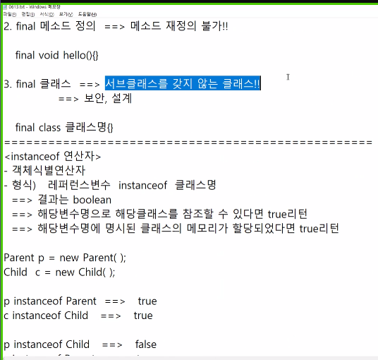

## 자바 프로그램을 잘하려면?

## 자바 시험 전 정리

1. 프로그램의 구성요소

   - 필드

     데이터 속성 자료구조, 데이터를 담는 그릇

   - 메서드

     기능, 행위

   - 클래스

     필드와 메서드를 담는 울타리

2.  구성요소 구분

   - 변수, 필드

     첫글자 소문자. 단어뒤에 ()소괄호가 포함❌

   - 메서드

     첫글자 소문자, 단어뒤에 소괄호 포함⭕

   - 클래스

     첫글자 대문자

- 자주 발생하는 에러
  - 컴파일 에러
  - 실행에러(runtime)

- 기본 자료형

  char, bytr, short ,int, long, float, double, boolean


클래스를 생성하고 main에서 사용하려면 static으로 설정해준다.

그러면 생성하지 않아도 사용가능하다.

- 후위 연산자<small>(나중연산자)</small>

  `su++;`

- 전위 연산자<small>(먼저연산자)</small>

  `++su;`

### 객체지향의 특징

1. 캡슐화

   정보은닉

   모듈성

2. 상속

   - 부모가 갖는 자원(필드, 메소드)을 아낌없이 물려주는 것
   - 관련키워드: `extends`
   - 단일 상속이 기본원칙

3. 다형성

   - <span class="hlm">메소드 오버라이딩<small>(MethodOverriding)</small></span>

     상속 관계에 있는 부모 클래스에서 이미 정의된 메소드를 자식 클래스에서 같은 시그니쳐를 갖는 메소드로 다시 정의하는 것이라고 할 수 있다.

     

     

   - 메소드 오버로딩<small>(MethodOverloading)</small>

     자바에서 한 클래스 내에서 이미 사용하려는 이름과 같은 이름을 가진 메소드가 있더라도 매개변수의 개수 또는 타입이 다르면, 같은 이름을 사용해서 메소드를 정의할 수 있다.

### this 자기참조 연산자

현재 클래스를 가르키는 레퍼런스 변수(참조 변수)

`보통은 생략함`

1. 메소드 내에서 사용

2. 객체 생성자내에서 다른 생성자를 호출시 사용

3. 매개변수(지역변수)와 멤버변수(필드)를 구분하기 위해 멤버변수 앞에 this.를 붙여서 사용

   ``` java
   this.필드명
   this.메소드명();
   this(); //생성자 호출
   ```


- 접근 지정자

  - public

    서로 다른 패키지에서도 접근 가능

  - protected

    서로 같은 패키지에서 접근 가능, 만약 상속관계를 갖는다면 다른 패키지라도 자식이 부모를 참조

  - default

    서로 같은 패키지에서 접근 가능

  - private

    같은 클래스 내에서만 접근 가능

### 자바빈(자바클래스)

서로 관련성 있는 속성을 묶어주는 클래스

- DTO<small>(Data Transfer Object)</small>, VO<small>(Value Object)</small> 라는 이름으로도 사용
- 속성은 private 선언


for중첩문에서 break해서 빠져나올 때,  break 선언된 for문 말고 다른곳으로 빠져나가고 싶다고 하면 추가로 flag를 사용해 줘야한다.


그래서 레이블을 작성해준것이다.`ureca:, good:`를 레이블을 사용해주면 벗어나는 것이 간단하다.

break뿐만 아니라 continue도 가능하다. 레이블은 반복문 위에다가 적어준다.


static기억하기

static 키워드를 붙이면 자바는 메모리 할당을 딱 한 번만 하게 되어 메모리를 적게 사용할 수 있다.

또한 값을 공유할 수 있다. ➡ static으로 설정하면 같은 메모리 주소만을 바라봐서 static 변수의 값을 공유하게 된다.

### final




### instanceOf 연산자


- 객체식별연산자

  ``` java
  레퍼런스 변수 instanceOf 클래스명
  ```

  결과는 boolean

  해당변수명으로 해당클래스를 참조할 수 있다면  true리턴

  

