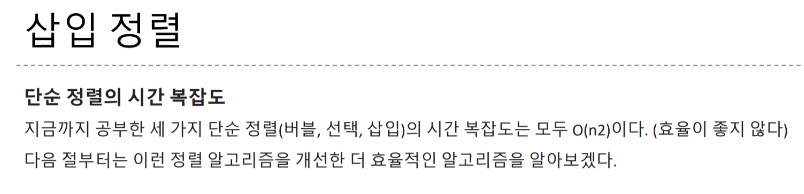

## 시간 복잡도 표기법 알아보기

알고리즘에서 시간 복잡도는 **주어진 문제를 해결**하기 위한 **연산 횟수**를 말한다.

일반적으로 **1억번의 연산**을 1최의 시간으로 간주하여 예측한다.

### 시간 복잡도의 유형

시간 복잡도를 정의 하는 3가지 유형은 다음과 같다.

- 빅-오메가

  최선일 때(best case)의 연산 횟수를 나타낸 표기법

- 빅-세타

  보통일 때(average case)의 연산 횟수를 나타낸 표기법

- 빅-오

  최악일 때(worst case)의 연산 횟수를 나타낸 표기법


### 시간 복잡도 표기법 알아보기

빅-오 표기법<small>(O(n))</small>으로 표현한 시간 복잡도 그래프


효율성 : O(1) >O(log n) > O(n) > O(n x log n) > O(n^2) > O(2^n) 

**대표 알고리즘**

- O(1): Operation push and pop on Stack
- O(log n): Binary Tree
- O(n): for loop
- O(nlog n): Quick Sort, Merge Sort, Heap Sort
- O(n<sup>2</sup>): Double for loop, Insert Sort, Bubble Sort, Selection Sort
- O(2<sup>n</sup>): Fibonacci Sequence
- O(n!) : 순열, 조합

| 표기법           | 이름      | 시간 복잡도    | 설명                                                         | 예시                                   |
| ---------------- | --------- | -------------- | ------------------------------------------------------------ | -------------------------------------- |
| O(1)             | 상수      | 상수 시간      | 입력 크기와 상관없이 일정한 실행 시간을 가집니다.            | 배열에서 원소 하나 찾기                |
| O(logn)          | 로그      | 로그 시간      | 입력 크기가 증가함에 따라 실행 시간이 로그함수의 형태로 증가합니다. | 이진 탐색 알고리즘                     |
| O(n)             | 선형      | 선형 시간      | 입력 크기와 비례하는 실행 시간을 가집니다.                   | 선형 탐색 알고리즘                     |
| O(nlogn)         | 로그 선형 | 선형 로그 시간 | 입력 크기가 증가함에 따라 실행 시간이 로그함수와 선형함수의 곱의 형태로 증가합니다. | 병합 정렬, 정렬 알고리즘               |
| O(n<sup>2</sup>) | 이차      | 이차 시간      | 입력 크기의 제곱에 비례하는 실행 시간을 가집니다.            | 선택 정렬, 버블 정렬, 퀵 정렬 알고리즘 |
| O(2<sup>n</sup>) | 지수      | 지수 시간      | 입력 크기의 지수에 비례하는 실행 시간을 가집니다.            | 부분집합                               |
| O(n!)            | 계승      | 팩토리얼 시간  | 입력 크기의 팩토리얼에 비례하는 실행 시간을 가집니다.        | 외판원 문제                            |

### 스택

### 피크 메서드<small>(peek)</small>

스택의 꼭대기에 있는 데이터를 들여다보는 메서드이다.

스택이 비어 있으면 예외를 내보낸다. 스택이 비어 있지 않으면 꼭대기에 있는 요소의 값을 반환한다. 이때 데이터를 넣거나 빼지 않으므로 스택 포인터는 변화시키지 않는다.


``` java
//비교하는 값 중에 앞에 값이 크다면
swap
temp = arr[i];
arr[i] = arr[j];
arr[j] = temp;
```




세 정렬이 기본은 N<sup>2</sup>이지만 삽입정렬의 경우에는 O(N)의 시간복잡도를 가지는 경우도 생긴다.

자바의 Arrays안에 있는 sort는Tim sort이다


- 참조 지역성 원리

  CPU가 미래에 원하는 데이터를 예측하여 속도가 빠른 장치인 캐시 메모리에 담아 놓는데 이때의 예측률을 높이기 위하여 사용하는 원리이다. 쉽게 말하자면, 최근에 참조한 메모리나 그 메모리와 인접한 메모리를 다시 참조할 확률이 높다는 이론을 기반으로 캐시 메모리에 담아놓는 것이다. 메모리를 연속으로 읽는 작업은 캐시 메모리에서 읽어오기에 빠른 반면, 무작위로 읽는 작업은 메인 메모리에서 읽어오기에 속도의 차이가 있다.