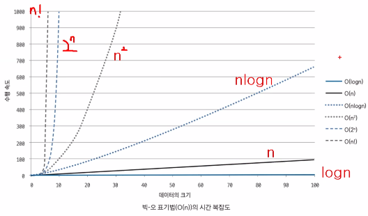

## 시간 복잡도 표기법 알아보기

알고리즘에서 시간 복잡도는 주어진 문제를 해결하기 위한 연산 횟수를 말한다.

일반적으로 1억번의 연산을 1최의 시간으로 간주하여 예측한다.

### 시간 복잡도의 유형

시간 복잡도를 정의 하는 3가지 유형은 다음과 같다.

- 빅-오메가

  최선일 때(best case)의 연산 횟수를 나타낸 표기법

- 빅-세타

  보통일 때(average case)의 연산 횟수를 나타낸 표기법

- 빅-오

  최악일 때(worst case)의 연산 횟수를 나타낸 표기법





효율성 : O(1) >O(log n) > O(n) > O(n x log n) > O(n^2) > O(2^n) 

대표 알고리즘

- O(1): Operation push and pop on Stack
- O(log n): Binary Tree
- O(n): for loop
- O(nlog n): Quick Sort, Merge Sort, Heap Sort
- O(n<sup>2</sup>): Double for loop, Insert Sort, Bubble Sort, Selection Sort
- O(2<sup>n</sup>): Fibonacci Sequence
- O(n!) : 순열, 조합


``` java
//비교하는 값 중에 앞에 값이 크다면
swap
temp = arr[i];
arr[i] = arr[j];
arr[j] = temp;
```


세 정렬이 기본은 N<sup>2</sup>이지만 삽입정렬의 경우에는 O(N)의 시간복잡도를 가지는 경우도 생긴다.

자바의 Arrays안에 있는 sort는Tim sort이다


- 참조 지역성 원리

  CPU가 미래에 원하는 데이터를 예측하여 속도가 빠른 장치인 캐시 메모리에 담아 놓는데 이때의 예측률을 높이기 위하여 사용하는 원리이다. 쉽게 말하자면, 최근에 참조한 메모리나 그 메모리와 인접한 메모리를 다시 참조할 확률이 높다는 이론을 기반으로 캐시 메모리에 담아놓는 것이다. 메모리를 연속으로 읽는 작업은 캐시 메모리에서 읽어오기에 빠른 반면, 무작위로 읽는 작업은 메인 메모리에서 읽어오기에 속도의 차이가 있다.