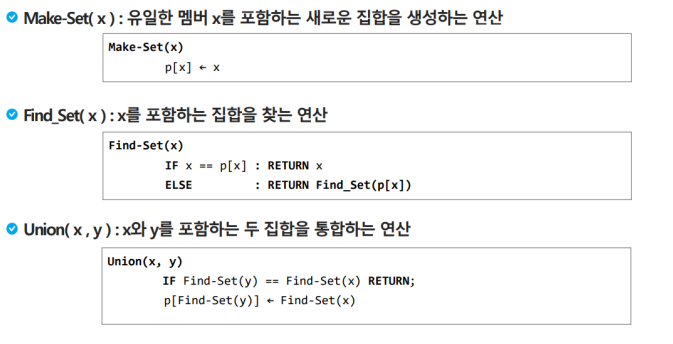

## 서로소집합

서로소 또는 상호배타 집합들은 **서로 중복 포함된 원소가 없는 집합**들이다. 다시 말해 교집합이 없다. 

집합에 속한 하나의 **특정 멤버**를 통해 각 집합들을 구분한다. 이를 대표자<small>(representative)</small>라 한다.

- 서로소 집합을 표현하는 방법

  - 연결 리스트
  - 트리

- 서로소 집합 연산

  - Make-Set(x)

    `x에대한 집합을 생성`

  - Find-Set(x)

    `x가 들어있는 집합의 대표자 찾기`

  - Union(x, y)

    `대표자가 같으면 합치기`

- 같은 집합의 원소들은 하나의 연결리스트로 관리한다.

- 연결리스트의 맨 앞의 원소를 집합의 **대표 원소**로 삼는다.

- 각 원소는 집합의 대표원소를 가리키는 링크를 갖는다.

  

- 같은 집합의 원소들을 하나의트리로 표현한다.

- 자식 노드가 부모 노드를 가리키며 루트 노드가 대표자가 된다.

  

- 서로소 집합을 표현한 트리의 배열을 이용한 저장된 모습

  

  

| 인덱스      | 0    | 1    | 2    | 3    | 4    | 5    |
| ----------- | ---- | ---- | ---- | ---- | ---- | ---- |
| 노드        | a    | b    | c    | d    | e    | f    |
| 부모 인덱스 | 0    | 1    | 2    | 2    | 2    | 4    |

### 연산표현 살펴보기

- Make-Set(x)

  유일한 멤버를  x를 표함하는 새로운 집합을 생성하는 연산

  

## 최소 신장 트리

- 그래프에서 최소 비용 문제
  1. 모든 정점을 연결하는 간선들의 가중치의 합이 **최소가 되는 트리**
  2. 두 정점 사이의 최소 비용의 **경로 찾기**

- **신장 트리**

  n개의 정점으로 이루어진 무향 그래프에서 n개의 정점과 **n-1개의 간선**으로 이루어진 트리

- 최소 신장 트리<small>(Minimum Spanning Tree)</small>

  무향 가중치 그래프에서 신장 트리를 구성하는 간선들의 가중치의 합이 최소인 신장 트리

### KRUSKAL

- 간선을 하나씩 선택해서 MST를 찾는 알고리즘

  1. 최소, 모든 간선을 가중치에 따라 **오름차순**으로 정렬
  2. 가중치가 **가장 낮은 간선부터 선택**하면서 트리를 증가시킴
  3. n-1개의 간선이 선택될 때까지 2번을 반복

  

  

