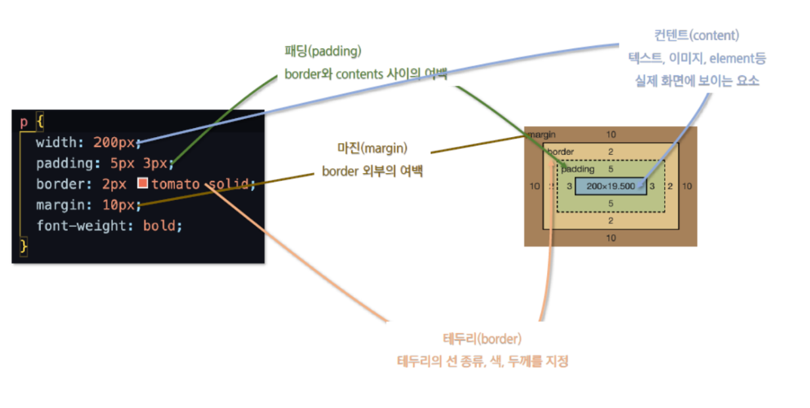

## + CSS

### Box Model

- CSS의 모든 엘리먼트는 여러 겹의 상자로둘러 쌓여 있따고 가정한다.

- 모든 HTML 요소는 사각형의 박스 모델이고 위에서 아래로(Block level), 왼쪽에서 오른쪽으로(Inline Level)으로 쌓인다.

- 컨텐트(Content), 패딩(Padding), 테두리(Border), 마진(Margin)으로 구분.

- 컨텐트 정렬 또는 위치를 지정하기 위해 Padding, Margin속성을 활용.

  



모든 엘리먼트의 box-sizing은 기본값이 content-box이다.

- padding과 border를 제외한 content영역만을 box로 지정

border 까지의 영역을 box로 지정할 경우 box-sizing을 border-box로 설정


#### 마진<small>(margin)</small>

마진 속성은 Box 마진 너비를 지정한다.

- 값이 1개

  - 모든 면에 적용

- 값이 2개

  - 1번째 값은 top, bottom에 적용
  - 2번째 값은 right, left에 적용

- 값이 3개

  - 1번째 값은 top
  - 2번째 값은 right, left
  - 3번째 값은 bottom

- 값이 4개

  - {top, right, bottom, left}순으로 적용

  

  위와 같은 순서는 padding에도 적용 된다.

## JavaScript

### 자바스크립트 특징

- 웹 개발을 위한 프로그래밍 언어
- 스크립트 언어(Script Language)
- 이벤트 드리븐 방식
- 자바스크립트 표준, ECMAScript

- <span class="hlm">자료형을 명시하지 않는다.</span>

  - 값이 할당 될 때 자동으로 자료형이 정해진다.

  - 동적타이핑(동적 프로그램) 언어<small>(JavaScript, Python)</small>

    ``` javascript
    var v;
    	v='안녕';
    	v=1000;
    	v= new Date();
    ```

- HTML문서 내에서 실행

  HTML에 종속적이다. 브라우저에서 실행된다.

- HTML문서<small>(동적페이지)</small>

- HTML 문서를 통해 입력된 데이터를 얻어오고 데이터에 대한 유효성 검사를 할 때 사용

  - 유효성 검사란?

    서버에게 데이터를 보내기 전에 검사

📌자바스크립트를 사용하는 이유?

​	➡️문서 조작<small>(태그와 속성, CSS)</small>

​		조작에 필요한 데이터가 외부에 존재한다면 Ajax를 사용

DOM

➡️ Document / Object Model

​	 text<small>(html, xml)</small>

## JavaScript와 Java 비교

- JavaScript: 클라이언트<small>(사용자, 브라우저)</small>➡️ 스크립트: 브라우저에서 실행
- JSP<small>(Java)</small>: 서버 ➡️ 스크립트: JVM에서 실행

### JavaScript의 위치

HTML 문서내에 포함되어서 실행

<span class="hlm">문서내의 어떤 위치라도 정의 가능</span>

``` html
 <html>
     <head>
         <script>
                  프로그램영역!!
            ----> 변수선언, 함수(function)정의                       
         </script>
      </head>
      ----------------------------------------
      <body>
         <script>
                    프로그램영역!!
              ----> 함수 호출
         </script>
      </body>
   </html> 

```

또한 한번의 스크립트 태그를 사용하는 것이 아니라 원하는 만큼 태그를 작성하여 사용 가능하다.

### 자바스크립트의 자료형

<span class="hlm">자바스트립트는 자료형을 선언, 정의하지 않는다.⭐</span>

- 자바와 비교

  -  자바

    ``` java
    String name="홍길동";
                 name="길라임";
                 name=3000; ❌
    ```

    

  - 자바스크립트

    ``` javascript
    String name="홍길동"; ❌ 에러발생!!
                 
           name="홍길동"; ⭕ 자료형 선언하지 않고 사용!!
                                      
    let su;  ---> 변수선언      
    	su=2000;        ---> number타입
        su="김주원";     ---> String타입 
                         //대입되는 데이터에 따라 자료형이 변환됨
        su=true;        ---> boolean타입
        su= new Date(); ---> Date타입
    
    ```

    

### 자바스크립트에서의 문자열

자바스크립트에서는 작은따옴표와 큰 따옴표를 구분 없이 사용한다.

``` html
 name1= "홍길동";  ⭕              
 name2= '홍길동';  ⭕                
 name3= "김주원';  ❌
```


- 자바스크립트는 구분자, 종결자 역할을 하는 ';'을 생략하는 것이 가능

  ➡️ 라인(줄바꿈)을 통해 서로 다른 문장을 구분한다.

  ``` javascript
   name='길동'
      age=13
      ==> ⭕
  
      name="라임" age=15
      ==> ❌
  
      name="주원"; age=17
      ==> ⭕
  ```

#### 문자열 비교

- 자바

   ` "java".equals("JAVA") ` ➡️ ⭕ 문자열 내용 비교
   `"java" == "JAVA"`  ➡️ ⭕ 메모리 주소 비교

- 자바스크립트

   ` "javascript".equals("JAVASCRIPT")` ➡️ ❌ 에러발생         

   `"javascript" == "JAVASCRIPT"`  ➡️ ⭕ 문자열 내용 비교

### 엄격한 비교 연산자

| ==, != 연산자                                       | === , !== 연산자                                            |
| --------------------------------------------------- | ----------------------------------------------------------- |
| 등가 연산자<br>데이터 내용만 비교(자동 형변환 발생) | 등가연산자(엄격한 비교연산자)<br>1. 자료형 비교 2. 내용비교 |

-  != (비교연산자)과 !== (엄격한 비교연산자)

  > 예)  
  >         100 == '100'    --->true  내용만 같다면 자동형변환 해서 비교
  >         100 === '100'   --->false  1.자료형비교 (자료형이 다르면 false) 
  >                                    2.자료형 같았을때 내용비교

#### 자바스크립트 /(몫), %(나머지)

```javascript
10/5  ---> 2
10%5  ---> 0
10/3  ---> 3.33333333        
          parseInt(3.33333333)  ---> 3
10%3  ---> 1
```
### 주석

Java와 동일하다.

- // 설명문 : 라인주석
- /* */: 블럭주석

HTML주석은 \<script>태그를 인식하지 못하는 브라우저를 위해 정의

``` html
<script>
    <!--
    alter('안녕~');
    -->
</script>

----------------------------

<script>
	document.write('안녕');
</script>
```

이때 alter는 실행이 잘된다. 옛날 브라우저는 Script 태그를 인식 못하는 경우가 종종 있었는데, 이때 자바스크립트 언어가 그대로 HTML에 노출이되면서 홈페이지에 나타나는 경우들이 발생했다, 그래서 HTML의 주석으로 감싸서 Script태그가 노출되더라도 주석으로 인해 보이지 않게 했다,

### 조건문

```javascript
   if(조건식){
          조건식의 결과가 참일 때 실행할 문장;
   }
   --->실행할 문장이 한개였을때 영역괄호{}는 생략가능!!
   
   if(조건식){
          조건식의 결과가 참일 때 실행할 문장;
   }else{
          조건식의 결과가 거짓일 때 실행할 문장;
   }

--------------------------------------------------------
  if(조건식1){
          조건식1의 결과가 참일 때 실행할 문장;
   }else if(조건식2){
          조건식1의 결과가 거짓이고!!
          조건식2의 결과가 참일 때 실행할 문장;
   }else{
          조건식1,2의 결과가 거짓일 때 실행할 문장;
   }

```

> **❗차이점**
>
> ``` javascript
>  if(조건식 ==> boolean, 숫자, 객체){
> 
> 
> 
> }
> ```
>
> ---
>
>   숫자: 0인 수(false), 0아닌 수(true)로 구분
>   객체: 브라우저에서 지원되는 객체인지 아닌지 판별.
>   ➡️ 변수에 값이 존재하는지 판단.   
>
>    존재하는 객체(문자열, 브라우저가 지원하는 객체) ➡️ true
>    null, undefined    ""                    ➡️ false
>    <span style="color: green"><small>초기화 되지 않은 변수</small></span>     

### 빈문자열 체크

1. str.length == 0

   ➡️자바스크립트 문자열 길이 구하기 : str.length 사용

   ​	`str.length()  : 에러발생: length()메소드 지원X`

2. str == ''

   ➡️ 2)번을 많이 사용

### <span class="hlm">함수(메소드) 정의 ⭐⭐</span>

- 자바

  ``` java
   void hello(String name, int age){}
   int hello(String name, int age){return 100;}
  ```

  

- 자바스크립트

  ``` javascript
    function hello(name, age){}
          function hello(name, age){
                if(age == undefined){
                        처리코드
                }
          return 100;}
          ==>호출:  hello('길동',13);
          ==>호출:  hello("길동"); //age를 주지않아도 이름만 맞으면 호출한다.
  //선언은 되어있지만 할당이 안된 상태를 undefine 상태라고 한다.
          ==>호출:  hello();
          
      
          var hello = function(name, age) {      };
          ==> 호출: hello('주원',15);
  ```

  자료형을 넣지 않고 매개변수를 넣어준다.

  **function은 Object이다.**

> **📌함수형식**
>
> ``` javascript
>  function 함수명(){
>         }  -----> return; 생략가능
>         function 함수명(변수명1, 변수명2){
>           return "리턴데이터";
>         }
> ```
>
>  ❗주의: 자바스크립트의 함수는 오버로딩을 제공할까요?
>
> ➡️기본적으로 제공X
>
> ``` javascript
> function hello(){
>                      안녕!!
>        } 
>          
>        hello();  호출  ---->  안녕!!
>        
>        function hello(){
>                      씬짜오!!
>        }   
>        ==> 에러가 발생하지 않는다!!
>        
>        hello();  호출  ---->  씬짜오!!    
>         
>        function hello(name){
>                      봉쥬르!!
>        }   
>        ==> 에러가 발생하지 않는다!!
>        
>        hello();          호출  ---->  봉쥬르!!                     
>        hello('나길동');       ----> 봉쥬르!!               
>        hello('나길동',13);    ----> 봉쥬르!!
> 
> ```
>
> ➡️함수호출시 매개변수(인자)의 갯수와 상관없이 <span class="hlm">함수명만 일치하면 호출 가능</span>
> ➡️같은 영역(파일)에  동일한 이름의 함수가 여러개 존재한다면<small>(인자의 갯수는 상관없이)<small> <span class="hlm">제일 아래에 있는 함수로 overwrite</span>

### on접두사를 갖는 이벤트 속성

HTML태그내의 속성 중 on 접두사를 갖는 속성은 이벤트 속성이다.

``` html
<input type='button' value='버튼' onclick="자바스크립트 코드">
➡️주로 함수를 호출한다.
```

- onclick: 버튼을 클릭했을 때 이벤트 실행
- onfocus: 포커스가 들어왔을 때 이벤트 실행
- onblur: 포커스를 잃었을때 이벤트 실행
- onchange: select태그에서 선택을 바꾸었을때 이벤트 실행
- onkeydown: 키보드를 눌렀을때
- onkeyup: 키보드를 땠을때
- onmouseover: 마우스가 진입했을때, 엘리먼트위에 올려졌을때
- onmouseout: 마우스가 나갔을 때
- onmousedown: 마우스를 클릭했을때

### 배열<small>(Array)</small>

- 자바

  `자료형[] 변수명 =  new 자료형[size]`

- 자바스크립트

  `자료형 [] 변수명 = new Array(size);`

  `자료형 [] 변수명 = new Array(데이터1, 데이터2, 데이터3...);`

  `자료형 [] 변수명 = [데이터1, 데이터2, 데이터3,...];`

  >ex)
  >
  >`var myArry = new Array(5);`
  >
  >➡️배열의 크기(length)가 5인 배열 생성
  >
  >➡️변수 선언에 자료형 뿐만 아니라[]를 명시하지 않음
  >
  >`var String []myArry = new Array(5);`➡️❌
  >
  >`var        []myArry = new Array(5);`➡️❌

  - 자바스크립트 배열은 한 변수명에 여러 자료형의 데이터를 입력할 수 있으나 권장하지 않음

  - 가변길이 배열

    - 정해진 법위를 넘어서는 데이터에 대해서도 입력가능

  - 데이터 집합을 표현할 때 {}를 사용하지 않고  []를 사용

    `var su=[1,2,3,4];`

{: .notice}

<pre><span class="hlml">참고⭐</span>
   { }표기는 JSON(JavaScript Object Notation)표현!!

  ➡️ 형식) 자바의 Map 또는 Properties와 비슷. (key,value쌍으로 데이터를 저장!!)
             key==>변수명 , value==>데이터!!
                                 
  ===> var 변수명 = {key1:value, key2:value, key3:value};                       
                   key: 데이터를 저장하기 위한 유일한 변수.
                   value: 저장할 데이터.
                   
   var v = {  } ;   ===> v는 Object다!!  
     ===> var v = new Object(); 와 동일함!!

</pre>

