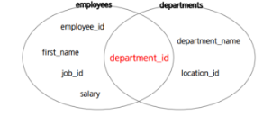

## JOIN

- JOIN이란

  조인 또는 결합 구문은 한 데이터베이스 내의 **여러 테이블**의 레코드를 조합하여 하나의 열로 표현한 것이다.

  따라서 조인은 테이블로서 저장되거나 그 자체로 이용할 수 있는 결과 셋을 만들어 낸다.

  - 일반적으로 조인 조건을 포함하는 **WHERE 절**을 작성해야 한다.
  - 조인 조건은 일반적으로 각 테이블의 **PK 및 FK**로 구선된다.


<small>\[출처][블로그| Inpa Dev](https://inpa.tistory.com/entry/MYSQL-%F0%9F%93%9A-JOIN-%EC%A1%B0%EC%9D%B8-%EA%B7%B8%EB%A6%BC%EC%9C%BC%EB%A1%9C-%EC%95%8C%EA%B8%B0%EC%89%BD%EA%B2%8C-%EC%A0%95%EB%A6%AC)</small>

- JOIN의 종류

  - INNER JOIN

    조인하는 테이블의 ON절의 조건이 일치하는 결과만 출력

    단순히 from절에 콤마 쓰면 inner join으로 치부된다.

    ``` mysql
    select u.userid, name 
    from usertbl u, buytbl b 
    where u.userid=b.userid and u.userid="111"
    ```

    

  - OUTER JOIN

    - LEFT OUTER JIN
    - RIGHT OUTER JOIN

- JOIN 조건의 명시에 따른 구분

  - NATURAL JOIN
  - CROSS JOIN<SMALL>(FULL JOIN, CARTESLAN JOIN)</SMALL>

### INNER JOIN

가장 일반적인 JOIN의 종류이며 교집합이다.



동등 조인(Equi-Join)이라고도 하며, N개의 테이블 조인 시 <span style="color:red">**N-1개의 조인 조건**</span>이 필요함

조인하는 테이블의 ON절의 조건이 일치하는 결과만 출력한다.

표준 SQL과는 달리 MySQL에서는 JOIN, INNER JOIN, CROSS JOIN이 모두 같은 의미로 사용된다.

> **[형식]**
>
> ``` mysql
> SELECT COL1, COL2,...COLN
> FROM table1 INNER JOIN table2
> ON table1.column = table2.column;
> ```
>
> **[table에 alias 사용]**
>
> ``` mysql
> SELECT alias1.COL1, alias1.COL2,...alias2.COLN
> FROM table1 AS alias1 INNER JOIN table2 AS alis2
> ON alias1.column = alias2.column;
> ```

- INNER JOIN -USING을 이용한 JOIN조건 지정

  > **[형식]**
  >
  > ``` mysql
  > SELECT COL1, COL2,...,COLN
  > FROM table1 JOIN table2
  > USING (공통column);
  > 
  > ```
  >
  > USING(공통컬럼) 사용시 테이블명은 명시하면 안됨

- NATURAL JOIN

  > **[형식]**
  >
  > ``` mysql
  > SELECT COL1, COL2, ...,COLN
  > FROM table1 NATURAL JOIN table2
  > ```
  >
  > 두 테이블의 이름만 오로지 보고 같은 애를 자연적으로 조인한다.
  >
  > 테이블 명이 같아도 내용이 다른 경우가 있을 수 있어서 사용을 지양한다.
  >
  > NATURAL JOIN은  두 테이블의 이름이 동일한 컬럼을 기준으로 매핑한다.

### OUTER JOIN

- LEFT OUTER JOIN, RIGHT OUTER JOIN, FULL OUTER JOIN으로 구분됨
- 어느 한쪽 테이블에는 해당하는 데이터가 존재하는데 다른 쪽 테이블에는 데이터가 존재하지 않을 경우 그 데이터가 검색되지 않는 문제점을 해결하기 위해 사용


- LEFT OUTER JOIN

  왼쪽 테이블을 기준으로 JOIN 조건에 일치 하지 않는 데이터까지 출력

  > **[형식]**
  >
  > ``` mysql
  > SELECT COL1, COL2,...COLN
  > FROM table1 LEFT OUTER JOIN table2
  > ON or USING;
  > ```
  >
  > 

- RIGHT OUTER JOIN

  오른족 테이블을 기준으로 JOIN조건에 일치하지 않는 데이터까지 출력

  > **[형식]**
  >
  > ```mysql
  > SELECT COL1, COL2,...,COLN
  > FROM table1 RIGHT OUTER JOIN table2
  > ON or USING;
  > ```

### SELF JOIN

- SELF JOIN(자체조인)

  말 그대로 테이블 자기자신을 조인한 것이다.

  한 테이블 안에 얻고자하는 정보가 다른행에 있을 때 사용한다.

  - 같은 테이블 끼리 JOIN
  - 모든 사원의 사번, 이름, 매니저사번, 매니저 이름

### None-Equi JOIN<small>(비등가 조인)</small>

- INNER JOIN의 한 종류  EQUI JOIN이 기준이 되는 공통 컬럼에서 일치하는 데이터를 기준으로 JOIN을 실시한다면, NON-EQUI JOIN은 기준 컬럼의 값이 서로 같지 않더라도 서로가 지정한 범주에 속하는 관계라면 JOIN이 가능하다.

- table의 PK, FK가 아닌 일반 column을 join 조건으로 지정

- 모든 사원의 사번, 이름, 급여, 급여등급

  