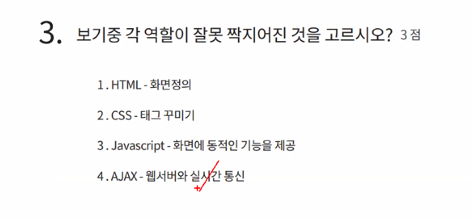

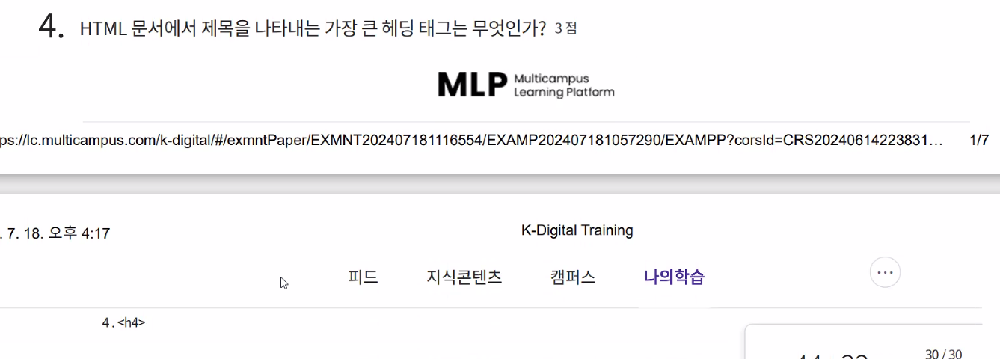

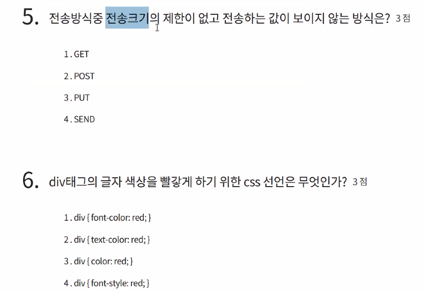

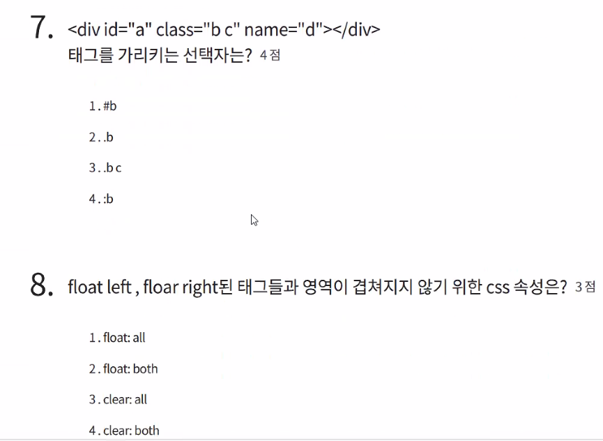

7번 답 2

8번 답 4

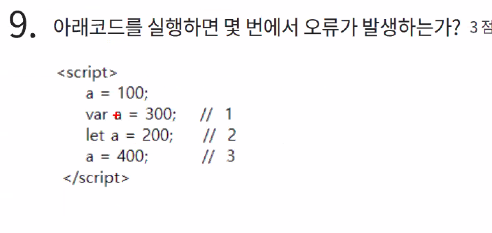

9번 -2

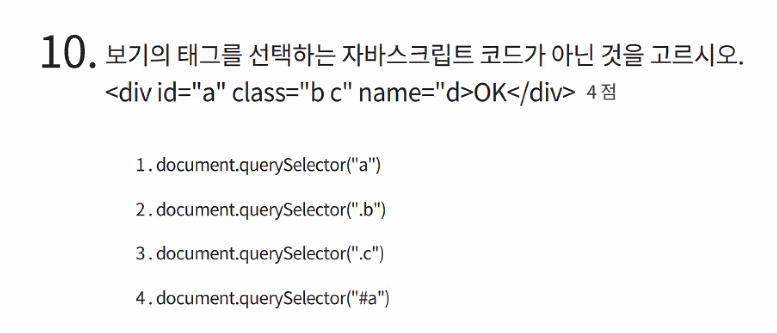

10번 -1

1번은 \<a>태그를 가져온다라는 의미

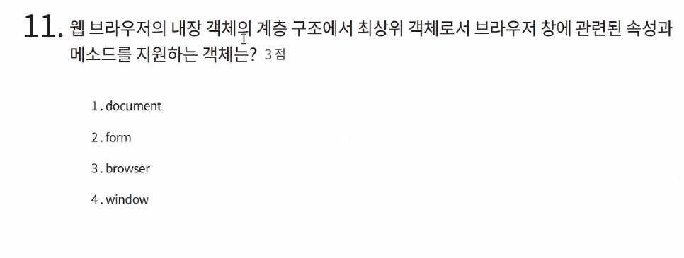

11- 4

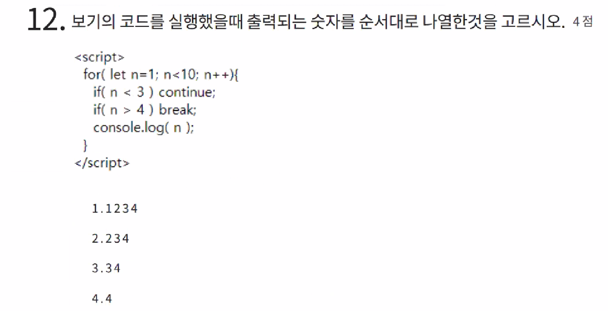

12번 - 3

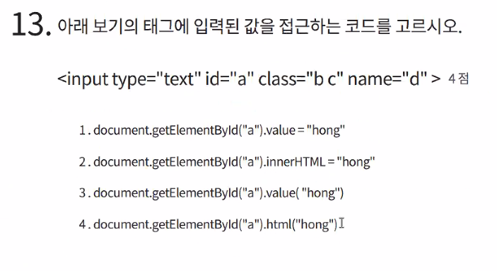

13번 -1

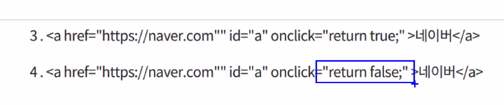

14번 -4

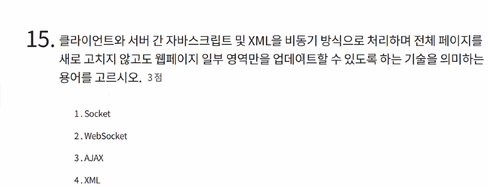

15번 - (서버, 비동기 키워드로) 3 AJAX

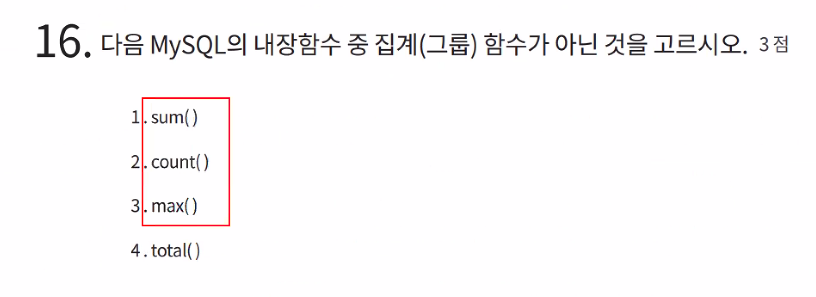

16 -4

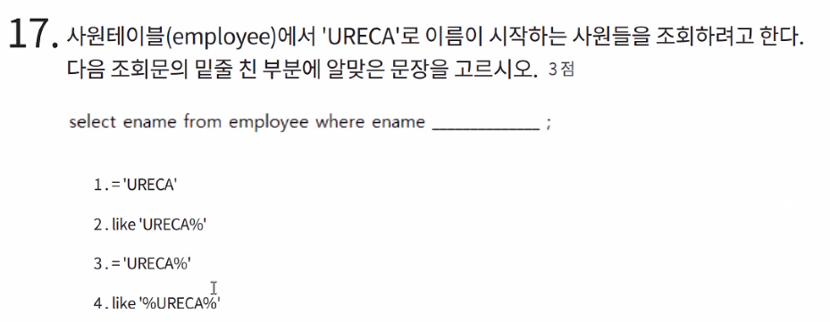

17- 2

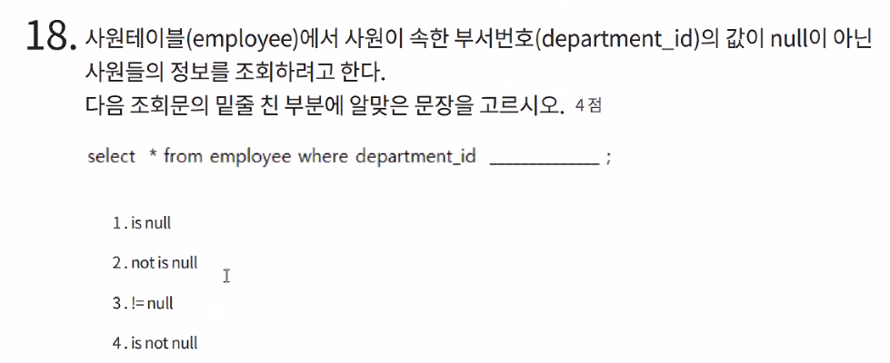

18 -4

19번 use ureca

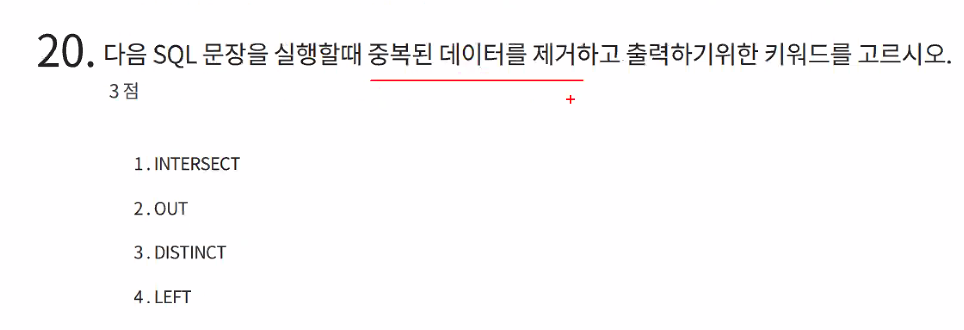

20- 3

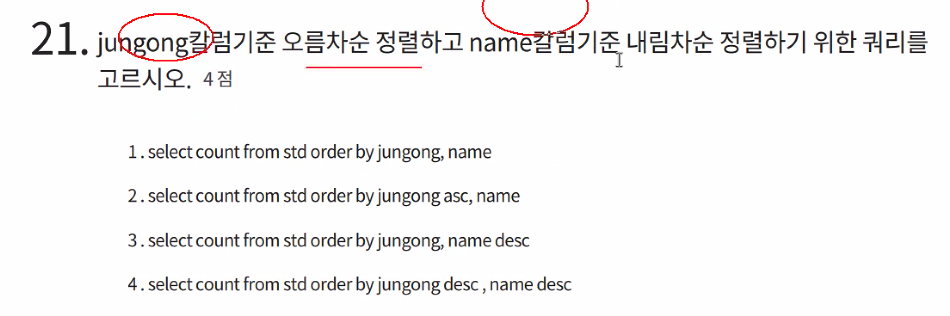

21 -4

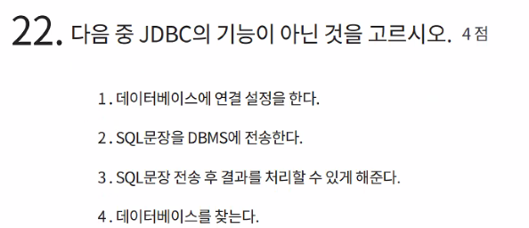

22 -4

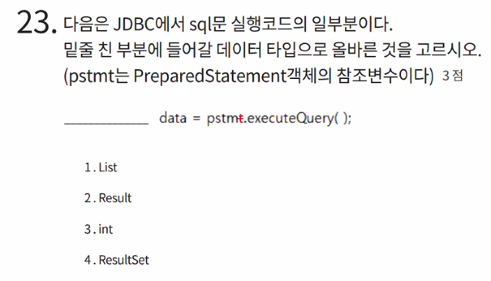

23 -4

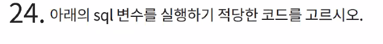

String sql = "DELETE FROM 머시기"

=> stmt.executeUpdate(sql);

avg(sal)같은 집계합수는 where절에서 사용이 불가능 하다.

그러므로 2번

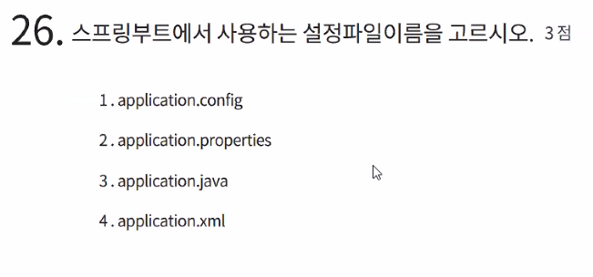

26 -2

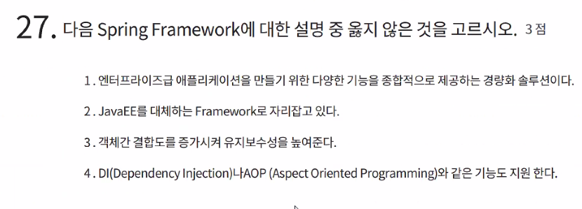

27 -3 결합도를 증가시키는게 아니라 느슨하게 만든다.

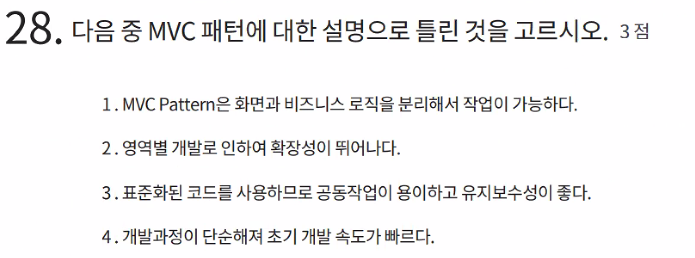

28 -4

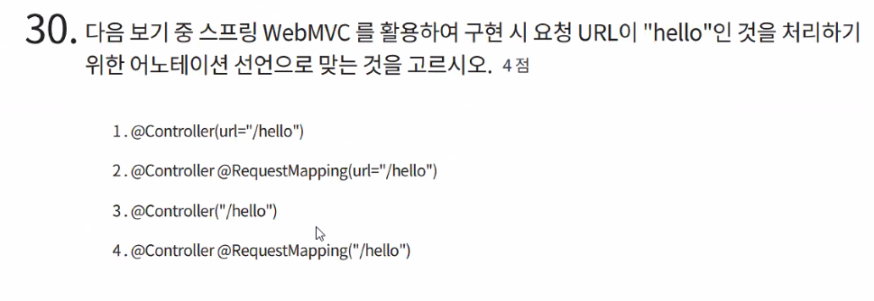

30 -4