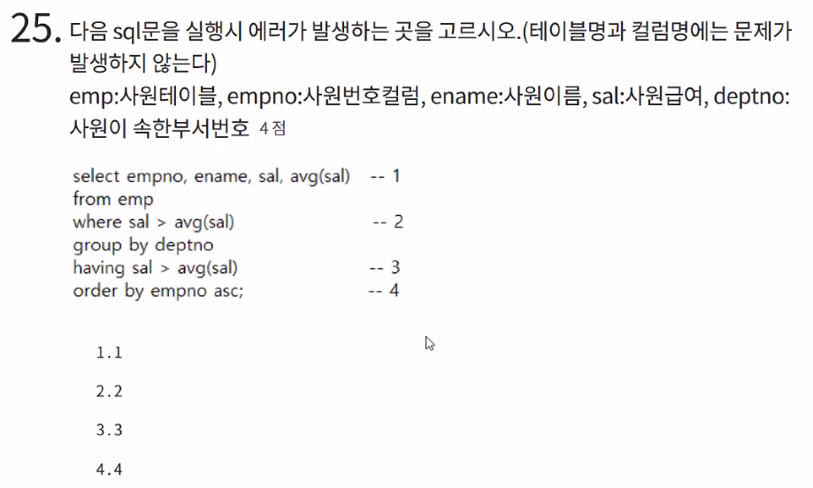

7번 답 2

8번 답 4

9번 -2

10번 -1

1번은 \<a>태그를 가져온다라는 의미

11- 4

12번 - 3

13번 -1

14번 -4

15번 - (서버, 비동기 키워드로) 3 AJAX

16 -4

17- 2

18 -4

19번 use ureca

20- 3

21 -4

22 -4

23 -4

String sql = "DELETE FROM 머시기"

=> stmt.executeUpdate(sql);

avg(sal)같은 집계합수는 where절에서 사용이 불가능 하다.

그러므로 2번

26 -2

27 -3 결합도를 증가시키는게 아니라 느슨하게 만든다.

28 -4

30 -4