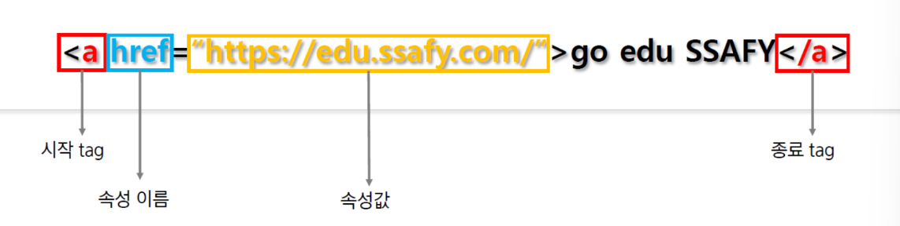
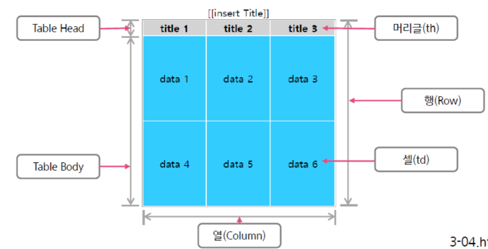

## HTML

- HTML은 <span class="hlm">Hypertext Markup Language</span>의 약자.

- 1990년도 이후 웹(web, World Wide Web)에서 사용하는 문서 양식

- 문서에 하이퍼 텍스트,표, 목록, 비디오 등을 포함 할 수 잇는 tag를 사용

- 문서를 **Web Browser**에 표현할 때 **tag**를 사용

  - tag의 종류

    - 시작태그

      `ex) <table>`

    - 끝태그

      `ex) </table>`

    - 빈태그

      `ex) <br></br> ➡️ <br/>`

  - 태그와 엘리먼트<small>(element)</small>의 차이점

    table 태그 ➡️ `<table>`

    table 엘리먼트 ➡️

    ``` html
    <table>
        <tr>
        	<td>내용</td>
        </tr>
    </table>
    ```

    이렇게 자식 태그까지 포함한 것을 엘리먼트. 즉, 요소라고 말할 수 있다.

### 개발 배경

- 수많은 플러그인들로 인한 Browser간의 부작용을 막기 위해 개발.
- HTML5개발 단계
  - 익스플로러 독점
  - 익스플로러에 맞는 많은 플러그인 개발
  - 거대해져가는 브라우저 및 보안 취약점 발생
  - MS를 제외한 회사들이 HTML표준안을 W3C에 제시
  - HTML 표준안 무시
  - 무시당한 회사들이 Web Application1.0개발
  - W3C에서 XHTML2.0개발
  - XHTML2.0 쇠퇴
  - W3C에서 Web Application 1.0을 웹 표준안으로 수용.
  - Web Application 1.0을 HTML5로 계명.
  - 2014년 HTML5로 정식 배포.

기존의 Web Browser에 많은 플러그인이 설치되면서 많은 문제점이 발생했고, 이를 해결하기 위한 방안으로 W3C에서 Web Application1.0을 HTML5로 수용. 2014년에 정식으로 배포되었으며, 계속 업그레이드되고 있다.

### 웹표준

- 모든 브라우저에서 웹서비스가 정상적으로 보여질 수 있도록 하는 것.
- W3C(World Web Consertium)
  - 월드와이드웹(www)의 창시자인 팀 버너스 리를 중심으로 창립된 월드와이드웹 컨소시엄
- W3C에서 HTML5를 웹 표준으로 권고하고 웹 브라우저는 이를 따름


### 특징

- HTML5는 지금도 개발 중에 있고, 다양한 기능이 추가됨
- 멀티미디어 요소 재생
  - 과거 브라우저는 멀티미디어를 재생하기 위해 별도의 외부 플러그인을 사용해야 했으나, HTML5에서는 멀티미디어 요소를 별도의 플러그인 없이도 재생가능
- 서버와 통신
  - 서버와 클라이언트 사이에 소켓 통신이 가능
- Semantic tag 추가
  - 웹사이트를 검색엔진이 좀더 빠르게 검색할 수 있도록 하기 위해 특정 tag에 의미를 부여하는 방식.

### 문서구조

- <IEOCTYPE html>tag는 현재 문서가 HTML문서임을 정의
- 시작tag(\<tagname>)와 종료 tag(\</tagname>)가 있으며, tag사이에 문서 내용을 정의
- 각 tag는 고유의 의미를 가지고 있으며, Web Browser는 이 의미에 따라 문서를 화면에 표신


### Web & HTML 작동원리

- 서버는 클라이언트의 요청 내용을 분석하여 결과값을 HTML로 전송.
- 서버는 결과값을 전송한 후 클라이언트와 연결 종료.
- 클라이언트는 서버로부터 전달받은 HTML을 Web Browser에 표시
- 각 Web Browser는 브라우저 엔진이 내장되어 있고, 이 엔진이 tag를 해석하여 화면에 표현.


> CRS -  Client Side Renderin
>
> SSR - Server Side Rendering 


### HTML

웹 문서를 구성하는 3가지 요소


- HTML은 마크업 언어(markup language)로 웹 문서를 작성하며, tag를 사용하여 문서의 구조 등을 기술하는 언어

  

### tag와 속성

> - attribute
>   - name
>   - value


- HTML 문서는 `tag`로 만들어진다.
- HTML문서의 전체 구성은 html, head,body tag로 구성.

- tag는 시작 tag와 종료tag로 쌍을 이루거나 시작 tag만 존재하는 tag도 있다.
- 시작 tag와 종료 tag는 `/`로 구분하며 중첩되지 않도록 한다.
- 각각의 tag는 속성과 속성 값이 존재한다.




- HTML tag에는 어는 tag에나 넣어서 사용할 수 있는 글로벌 속성<small>(global attribute)</small>

| 글로벌 속성 | 설명                                                         |
| ----------- | ------------------------------------------------------------ |
| class       | tag에 적용할 스타일의 이름을 지정<br>`ex) <div class="content">...</div>` |
| dir         | 내용의 텍스트 방향을 지정. 왼쪽>> 오른쪽(기본값, ltr), 오른쪽 >> 왼쪽 (rtl), 왼쪽 또는 오른쪽 정렬과 비슷한 형태로 표현.<br/>`ex) <p dir="rtl">오른쪽에서 왼쪽으로 표시됨</p>` |
| id          | tag에 유일한 ID를 지정함. 자바스트립트에서 주로 사용<br/>`ex) <input type="text id="userid">` |
| style       | 인라인 스타일을 적용하기 위해 사용<br/>`ex) <p style="color:red; text-align:center">빨간색 가운데</p>` |
| title       | tag에 추가 정보를 지정. tag에 마우스 포인터를 위치시킬 경우title값 표시<br/>`ex) <p><abbr title="Web Application Server">WAS</abbr>는...</p>` |

### 주석

- 주석의 내용은 브라우저에 출력되지 않는다.
- HTML tag의 내용을 설명하기 위한 용도로 사용


### 문서 구성 요소

\<html> tag는 HTML문서 전체를 정의.

Head`<head>...</head>`와 Body`<Body>...</Body>`로 구성


- \<head> tag는 브라우저에게 HTML문서의 머리 부분임을 인식.
- \<title>,\<meta>,\<style>,\<link> tag를 포함 가능.
- \<title> tag는 문서의 제목을 의미, 브라우저의 제목 표시줄에 tag내용이 나타남.
- \<title> tag 이외의 다른 tag로 표현한 정보는 화면에 출력 X.

- 문서의 작성자, 날짜, 키워드 등 브라우저의 본문에 나타나지 않는 일반 정보를 나타냄

- name과 content속성을 이용하여 다양한 정보를 나타냄

- http-equiv속성을 이용하여 문서 이동 및 새로 고침이 가능

- charset속성을 이용하여 문서의 인코딩 정보를 설정

- Web Browser에 보여질 문서의 내용을 작성

- \<head> tag 다음에 위치하고 \<head> 내부에 위치하는 tag와 \<html>을 제외한 모든 tag.

- id 속성을 이요하여 문서 내에서 tag를 유일하게 식별 가능<span style="color:red">(id속성은 중복❌)</span>

- class 속성을 이용하여 여러 tag에 공통적인 특성(CSS)를 부여<span style="color:red">(class속성은 중복⭕)</span>

- 문단의 제목을 지정할 때 사용. `<h1>`부터`<h6>`까지 구분

  ➡️숫자가 커질 수록 글자는 작아 짐.

- `<section>`tag를 이용하면 같은 tag를 서로 다르게 표현

- 문서 구조를`<section>`tag를 이용하여 구분하면 각 문단의 제목을 하나의 tag로 작성가능


### 특수문자

| 엔티티 이름 | 설명                     | 화면 출력 |
| ----------- | ------------------------ | --------- |
| \&nbsp;     | Non-breaking space(공백) |           |
| \&lt;       | Less than                | <         |
| \&gt;       | Greater than             | >         |
| \&amp;      | Ampersand                | \&        |
| \&quot;     | Quotation mark           | "         |
| \&copyl     | Copyright                | ©         |
| \&reg;      | registered tradmark      | ®         |

### 포맷팅

- 포맷팅 요소에서는 화면에 동일하게 출력되지만 각 요소가 가진 의미가 다른 것이 있다.

  `ex) <b>와 <strong>은 모두 텍스트를 굴게 표현하지만, <strong>요소는 텍스트를 강조`

| tag 명           | 설명                                       |
| ---------------- | ------------------------------------------ |
| \<abbr>          | 생략된 약어 표시, Title 속성을 함께 사용   |
| \<address>       | 연락처 정보 표시                           |
| \<blockquote>    | 긴 인용문구 표시, 좌우로 들여쓰기가 됨     |
| \<q>             | 짧은 인용문구 표시, 좌우로 따옴표가 붙음   |
| \<cite>          | 웹 문서나 포스트에서 참고 내용 표시.       |
| \<pre>           | 공백, 줄 바꿈 등 입력된 그대로 화면에 표시 |
| \<code>          | 컴퓨터 인식을 위한 소스 코드.              |
| \<mark>          | 특정 문자열을 강조. 화면에는 하이라이팅 됨 |
| \<hr>            | 구분선                                     |
| \<b>, \<strong>  | 굵은 글씨로 표시, 특정 문자열을 강조       |
| \<i>, \<em>      | 이텔릭(기울게) 표시, 특정 문자열을 강조    |
| \<big>, \<small> | 큰 글자, 작은 글자로 표시                  |
| \<sup>, \<sub>   | 위 첨자, 아래 첨자로 표시                  |
| \<s>, \<u>       | 취소선, 밑줄                               |

### 기본태그

- 목록 tag는 하나 이상의 하위 tag를 포함
- 목록 tag는 각 항목을 들여쓰기로 표현
- 번호 또는 심볼을 이용해서 목록을 표현

| tag 명 | 설명                                                       |
| ------ | ---------------------------------------------------------- |
| \<ul>  | 번호 없는 목록을 표시. 항복 앞에 심볼을 표시               |
| \<ol>  | 번호 있는 목록을 표시. 숫자, 알파벳, 로마 숫자 등으로 표시 |
| \<li>  | 목록  항목\<ul>이나 \<ol> tag하위에서 사용                 |
| \<di>  | 용어 정의와 설명에 대한 내용을 목록화 해서 표시            |
| \<dt>  | 용어 목록의 정의 부분을 나타냄                             |
| \<dd>  | 용어 목록의 설명 부분을 나타냄                             |

- **ol 태그 속성**
  - type
    - 1 : 숫자(기본 값)
    - a : 영문 소문자
    - A: 영문 대문지
    - i: 로마숫자 소문자
    - I: 로마숫자 대문자 
  - start
    - 숫자: 시작 번호
  - reversed
    -  역순으로 표시

> ul>li
>
> 

#### table

- HTML table모델은 데이터를 행(Row)과 열(Column)의 셀(Cell)에 표시.
- 행 그룹요소인 \<thead>, \<tbody>요소를 사용하여 행들을 그룹화

- \<colgroup>과 \<col>요소는 열 그룹을 위한 추가적인 구조정보를 제공.
- tabke의 셸(Cell)은 머리글 (\<th>)이나 데이터(\<td>)를 가질 수 있음.



``` html
<table>
   <caption>[[insert Title]]</caption> 
   <thead>
    	<tr>
       		<th>title1</th>
            <th>title2</th>
            <th>title3</th>
       </tr>
    </thead>
    <tbody>
    	<tr>
        	<td>data1</td>
            <td>data2</td>
            <td>data3</td>
        </tr>
        <tr>
        	<td>data4</td>
            <td>data5</td>
            <td>data6</td>
        </tr>
    </tbody>
</table>
```

- \<table>, \<tr>, \<td> tag에는 table에 스타일을 적용하는 다양한 속성들이 있다.
- frame 속성은 table의 특정 선을 보여줄지를 결정하며, rules 속성은 셀과 셀사이의 줄이 나타날 것인가를 지정
- table정렬을 위한 align속성, background, bgcolor, border속성 등이 있음
- HTML5부터는 이러한 속성들을 더 이상 지원하지 않는다. 스타일은 CSS를 사용하여 적용.

- \<caption>tag는 table 제목을 정의하기 위해 사용하며 \<table>start tag 바로 뒤에 위치.
- \<caption> tag는 table당 하나만 사용
- table 제목은 기본적으로 가운데 정렬, 정렬 방식 변경은 CSS를 사용

- table행 그룹요소는 table의 행들을 머리글, 바닥글, 하나 이상의 복체 항목으로 그룹핑
- 행 그룹 요소에는 머리글\<thead>, 본체항목\<tbody>, 바닥글\<tfoot> 요소가 있다.
- 각 행 그룹은 최소 하나 이상의 \<tr>을 가져야 함

- table열 그룹 요소는 table내에서 구조적인 분리를 가능하게 함.

- \<colgroup>요소는 명시적인 열 그룹을 만들며, \<col>요소는 열(column)을 묶어 그룹핑함.

- \<colgroup>요소는 span 속성은 열 그룹에서 열의 개수를 저으이

- \<col>요소의 span 속성은 \<col>에 의해 묶여진 열의 개수를 말함.

  ``` html
  <table>
      <colgroup>
      	<col span="2" style="background-color: sktblue">
          <col width="200">
      </colgroup>
      <tr>
      	<th>No</th><th>강좌명</th><th>가격</th>
      </tr>
      <tr>
      	<td>1</td><td>HTML&CSS3</td><td>25000원</td>
      </tr>
      <tr>
      	<td>2</td><td>Spring Framework</td><td>47000원</td>
      </tr>
  </table>
  ```

- cellspacing은 table Cell과 Cell사이의 공간을 의미
- cellpadding은 Cell외곽과 Cell컨텐츠 사이의 공간을 의미
- HTML5 부터는 테두리 스타일 관련 속성을 지원하지 않고, CSS를 사용.


- HTML table\<td>요소에는 셀(Cell)을 병합하기 위한 두개의 속성이 있음.
- <span class="hlm">colspan</span>속성은 두 개 이상의 열(Column)을 하나로 합치기 위해 사용
- <span class="hlm">rowspan</span>속성은 두 개 이상의 행(Row)을 하나로 합치기 위해 사용

#### img

- \tag를 사용하여 이미지를 삽입하기 위해 사용

- <span class="hlm">src</span>속성은 이미지 경로를 지정하기 위해 사용(상대경로, URL 모두 가능)

- height, width 속성은 이미지 사이즈를 지정하기 위해 사용.

- alt 속성은 이미지를 표시할 수 없을 때 화면에 대신하여 보여질 텍스트를 지정

  ``

- \<figure>는 설명 글을 붙여야 할 대상을 지정

- \<figcaption>: 설명 글이 필요한 대상은\<figure> 태그로 묶고 설명 글은 \<figcaption>태그로 묶는다.

- 설명 글을 붙일 수 있는 대상은 이미지나 오디오, 비디오 같은 미디어 파일이나 텍스트 단락이나 표. 

#### 링크요소 anchor⭐

- \<a>tag를 사용하며, 하나의 문서에서 다른 문서로 연결하기 위해 <span class="hlm">하이퍼링크</span> 사용
- tag를 서로 중첩해서 사용할 수 없다.
- <span class="hlm">href</span>속성은 하이퍼링크를 클릭했을 때 이동할 문서의 URL이나 문서의 책갈피를 지정.
- target 속성은 하이퍼 링크를 클릭했을 때 현재 윈도우 또는 새로운 윈도우에서 이동할지를 지정.

> - 자바스크립트 사용
>
>   
>
>   a태그를 사용해 자바스크립트를 실행하려면
>
>   
>
>   ``` html
>    <a href="javascript:ureca()">눌러주세요</a>
>   ```
>
>   이렇게 작성해준다.


| 속성 값 | 설명                                                         |
| ------- | ------------------------------------------------------------ |
| _blank  | 링크 내용이 새 창이나 새 탭에서 열린다.                      |
| _self   | target 속성의 기본 값으로 링크가 있는 화면에서 열린다.       |
| _parent | 프레임을 사용했을 때 링크 내용을 부모 프레임에 표시          |
| _top    | 프레임을 사용했을 때 프레임에서 벗어나 링크 내용을 전체화면으로 표시 |

- 같은 페이지 안에서 특정 요소를 클릭시 그 위치로 한 번에 이동시킨다.
- `<tag id="anchor name">text or image</tag>`
- `<a href="#anchor name">text or image</a>`

#### 링크요소 link

- link tag를 사용하며 문서와 외부 자원을 연결하기 위해 사용
- \<head> 위치에 정의하며 여러 자원을 연결할 수 있다.
- rel 속성은 현재 문서와 연결된 문서 사이의 연관관계를 지정하기 위해 사용.
- href 속성은 연결된 문서의 위치를 지정하기 위해 사용

#### iframe

- 화면의 일부분에 다른 문서를 포함
- src속성은 포함시킬 외부 문서의 경로를 기정(상대경로, URL 모두 가능)
- height, width 속성은 프레임 사이즈를 지정
- name 속성은 프레임의 이름을 지정

#### form

-  사용자로부터 데이터를 입력 받아서 서버에서 처리하기 위한 용도로 사용
- 사용자의 요청에 따라 서버는 HTML form을 전달(회원가입 양식, 검색 양식 등)
- 사용자는 HTML form에 적절한 데이터를 입력한 후 서버로 전송. 이를 submit이라고함.
- 서버는 사용자의 요청을 분석한 후 데이터를 등록하거나, 원하는 데이터를 조회하여 결과를 다시 반환함

- 사용자가 입력하기 위한 control 요소들은 모두\<form>tag 하위에 위치해야 서버로 전송됨
- 각 control요소마다 텍스트 입력, 버튼 클릭 등 다양한 형식으로 입력을 받는다.

| tag명       | 설명                                                         |
| ----------- | ------------------------------------------------------------ |
| \<form>     | 사용자에게 입력 받을 항목을 정의, form tag내부에 여러 개의 control요소를 포함 |
| \<input>    | 텍스트 box, 체크 box, 라디오 버튼 등 사용자가 데이터를 입력할 수 있도록 함 |
| \<textarea> | 여러 줄의 문자를 입력할 수 있도록 함.                        |
| \<button>   | 버튼을 표시                                                  |
| \<select>   | select box(dropdown, combo box)를 표시                       |
| \<optgroup> | select box의 각 항목들을 그룹화 함                           |
| \<option>   | select box의 각 항목들을 정의 함                             |
| \<label>    | 마우스를 이용하여\<input> 항목을 선택 시 편리함을 제공, for 속성을 이용하여 다른 control 요소와 텍스트를 연결시켜서 더 편리하게 선택할 수 있도록 함 |
| \<fieldset> | 입력 항목들을 그룹화 함                                      |
| \<legend>   | \<fieldset>의 제목을 지정 함                                 |

- 사용자가 입력한 자료들을 어떤 방식으로 서버로 전달할 것인지 결정

- 서버에서 어떤 프로그램을 이용해 처리할 것인지 결정

  `<form [속성="속성값"]>form control</form>`

> **속성의 종류와 설명**
>
> - <span class="hlm2">**method**</span>
>
>   사용자가 입력한 내용을 서버 쪽 프로그램으로 어떻게 넘겨줄지 지정
>
>   - 속성값
>
>     - **GET** : 주소 표시줄에 사용자가 입력한 내용이 표시 256~2048bytes의 데이터만 서버로 전송
>
>     - **POST**: HTTP메시지의 Body에 담아서 정송하기 때문에 전송 내용의 길이에 제한이 없다.
>
>       사용자가 입력한 내용이 표시되지 않는다.
>
> - name
>
>    form의 이름을 지정. 한 문서 안에 여러개의 \<form> 태그가 있을 경우, 구분자로 사용
>
> - <span class="hlm2">**action**</span>
>
>   \<form> 태그 안의 내용들을 처리해 줄 서버상의 프로그램 지정(URL) 
>
> - target
>
>   \<action> 태그에서 지정한 스크립트 파일을 현재 창이 아닌 다른 위치에 열도록 지정
>
> - autocomplete
>
>   자동완성 기능, 기본값 on

- form control에 레이블(텍스트)을 연결

- 사용법

  `<label [속성="속성값"]>레이블<input...></label>`

  `<label for ="id이름"><input id="id이름"[속성="속성값"]></label>`

- form 요소를 그룹으로 묶음

  ``` html
  <fieldset>
      <legend>
          제목
      </legend>
      <input type="text"/>
      <input type="password"/>
  </fieldset>
  ```


#### input

- \<input>tag는 type속성에 따라 여러 가지 형태로 화면에 표시

<span class="hlm">\<input type="유형" [속성="속성값"]></span>

- **id** 속성은 여러 번 사용된 폼 요소를 **구분**하기 위해 사용

- id 속성 값은 최소한 한 개 이상의 문자여야 하며 공백은 허용❌
- 같은 html document에서 id는 하나의 값만 가능하고, name은 중족이 허용된다.


label의 for는 input에 할당된 id를 찾아서 포커스 해준다.

> - 문제 내기 좋은 것들
>   - ul, ol, li
>   - colspan, rowspan
>   - action, method의 의미

