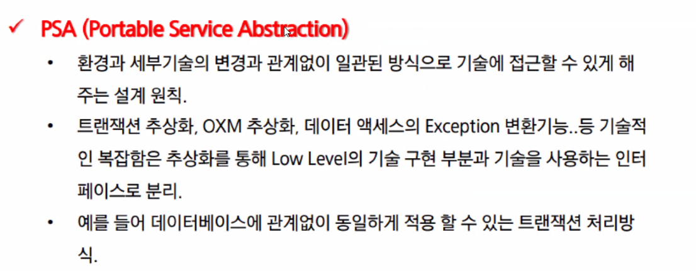
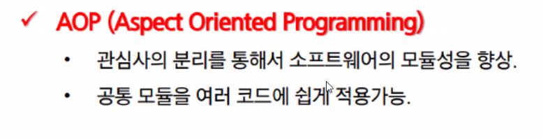
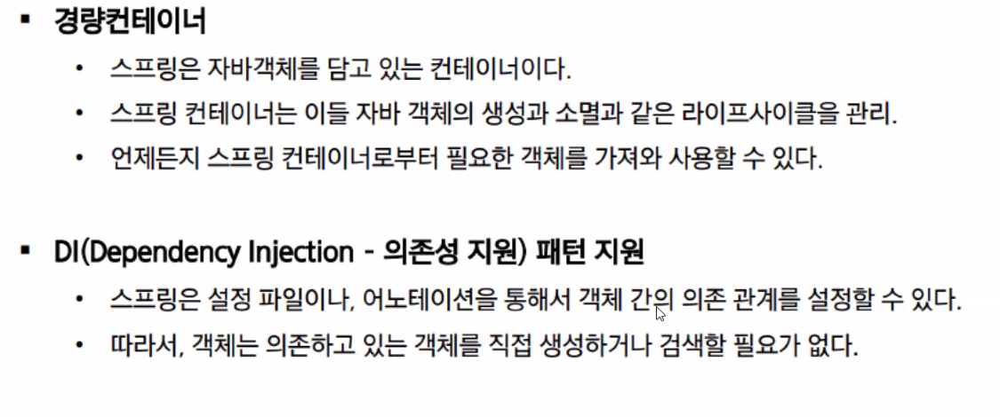
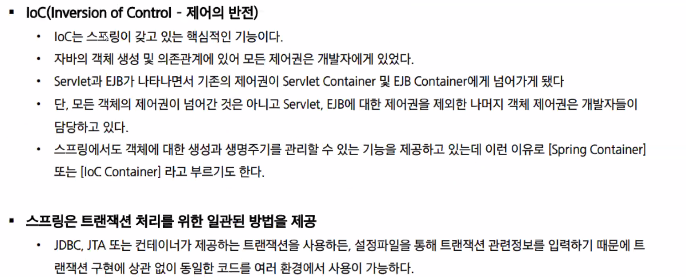

## Spring Framework

- 엔터프라이즈 급 애플리케이션을 만들기 위한 **모든 기능을 종합적**으로 제공하는 **경량화된 솔루션**이다.

- JEE<small>(Java Enterprise Edition)</small>가 제공하는 다수의 기능을 지원하고 있기 때문에, **JEE를 대체하는 Framwork**로 자리잡고 있다.

- SpringFramework는 JEE가 제공하는 다양한 기능을 제공하는 것 뿐만 아니라, DI<small>(Dependency Injection)</small>나 AOP<small>(Aspect Oriented Programming)</small>와 같은 기능도 지원 한다.

  - DI: 의존성 주입

    외부에서 두 객체 간의 관계를 결정해주는 디자인 패턴으로, 인터페이스를 사이에 둬서 클래스 레벨에서는 의존 관계가 고정되지 않도록 하고 런타임시에 관계를 동적으로 주입하여 유연성을 확보하고 결합도를 낮출 수 있게 해준다.

- Spring Framework는 자바로 Enterprise Application을 만들 때 포괄적으로 사용하는 programming 및 Configuration

### Spring Framwork - 구조

- Spring 삼각형

  - Enterprise Application 개발 시 복잡함을 해결하는 Spring의 핵심

    1. POJO

       Plain Old Java Object

       - 특정 환경이나 클래스에 

         

    2. PSA

       

    3. IoC/DI

       

    4. AOP

       

### Spring Framework - 특징

- 경량컨테이너
- DI패턴

이클립스 

window> preferences>

[https://mvnrepository.com/artifact/org.springframework/spring-context/6.1.10](https://mvnrepository.com/artifact/org.springframework/spring-context/6.1.10)

필요한 라이브러리를 pom.xml에 넣으면 가져온다.

**maven project로 변환**

변환할 프로젝트를 우클릭하고

그러면 

`pom.xml`파일이 생성되는데 여기에 아까 사용하고자 했던 것을 붙여넣기 하면 된다.

붙여 넣기하는 위치는 version과 bulid사이 혹은 bulid가 끝나는 시점에 넣어주면 된다.

#### Inteface

스프링 프레임 워크에서 인터페이스를 사용하는 이유는 주로 유연한 설계와 느슨한 결합을 가능하게 하기 때문이다.

- 느슨한 결합<small>(Loose Coupling)</small>

  - 유연한 변경

    인터페이스를 사용하면 구현체를 변경 할 때 인터페이스를 구현하는 클래스만 변경하면 되니까 다른 부분의 코드를 변경하지 않아도 된다.

  - 확장성

    새로운 기능을 추가하거나 구현체를 교체할 때도 기존 코드에 영향을 미치지 않고 확장 가능.

#### bean

XML 파일에서의 `bean`요소는 스프링 프레임워크에서 중요한 역할을 한다.

애플리케이션 컨텍스트에 등록됭 객체를 정의하고 설정하는데 사용된다.

스프링 컨테이너는 이 `bean`정의를 기반으로 객체를 생성하고, 의존성 주입을 통해 빈들 간의 관계를 설정한다.