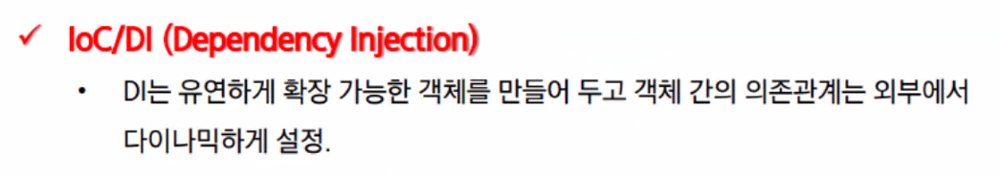

## Spring Framework

- 엔터프라이즈 급 애플리케이션을 만들기 위한 **모든 기능을 종합적**으로 제공하는 **경량화된 솔루션**이다.

- JEE<small>(Java Enterprise Edition)</small>가 제공하는 다수의 기능을 지원하고 있기 때문에, **JEE를 대체하는 Framwork**로 자리잡고 있다.

- SpringFramework는 JEE가 제공하는 다양한 기능을 제공하는 것 뿐만 아니라, DI<small>(Dependency Injection)</small>나 AOP<small>(Aspect Oriented Programming)</small>와 같은 기능도 지원 한다.

  - DI: 의존성 주입

    외부에서 두 객체 간의 관계를 결정해주는 디자인 패턴으로, 인터페이스를 사이에 둬서 클래스 레벨에서는 의존 관계가 고정되지 않도록 하고 런타임시에 관계를 동적으로 주입하여 유연성을 확보하고 결합도를 낮출 수 있게 해준다.

- Spring Framework는 자바로 Enterprise Application을 만들 때 포괄적으로 사용하는 programming 및 Configuration

### Spring Framwork - 구조

- Spring 삼각형

  - Enterprise Application 개발 시 복잡함을 해결하는 Spring의 핵심

    1. POJO

       Plain Old Java Object

       - 특정 환경이나 클래스에 

         

    2. PSA

       

    3. IoC/DI

       

    4. AOP

       

### Spring Framework - 특징

- 경량컨테이너
- DI패턴

이클립스 

window> preferences>

