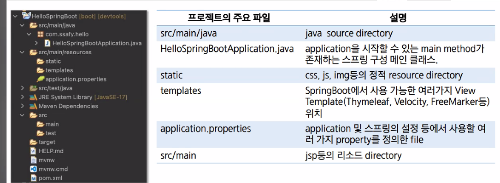
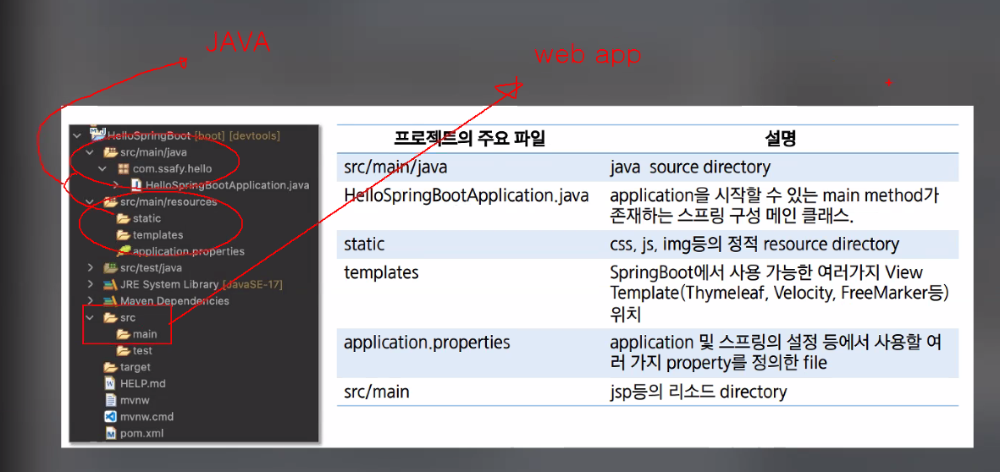

---

title: "[LG 유플러스] 시험정리2"
toc: true
toc_lable: "목차"
toc_stick: true 
---

## 시험 정리

1. 웹 구성요소

   > HTML, CSS, JS

2. 웹 프로토콜

   >HTTP(Hyper Text Transfer)

3. 기본태그

   - \<html>\</html>

   - \<head>\</head>

     문서 제목, 스타일, 스크립트 등등 ➡️ 문서에 대한 정보를 제공

   - \<meta charset="UTF-8">

     인코딩 설정

   - \<title>\</title>

     문서의 제목을 쓴다.  탭에 표시

   - \<body>\</body>

     화면에 표시되는 문서의 내용을 쓴다.

4. HTTP요청방식(전송방식)

   - **GET**

     서버에서 자원을 가져올 때

     가장 단순한 요청 방식 ➡️ 서버에 빠른 속도로 요청 할 때 사용

     URL에 데이터를 포함시켜 요청 ➡️ 보안에 취약

     전송하는 길이에 제한이 있다.

     캐싱을 할 수 있다.

   - **POST**

     서버에 자원을 새로 등록할 때 사용

     데이터를 생성/ 수정하기 위해 설계된 메소드

     URL에 데이터를 노출하지 않고 요청

     데이터를 Body에 포함

     전송하는 길이에 제한 없다.

     캐싱을 할 수 없다.

   - **PUT**

     서버의 자원을 요청에 들어 있는 자원으로 치환하고자 할 때나 파일을 업로드 할 때 사용

   - PATCH

     서버 자원의 일부만 수정하고자 할 때 사용

   - **DELETE**

     서버의 데이터를 삭제하는 작업을 요청할 때 사용

   - HEAD

     GET방식과 같으나 요청 정보의 몸체 없이 헤더 정보만 요청하는 방식

   - OPTION

     요청 URL에 대하여 허용되는 통신 옵션을 알고자 할 때 사용하는 방식

   - TRACE

     웹 **클라이언트의 요청을 그대로 반환**하는 방식. 

     요청 정보가 웹 서버에 도달하기까지의 경로를 기록

5. 스타일 글자색 바탕색

   - 바로 지정해줄 때

     ``` html
     <div style="color: gray; background-color: white;">
     </div>
     ```

   - css로 지정할 때

     ``` css
     div{
         color: gray;
         background-color: white;
     }
     ```

     

6. 선택자

   - 일반선택자

      우선순위: <span class="hlm">전체 선택자<타입 선택자< 클래스 선택자< ID 선택자 </span>

     - 전체 선택자: `*{}` 
     - 타입 선택자:  `elementName{}`
     -  클래스 선택자: `.class-Name{]`
     - ID선택자: `#id-Name{}`

   - 복합선택자

     - 자식 선택자: `element> element{ }`

       자식선택자는 <span class="hlm2">1단계 하위요소에만 적용</span>

     - 하위 선택자: `element element{ }`

       하위 선택자는 1단계 하위요소와 2단계 이상 하위 요소에 모두 적용

     - 인접 형제 선택자: `element + element{}`

       형제 관계 엘리먼트가 여러개면 첫 번째 엘리먼트만

     - 일반 형제 선택자: `element ~ element{}`

       여러개 존재하면 모든 엘리먼트 선택

   - 엘리먼트 잡아오기

   - 태그 이름, 클래스 이름, 아이디

   - 부모자식 정의 (형제는 안나옴)

     상위에 하위 요소를 감싸고 있는 요소를 부모, 하위에 있는 요소를 자식

7. ES6

   ES6(ECMAScript 6)는 ECMAScript 표준의 가장 최신 버전이다.

   - 블럭변수 let 사용

   - let을 사용하면 안나던 오류가 나옴

     let은 중복선언이 불가능하다. ➡️ 재할당은 가능하지만 하기전에 반드시 선언이 필요

     호이스팅 대상에서 제외

     

   - const

     - 상수로 사용
     - 선언 시 값을 할당해야함
     - 호이스팅 대상에서 제외
     - let 키워드와 값을 변경할 수 없다는 것만 빼면 동일하다.

8. 자바스크립트 반복문 제어문 실행
   - for문
   - 제어문: break, continue
   - 조건문: if

9. Js input 태그 데이터 얻기/주기

   - 다채롭게

     |       요소 접근 메서드       |                             설명                             |
     | :--------------------------: | :----------------------------------------------------------: |
     |     getElement**ById**()     |     **id 속성값**으로 특정 값을 갖는 요소를 반환합니다.      |
     |  getElements**ByTag**Name()  |     **특정 태그(tag)명**을 갖는 모든 요소를 반환합니다.      |
     | getElements**ByClass**Name() |  **class속성값**으로 특정 값을 갖는 모든 요소를 반환합니다.  |
     |   getElements**ByName**()    |  **name 속성**값으로 특정 값을 갖는 모든 요소를 반환합니다.  |
     |       querySelector()        | 특정 CSS 선택자 형식과 일치하는 **첫 번째 요소를 반환합니다.** |
     |      querySelectorAll()      | 특정 CSS 선택자 형식과 일치하는 **모든 요소를 반환합니다.**  |

      

10. 비동기방식

    - 딱 알지 ?

      자바스크립트는 기본적으로 단일 스레드에서 실행된다. 비동기 방식은 웹 브라우저가 느린 작업을 효율적으로 처리할 수 있도록 도와준다.

      

---

1. 집계함수

   - sum, avg, min, max, count

   - 총합 평군 최소최대 행의 갯수
   - 전체 데이터를 그룹별로 구분하여 통계적인 결과를 구하기 위해 사용
   - 결과값은 항상 단행
   - 그룹함수와 단순 컬럼은 함께 사용하는 것이 불가능
     - group by절과 함께 사용하는 것이 가능
   - Null 은 결과값에서 제외 > ifnull(null,0)

2. sql 조건식 연산자
   - where 안에 들어가는 조건문
   - 조건식을 구성하는 요소 3가지, 그 안에 연산자 들어가는 것

3. null 검색

   - insert, update 시 칸 안에 데이터가 들어갈 수 있는데 아직 정의되지 않은 데이터를 null이라하는데, 이러한 null을 검색하는 방법

4. 중복제거
   - Select distinct 칼럼명
   - Group by도 distinct와 비슷한 맥락

5. 정렬
   - order by (1차, 2차, 3차 정렬)

     DESC 내림차순, ASC 오름차순

   - select부터 orderby까지 6개의 절이 나옴 (실행 순서)

6. jdbc기능
   - 프로그램과 DB를 연결해서 SQL을 실행하는 기능
   - 커넥션 연결,stmt result

7. Jdbc sql실행
   - execute로 시작하는 메소드를 문장별로 정리
   - 공유 파일 확인 (가볍게만)

8. 스프링부트 설정파일
   - di 알려줄 때 applicationcontext.xml에 bean 태그를 활용해 관리할 클래스를 등록함

   - spring을 구현할 프로젝트가 2개임 (시험문제 x)

     레것; + 스타터

     1. 스타터 프로젝트
        - SpringBoot
        - 스타터 즉, 스프링 부트를 사용하게되면 xml이 사라짐
     2. 레거시 프로젝트
        - root-context.xml, serveltcontext.xml 두 개에 beans 관련 프로그램이 들어있음 (STS에선 안씀)

9. 스프링프레임워크 특징

10. mvc 특징

    - 유지보수를 위해

11. 스프링프레임워크 제공 모듈

    - 제공하는 모듈이 뭔지 확인

12. url 요청방법


---

### 프로젝트 구조





application.properties : application 및 스프링의 설정 등에서 사용할 여러 가지 property를 정의한 file < JSP위치, 포트넘버 다 여기서 한다.


``` html
<!DOCTYPE html>
<html lang="ko">
  <head>
    <meta charset="UTF-8" />
    <meta name="viewport" content="width=device-width, initial-scale=1.0" />
    <title>Position Property(float)</title>

    <style type="text/css">
      .outer {
        background: lightgray;
        font: 12px/1.5em Verdana;
        font-family: "Verdana", "gulim", "굴림", "굴림체";
        padding: 10px;
        text-align: justify;
        height: 200px;
      }
      .inner {
        width: 100px;
        height: 100px;
        padding: 5px;
      }
      #div1 {
        width: 100px;
        height: 100px;
        background: orange;
      }
      #div2 {
        width: 100px;
        height: 100px;
        background: steelblue;
      }
    </style>
  </head>
  <body>
    <div class="outer">
      <div id="div1" class="inner">Block-Level div<br />float: left</div>
      <div id="div2" class="inner">Block-Level div<br />float: right</div>
      Lorem ipsum dolor sit amet, consectetur adipisicing elit. Quam alias ullam illo distinctio rem
      sit fugiat doloremque aut. Alias assumenda voluptatum voluptate a neque odio vero magni
      eligendi, debitis inventore. Eos ea error excepturi quod, eaque aut eveniet quia at commodi
      possimus repellat. Consequuntur dolor corrupti necessitatibus voluptatum vero totam officiis
      debitis, placeat est ab, odio libero dolore ea pariatur dignissimos. Aut ad obcaecati alias
      laboriosam maxime quisquam, quam deserunt repudiandae cum. Perspiciatis, ratione. Saepe dolor
      expedita adipisci iste eligendi! Quae vel maxime voluptate ducimus corrupti. Assumenda harum
      quo inventore non sint culpa autem consequatur, dolores impedit! Delectus, explicabo quo!
    </div>
  </body>
</html>
```

