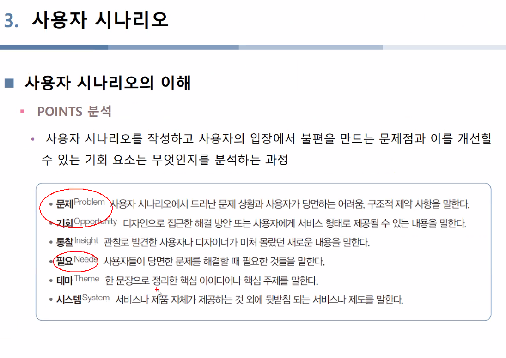

---

title: "[유레카] 디자인"
---

## 서비스 디자인

### 더블 다이아몬드 방법론

### 서비스 개발 방법론

- 애자일 프로세스

  사용자의 요구사항을 끊임없이 반영하고 점진적으로 제품을 업데이트하여 서비스가 

  

- 린 프로세스

  기업이 가정한 시장 상황을 테스트하기 위해 프로토타입을 만들고 

  

## 서비스 디자인 기획

### 서비스 디자인 기획의 이해

- 서비스 디자인을 개발하려면 우선 어떤 서비스를 만들 것인지 정해야 함
- 처음부터 개발할 플랫폼의 가치를 높게 설정하고 규모가 커질 가능성을 고려한 주제를 기획하는 것도 의미 있지만 일상에서 발견한 문제에 먼저 접근해 보는 것이 더 좋음

### 피그마

