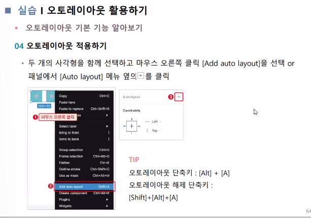

# 04. 컴포넌트의 활용

## 오토레이아웃

### 오토레이아웃의 이해

	

## 그룹, 프레임 컴포넌트의 이해

- 컴포넌트의 이해
  - 컴포넌트를 사용하면 흩어져있는 디자인 요소를 한번에 수정하고 변경할 수 있음
  - 피그마로 제작한 컴포넌트는 다른 페이지와 프로젝트에서 재사용할 수 있음
  - 피그마는 컴포넌트 라이브러리를 제공 > 컴포넌트를 빠르게 만들고 재사용할 수 있음
  - 피그마 온라인에 접속 > [Design]을 클릭 > 피그마 에디트 모드로 전환
- 인스턴스의 이해
  - 컴포넌트: 재사용하도록 등록한 원본
  - 인스턴스 : 원본 컴포넌트를 복제한 오브젝트

