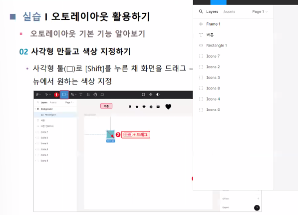

# 03. 스타일과 레이아웃 

## 04) 오토레이아웃

### 오토레이아웃의 이해

**오토레이아웃**이란 **디자인 요소의 위치**나 **간격**을 **동적으로 관리하고 조정**할 때 사용하는 옵션이다.

디자인 요소 간의 관계를 유지하면서 화면의 크기 또는 기기의 방향에 따라 UI요소가 적절하게 조정되어 일관된 레이아웃을 유지할 수 있게 도와준다.

➡️ 반응형 디자인을 구현할 때 유용하다.

>① 방향 설정: 오브젝트의 정렬 방향 선택한다.
>
>② 간격 조정: 오브젝트 간의 간격 조정한다.
>
>③정렬 프레임 내부 오브젝트의 위치와 방향을 정렬한다.
>
>④패딩 설정: 오브젝트 외부의 간격 조정한다.

	

## 그룹, 프레임 컴포넌트의 이해

- 컴포넌트의 이해
  - 컴포넌트를 사용하면 흩어져있는 디자인 요소를 한번에 수정하고 변경할 수 있음
  - 피그마로 제작한 컴포넌트는 다른 페이지와 프로젝트에서 재사용할 수 있음
  - 피그마는 컴포넌트 라이브러리를 제공 > 컴포넌트를 빠르게 만들고 재사용할 수 있음
  - 피그마 온라인에 접속 > [Design]을 클릭 > 피그마 에디트 모드로 전환
- 인스턴스의 이해
  - 컴포넌트: 재사용하도록 등록한 원본
  - 인스턴스 : 원본 컴포넌트를 복제한 오브젝트

