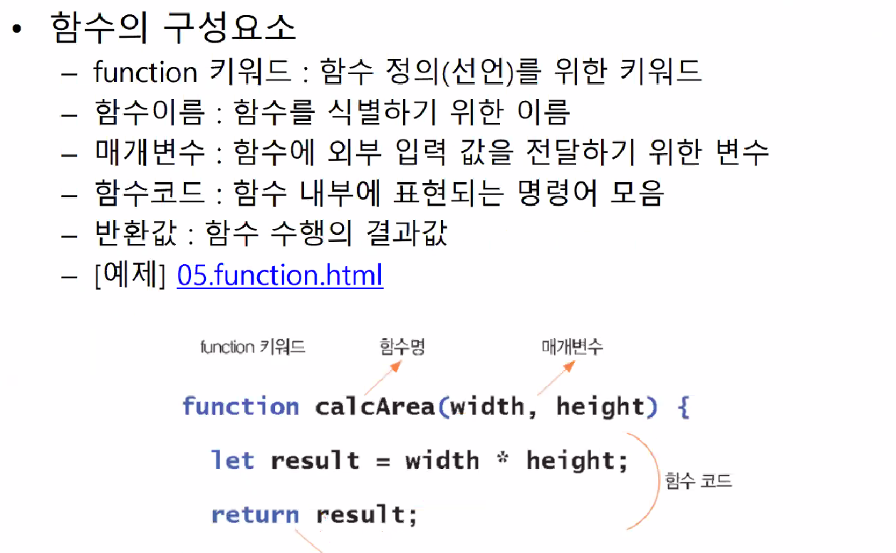
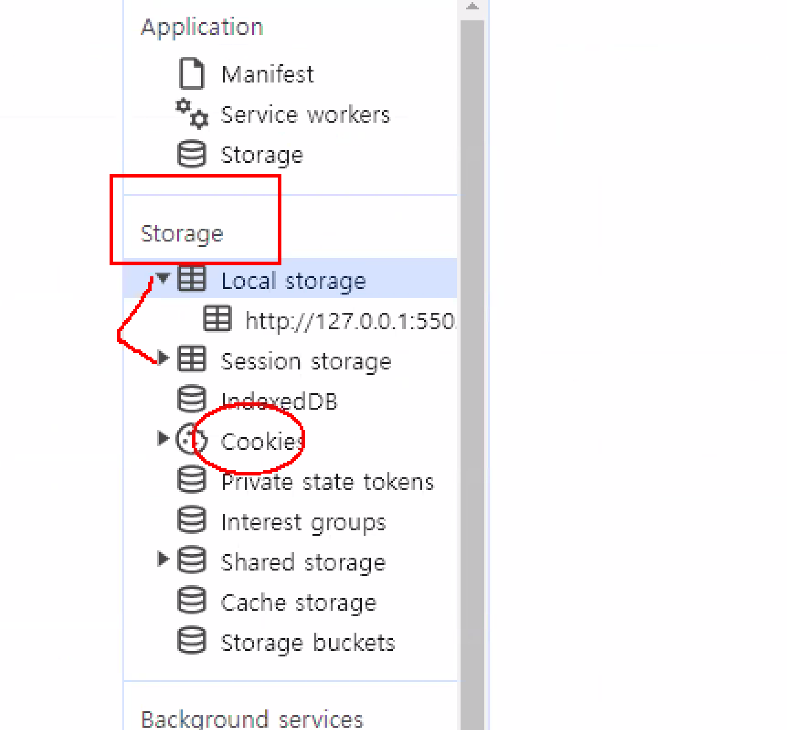

---


title: "[LG 유레카] 자바스크립트 복습"
toc: true
toc_sticky: true
toc_label: "목차"
---

# 리액트 배우기전 자바스크립트 복습⭐

## 프로그래밍과 웹 코딩

- 자바스크립트 특징
  - 웹 개발을 위한 프로ㅡ래밍 언어
- 웹 표준
  - 웹이 작동하는 방식 정의
  - 관련 국제 표준 기구:W3C, ECMA, IETF 등
  - HTML,CSS, Javascript

## 자바스크립트 연결하기

- HTML 이벤트 속성을 이용한 연결(높은 복잡도)


## 변수

- 유효 범위 : 전역(global) 변수, 지역변수
  - local scope, function scope, block scope, global, global scope
  - var, const, let
- 값의 변화 : 정적 변수, 동적 변수
  - 정적 변수: 직접 값을 할당한 변수
  - 동적 변수: 함수 등 연산의 결과로 값의 변경이 가능한 변수
- 값의 개수 : 스칼라 변수, 오브젝트 변수
  - 스칼라 변수: 하나의 변수에 하나의 값만 할당 ➡️ 1:1
  - 오브젝트 변수 : 하나의 변수에 여러 개의 값 할당 가➡️ 1: N


## 함수

### 함수의 구성요소




## localstorage에 값 저장하기

```html
<!DOCTYPE html>
<html lang="en">

<head>
    <meta charset="UTF-8">
    <meta name="viewport" content="width=device-width, initial-scale=1.0">
    <title>Document</title>
    <script>
        function init() {
            //localstorage에 데이터 저장하기
            localStorage.setItem("username", "전경원");
        }
    </script>
</head>

<body onload="init()">

</body>

</html>
```


