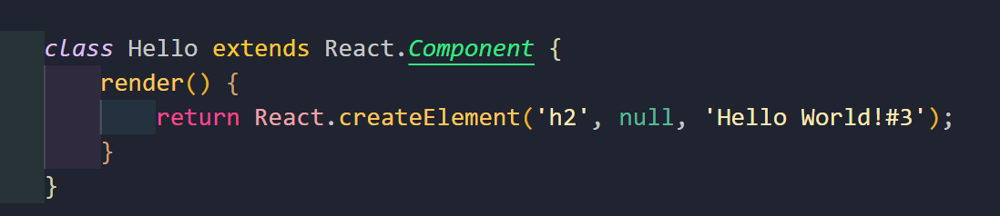

# 자바스크립트 응용

# 리액트

## 자바스크립트 혁명

- Node.js
  - 크롬 브라우저의 V8이라 불리는 자바스크립트 구문 해석기(javascript engine)를 기반으로 만들어진 자바스크립트 실행 환경(runtime environment)
  - 브라우저가 없어도 자바스크립트를 실행할 수 있음
  - Full-stack Development ➡️ Javascript(Front-End + Back-End)
- 실행 환경(runtime environment)
  - 수영을 위한 수영장 처럼 프로그램을 실행 할 수 있게 하는 환경
  - 프로그램을 실행하기 위해 연산, 메모리, 네트워크 등 컴퓨터 자원에 접근하여 사용하고 제어할 수 있도록 지원하는 환경
- <span class="hlm">리액트(React)</span>
  - 자바스크립트의 혁신적인 실행 환경(node.js)을 사용하는 자바스크립트 기반 웹 애플리케이션 프레임워크
  - 리액트(React), 앵귤러(Angular), 뷰(Vue)

## 개발 환경

- npm(node package manager)
  - 자바스크립트 모듈 또는 패키지를 관리하는 시스템

  - Node.js의 기본 패키지 관리자

    [Node.js 홈페이지]<https://nodejs.org/en>


- Node.js 버전 정보 확인

  - CMD실행 ➡️ `node -version`

    

- 코드 편집기 환경
  - 비주얼 스튜디오 코드(VSCode)
    - 로컬 컴퓨터에서 개발 환경을 구성할 경우, 예제를 구성할 때마다 관련 패키지를 중복으로 내려받는 경우가 생겨 디스크 용향에 부담
  - 온라인 편집기
    - 코드샌드박스, 코드펜, 리플릿

## 헬로! 리액트

- 리액트(React)

  [새로운 홈]< https://react.dev/>

  > 1. 리액트는 사용자 인터페이스를 만들기 위한 자바스크립트 라이브러리 입니다.
  > 2. 리액트는 SPA(Single-Page Application) 프로젝트에 활용됩니다.
  > 3. 리액트는 재사용이 가능한 UI 컴포넌트를 생성하여 효율적인 프로그래밍이 가능합니다. 
  > 4. 리액트는 가상 DOM(virtual DOM)을 이용하여 변경해야할 사항만 브라우저 DOM에 반영합니다.

  

  

  

  

- 리액트 시작하기
  - – [API 문서] https://reactjs.org/docs/getting-started.html
  - – [자습서] https://reactjs.org/tutorial/tutorial.html
  - – [사이트 예제] https://reactjs.org/community/examples.html
  - – [예제] 13.helloReact.html
  - – [예제] 13.helloReact2.html
  - – [예제] 13.helloReact3.html

- JSX와 바벨(Babel)
  - JSX(Javascript XML): 자바스크립트를 확장한 문법
    - UI가 어떻게 보여야 하는지 설명하기 위한 형식
    - XML 문법 적용
    - 템플릿(template) 언어 형식
  - 바벨(Babel) :자바스크립트 컴파일러
    - 최신 버전의 자바스크립트 코드를 모든 브라우저가 해석할 수 잇는 자바스크립트 코드로 변환하는 기능


# 실습

초기화 하겠다. package.json생성


리액트를 실행하기 위해서는 react.js와 react.dom이 필요하다.


- scr 

- csr➡️(Javascript라고 봐도 무방)
  - 특정부분만 변경(화면이동 없이) 



클래스 안에 함수를 선언할 수 있는데 이때 `function`을 쓰지 않고 이름만 적어줘야한다.

- Javascript 클래스

  - prototype 기반의 객체지향 프로그래밍 언어
  - ES6부터 추가
  - class는 직관적인 코드로 쉽게 읽을 수 있고 작성할 수 있음
  - class 기반 언어에 익순한 개발자가 더 빠르게 적응

  Class는 사실 특별한 함수입니다. 함수를 함수 표현식과 함수 선언으로 정의 할 수 있듯이 class문법도 class 표현식 and class 선언식 두가지가 존재합니다.

  ```js
  class Rectangle{
      constructor(height, width){
          this.height = height;
          this.width = width;
      }
  }
  ```

  