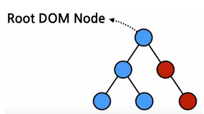
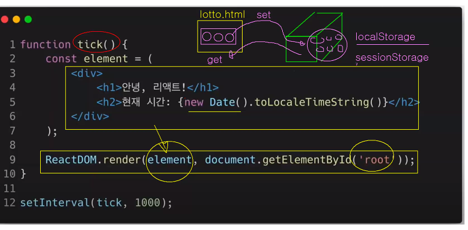

# 4장 엘리먼트 렌더링

## 엘리먼트란?

### 정의

{: .notice --primary}

**리액트 앱을 구성하는 가장 작은 블록들**

단어적 뜻은 어떤 물체를 구성하는 성분을 요소 즉, 엘리먼트라고 불린다.

엘리먼트는 기존에 웹사이트에 대한 정보를 담고 있는 객체인 DOM에서 사용하는 용어이다.

<br>

리액트 개발 초기에 <span class="hlm">화면에 나타나는 내용을 기술한 자바스크립트 객체</span>를 이야기할 용어가 필요

➡️ 기술하다라는 의미의 `descriptor`라는 이름으로 불림

➡️ `descriptor`가 최종적으로 나타나는 형태가 DOM엘리먼트 ➡️ **DOM 과의 통일성을 위해 엘리먼트로 불림**


실제 브라우저의 DOM에 존재하는 엘리먼트는 DOM엘리먼트가 되는 것이고 리액트의 Virtual DOM에 존재하는 엘리먼트가 바로 리액트 엘리먼트가 된다.

<span class="hlm">**리액트 엘리먼트는 DOM 엘리먼트의 가상표현**</span>


``` react
const element = <h1>Hello,world</h1>
```


### 엘리먼트의 생김새

**리액트 엘리먼트는 자바스크립트 객체 형태**로 존재한다.


## 엘리먼트 렌더링하기

엘리먼트 생성 후 실제로 화면에 보여주기 위해 렌더링을 해야한다.

`<div id = "root"></div>`

이 div 태그 안에 리액트 엘리먼트들이 렌더링되며 이것을 **react DOM node** 라고 부른다.




``` react
const element = <h1> 안녕, 리액트!</h1>
const root =  ReactDOM.createRoot(document.getElementById('root'));
root.render(element);
```

우선 엘리먼트를 하나 생성하고 생성된 엘리먼트를 root div에 렌더링하는 코드이다.

이때 ReactDOM의 createRoot()함수를 사용하는데 이 함수는 파라미터로 받은 리액트 엘리먼트를 root DOM node에 렌더링하는 역할을 한다.

<br>

➡️ virtual DOM에서 실제 DOM으로 이동하는 과정이 렌더링이다.

## 렌더링된 엘리먼트 업데이트하기

한번 렌더링된 엘리먼트를 업데이트 하려면 **엘리먼트의 불변성 때문에 다시 생성**해야한다.





## 실습


