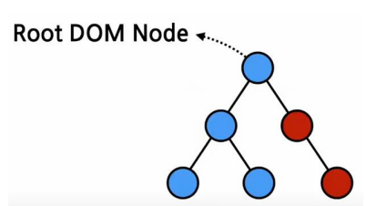

# 4장 엘리먼트 렌더링

## 엘리먼트란?

### 정의

{: .notice --primary}

**리액트 앱을 구성하는 가장 작은 블록들**

단어적 뜻은 어떤 물체를 구성하는 성분을 요소 즉, 엘리먼트라고 불린다.

엘리먼트는 기존에 웹사이트에 대한 정보를 담고 있는 객체인 DOM에서 사용하는 용어이다.

<br>

리액트 개발 초기에 <span class="hlm">화면에 나타나는 내용을 기술한 자바스크립트 객체</span>를 이야기할 용어가 필요

➡️ 기술하다라는 의미의 `descriptor`라는 이름으로 불림

➡️ `descriptor`가 최종적으로 나타나는 형태가 DOM엘리먼트 ➡️ **DOM 과의 통일성을 위해 엘리먼트로 불림**


실제 브라우저의 DOM에 존재하는 엘리먼트는 DOM엘리먼트가 되는 것이고 리액트의 Virtual DOM에 존재하는 엘리먼트가 바로 리액트 엘리먼트가 된다.

<span class="hlm">**리액트 엘리먼트는 DOM 엘리먼트의 가상표현**</span>


``` react
const element = <h1>Hello,world</h1>
```


### 엘리먼트의 생김새

**리액트 엘리먼트는 자바스크립트 객체 형태**로 존재한다. 

엘리먼트의 실제 모습을 보자면 아래와 같다.

``` jsx
{
    type: 'button',
        props: {
            className: {
                type: 'b',
                    props: {
                        children: 'Hello, element!'
                    }
            }
        }
}
```

위 코드는 버튼을 나타내기 위한 엘리먼트이다. 단순한 자바스크립트 객체인데 `type`에 HMTL 태그 이름이 문자열로 들어가는 경우 엘리먼트는 해당 태그 이름을 가진 DOM Node를 나타내고 props속성을 나타낸다. 

그래서 실제로 렌더링하면 아래와  같은 DOM엘리먼트가 된다.

```jsx
<button class ='bg-green'>
	<b>
    	Hello, element!
    </b>
</button>
```

 <br>

만약 	`type`이 HML태그의 이름이 들어가지 않은 경우는 어떨까?


 위 사진 처럼 엘리먼트는 자바스크립트 객체형태로 존재한다. 그리고 이 객체를 만드는 역할을 하는 것이 바로 createElement()함수 이다.


### 엘리먼트의 특징

리액트 엘리먼트의 가장 중요한 특징은 <span class="hlm">**불변성**</span>이다. 불변성은 변하지 않는 성질을 의미한다. 즉, 한 번 생성된 엘리먼트는 변하지 않다.

➡️ 엘리먼트 생성 후에는 children 이나 attibutes를 바꿀 수 없다.


엘리먼트는 다양한 모습으로 존재할 수 있지만 한 번 생성된 다음에는 변경이 불가능하다.

변경된 엘리먼트를 보여주기 위해서는 새로운 엘리먼트를 만들어서 기존 엘리먼트와 바꿔야한다.


## 엘리먼트 렌더링하기

엘리먼트 생성 후 실제로 화면에 보여주기 위해 렌더링을 해야한다.

`<div id = "root"></div>`

이 div 태그 안에 리액트 엘리먼트들이 렌더링되며 이것을 **react DOM node** 라고 부른다.




``` react
const element = <h1> 안녕, 리액트!</h1>
const root =  ReactDOM.createRoot(document.getElementById('root'));
root.render(element);
```

우선 엘리먼트를 하나 생성하고 생성된 엘리먼트를 root div에 렌더링하는 코드이다.

이때 ReactDOM의 createRoot()함수를 사용하는데 이 함수는 파라미터로 받은 리액트 엘리먼트를 root DOM node에 렌더링하는 역할을 한다.

<br>

➡️ virtual DOM에서 실제 DOM으로 이동하는 과정이 렌더링이다.

## 렌더링된 엘리먼트 업데이트하기

한번 렌더링된 엘리먼트를 업데이트 하려면 **엘리먼트의 불변성 때문에 다시 생성**해야한다.


## 실습

### 실시간 시계 


우선 프로젝트를 하나 생성합니다.

그리고 src에 Clock.jsx 파일을 생성합니다.


그리고 현재 시간을 나타내는 함수를 사용해준다.

이제 만든 컴포넌트를 실제 화면에 렌더링 하기 위해서 index.js 파일을 수정해준다.


우선 `import Clock from './Clock';`을 입력해서 컴포넌트와 연결해주고

root아래에 컴포넌트를 넣어주는데, 이때 `setInterval()`함수로 1,000ms(1초)마다 새롭게 Clock 컴포넌트를 root div에  렌더링하도록 코드를 수정한다.