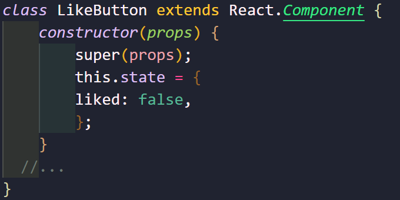

# State와 생명주기

## State 

### State란?

리액트의 state는 리액트 컴포넌트의 상태를 의미한다. 

➡️ 정산 비정상을 나타내는 것이 아닌 **리액트 컴포넌트의 변경 가능한 데이터**

**🔥중요한점**

렌더링이나 데이터 흐름에 사용되는 값만 state에 포함시켜야한다.

왜냐하면 state가 변경 될 경우 컴포넌트가 재렌더링 되어서 성능 저하를 유발한 수 있다. 

### State의 특징

state 또한 하나의 자바스크립트 객체이다. 

위의 간단한 예제 코드를 보면 이 코드는 LikeButton이라는 리액트 클래스 컴포넌트를 나타낸 것이다.

## 생명주기에 대해 알아보기

lifecycle은 생명주기라는 뜻을 가지고 있다.

리액트도 생명주기를 가지고 있는데, 컴포넌트가 생성되는 시점과 사라지는 시점이 정해져있다는 의미이다.

<small>[리액트 클래스 컴포넌트의 셍명주기]</small>

각 과정의 하단에 초록색으로 표시된 부분은 생명주겡 따라 호출되는 클래스 컴포넌트의 함수이다.

이 함수들을 Lifecycle method라고 부르며 생명주기 함수가된다.

- 컴포넌트의 생명주기

  1. 마운트<small>(Mount)</small>

     컴포넌트가 생성되는 시점이다.

     이 때 생성자<small>(constructor)</small> 가 실행된다. 생성자에서는 컴포넌트의 state를 정의하게 된다. 

     또한 컴포넌트가 렌더링되며 이후에 componentDidMount()함수가 호출된다.

  2. 업데이트<small>(Update)</small>

     리액트 컴포넌트도 생애 동안 변화를 겪으며 여러번 렌더링 되는데 이를 업데이트되는 과정이라고 한다.

      컴포넌트의 props가 변경되거나 setState() 함수 호출에 의해 state가 변경되거나 forceUpdate()라는 강제 업데이트 함수 호출로 인해 컴포넌트가 다시 렌더링 된다.

     렌더링 이후에 componentDidUpdate() 함수가 호출된다.

  3. 언마운트<small>(Unmount)</small>

     컴포넌트가 사라지게 되는 과정을 말한다.

     상위 컴포넌트에서 현재 컴포넌트를 더 이상 화면에 표시하지 않게 될 때 언마운트 된다.

     언마운트 직전에 componentWillUnmount() 함수가 호출된다.

대표적인 생명주기를 살펴봤다.

{: .notice--primary}

**컴포넌트는 계속 존재하는 것이 아니라 시간의 흐름에 따라 생성되고 업데이트가 되다가 사라진다.**

## 실습

