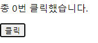
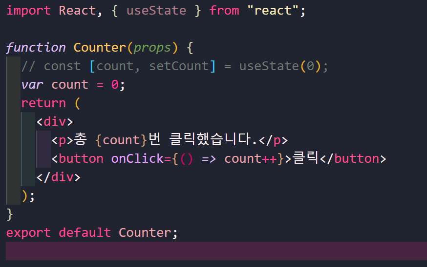
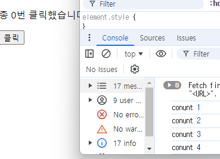

## 훅이란?

컴포넌트는 두 가지 종류가 있다.

1. 클래스 컴포넌트
2. 함수 컴포넌트

또한 컴포넌트에서 state를 이용해서 렌더링에 필요한 데이터를 관리한다.

| Function Component              | Class Component                       |
| ------------------------------- | ------------------------------------- |
| state 사용 불가                 | 생성자에서 state를 정의               |
| Lifecycle에 따른 기능 구현 불가 | setState() 함수를 통해 state 업데이트 |
|                                 | Lifecycle methods 제공                |

기존에 함수 컴포넌트는 클래스 컴포넌트와 다르게 코드가 간결하고, 별도 state를 정의. 사용 불가능하고 생명주기에 맞춰 어떤 코드가 실행되게 할 수 없다.

➡️**함수 컴포넌트에 이러한 기능이 가능하게 하는것이 훅**

### 훅<small>(Hook)</small>

원래 존재하는 어떤 기능에 마치 갈고리를 거는 것 처럼 끼어 들어가 같이 수행되는 것을 의미한다.

즉, **리액트의 state와 생명주기 기능에 갈고리를 걸어 원하는 시점에 정해진 함수를 실행되도록 만든 것**이다.

{: .notice}

훅의 이름은 모두 **use**로 시작한다.

## useState

- useState 사용법

  {: .notice--primary}

  const [변수명, set함수명] = useState(초기값);

state를 사용하기 위한 훅이다.

간단한 예시를 보자면

---

1. 

​		불변성 때문에 클릭해도 값이 증가하지 않는다.

console.log로 봤을 때는 count에 값이 추가되고 있다.

useState를 사용하여 카운트 값을 state로 관리하도록 만든 것이다.

이 코드에서 state의 변수명과 set함수가 각각count, setCount로 되어 있는 것을 볼 

있다.

버튼이 눌렸을 때 setCount() 함수를 호출해서 카운트를 1 증가 시킨다. 그리고 count의 값이 변경되면 컴포넌트가 재렌더링 되면서 새로운 카운트 값이 표시된다.

## useEffect

`useEffect()`는  사이드 이펙트를 수행하기 위한 훅이다. 

사이드이펙트란 부작용이라는 뜻이 있는데 리액트에서 사이드 이펙트는  효과 혹은 영향을 뜻하는 이펙트의 의미와 유사하다.

`ex) 서버에서 데이터를 받아오거나 수동으로 DOM을 변경하는 등의 작업`

useEffect()는 리액트의함수 컴포넌트에서 사이드 이펙트를 실행할 수 잇또록 해주는 훅이다. 클래스 컴포넌트의 `componentDidMount()`, `componentDidUpdate()`, `componentWillUnmount()`와 동일한 기능을 하나로 통합해서 제공한다.

➡️ useEffect() 훅 만으로도 생명주기 함수와 동일한 기능을 수행할 수 있다.

componentDidMount(), componentDidUpdate()와 같은 생명주기 함수의 기능을 동일하게 수행하도록 만들었다.

이펙트 함수에서는 브라우저에서 제공하는 API를 사용해서 document의 title을 업데이트 한다.

위 코드처럼 의존성 배열없이 `useEffect()`사용하면 리액트는 DOM이 변경된 이후에 해당 이펙트 함수를 실행하라는 의미로 받아드린다.

➡️ 매번 렌더링 될 때마다이펙트가 실행된다.

- `componentWillUnmount()`

  `useEffect()`로 구현한다면,

  

  useEffect() 에서 먼저 ServerAPI를 사용해서 사용자의 상태를 구독하고 있다. 이후에 함수 하나 리턴하는데 해당 함수 안에는 구독을 해지하는 API를 호출하도록 되었어서 useEffect()에서 리턴한느 함수는 컴포넌트가 마운트 해제될 때 호출된다.

## useMemo

`useMemo()`훅은 Memoized value를 리턴하는 훅이다. 파라미터로 Memorized Value를 생성하는 create 함수와 의존성 배열을 받는다.

이는 의존성 배열에 들어 있는 변수가 변했을 경우에만 새로 create 함수를 호출하여 결과값 반환, 그렇지 않은 경우에는 기존 함수이 결괏값을 그대로 반환한다.

`useMemo()`를 사용하면 **연산량이 높은 작업을 반복하는것을 피할 수 있다.**

## useCallback

`useCallback()` 훅은 이전에 나온 useMemo()훅과 유사한 역할을한다.

값이 아닌 함수를 반환한다는 차이점이 있다.

함수의 의존성 배열을 파라미터로 받고 

## useRef

## 훅의 규칙

## 나만의 훅 만들기

## 실습

---

1. 

​		불변성 때문에 클릭해도 값이 증가하지 않는다.

console.log로 봤을 때는 count에 값이 추가되고 있다.

