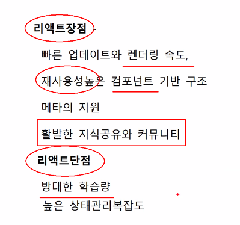
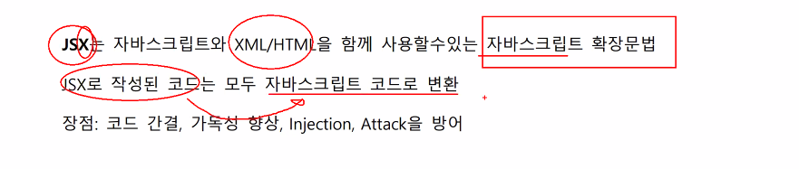
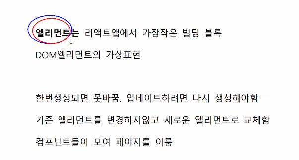
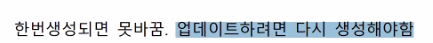
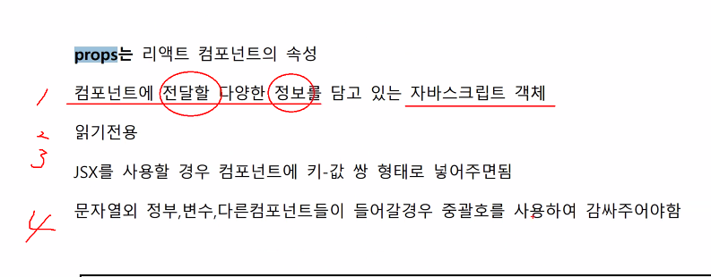
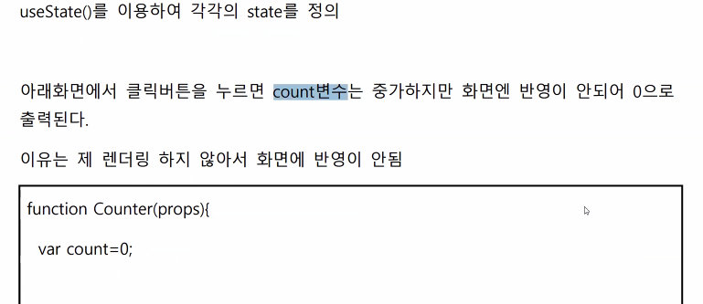
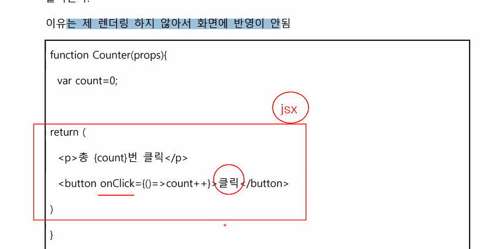
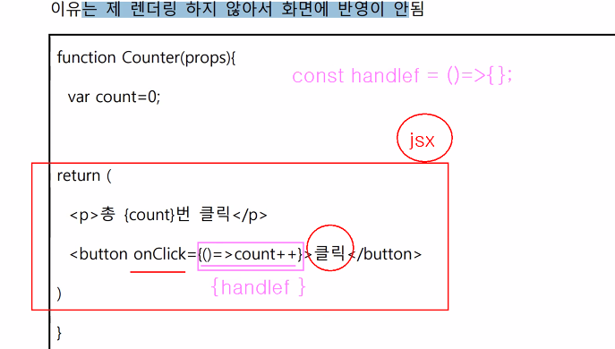
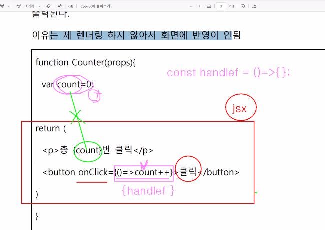

템플릿문자열 => \`\` 변수를 직접 삽입을 해줄 수 있고 멀티라인을 넣어줄 수 있다.



- <span class="hlm">엘리먼트는 **리액트앱에서 가장작은 빌딩 블록**</span>

  



정수, 변수, 다른 컴포넌트들이 들어갈 경우 중 괄호를 사용하여 감싸주어야함


### State

리액트 컴포넌트의 변경가능한 데이터

개발자가 직접 정의하여 사용

state가 변경될 경우 재 렌더링 됨

렌더링이나 데이터흐름이 사용되는 값만  state에 포함해야함





대소문자 구별 하기, onclick❌ onClick🅾️






변화되어야지 출력할 수 있다.


# 리액트와 웹시큐리티 요약

 ## 리액트 요약 

**리액트**는 사용자 인터페이스를 만들기 위한 자바스크립트 라이브러리. 

SPA를 쉽고 빠르 게 만들수 있도록 해주는 도구 


**리액트장점**

- 빠른 업데이트와 렌더링 속도, 

- 재사용성높은 컴포넌트 기반 구조 

- 메타의 지원 

- 활발한 지식공유와 커뮤니티 

  

**리액트단점** 

- 방대한 학습량 
- 높은 상태관리복잡도

 **JSX**는 자바스크립트와 XML/HTML을 함께 사용할수있는 자바스크립트 확장문법

 JSX로 작성된 코드는 모두 자바스크립트 코드로 변환

장점: 코드 간결, 가독성 향상, Injection, Attack을 방어

``` jsx
let name = "KIM" 
let ans = `HI ${name}` 
console.log( ans ) => HI KIM
```

 

 **엘리먼트**는 리액트앱에서 가장작은 빌딩 블록 

DOM엘리먼트의 가상표현 

한번 xjn생성되면 못바꿈. 업데이트하려면 다시 생성해야함 기존 엘리먼트를 변경하지않고 새로운 엘리먼트로 교체함 컴포넌트들이 모여 페이지를 이룸 props는 리액트 컴포넌트의 속성 컴포넌트에 전달할 다양한 정보를 담고 있는 자바스크립트 객체 읽기전용 JSX를 사용할 경우 컴포넌트에 키-값 쌍 형태로 넣어주면됨 문자열외 정부,변수,다른컴포넌트들이 들어갈경우 중괄호를 사용하여 감싸주어야함 function Main(props){ return (


) } function Plus(props){ return (

{props.num1 + props.num2}

) } State 리액트 컴포넌트의 변경가능한 데이터 개발자가 직접 정의하여 사용 state가 변경될 경우 재렌더링 됨 렌더링이나 데이터흐름이 사용되는 값만 state에 포함해야함 useState()를 이용하여 각각의 state를 정의 아래화면에서 클릭버튼을 누르면 count변수는 중가하지만 화면엔 반영이 안되어 0으로 출력된다. 이유는 제 렌더링 하지 않아서 화면에 반영이 안됨 function Counter(props){ var count=0; return (

총 {count}번 클릭

count++}>클릭 ) } 

## 생명주기 

- 마운트 
- 생성될 때
-  업데이트 
- 컴포넌트의 props가 변경될 때 
- setState()에 의해 state가 변경될 때
- `forceUpdate()`가 강제 호출될때

### 언마운트


상위컴포넌트에서 현재 컴포는트르 ㄹ더이상 화면에 표시하지 않을때


###  useEffect() 


사이드 이펙트를 수행하기 위한 **훅 (갈고리)**

**의존성배열**안의 **변수가 하나라도 변경되면 이펙트함수가 실행**됨 

`useEffect(이펙트함수) `처음 컴포넌트 마운트때, 이후 업데이트할때마다 이펙트함수 실행 

`useEffect(이펙트함수,[의존성 배열 안])` 처음 컴포넌트 마운트, 언마운트때 이펙트함수 실행 

`useEffect(이펙트함수,[종속성변수])` 처음 컴포넌트 마운트때, 종속성변수 변경될때마다 이 펙트함수 실행 


### useMemo() 


Memorized value를 리턴하는 훅

 연산량이 높은 작업에 매번 렌더링될때마다 반복되는것을 피하기위해 사용 

const value = useMemo(메모함수) 메모함수는 렌더링 할 때 마다 실행 

const value = useMemo(메모함수, []) 메모함수는 마운트때 실행

 const value = useMemo(메모함수, [의존성변수]) 메모함수는 렌더링때 실행, 의존성 변경 시 함수실행 반환

 버튼 이벤트 처리 코드 

``` jsx
function Confirm(props){
	function handleClick(e){
	alert("OK");
	}
	return (
    	<button onClick={handleClick}>확인</button>
		)
	}
```


**비교연산할 때 참으로 여겨지는 것(Truthy)**

` true, { }, [ ], 42, "0" `


**비교연산할 때 거짓으로 여겨지는 것(falthy)** 

`false, 0, -0, 0n, '', "", null, undefined, NaN `


제어 컴포넌트 만들기 

```jsx
function NameForm(props){
	const [ value, setValue ] = useState("");
	const handleChange=>(event){
	setValue(event.target.value)
	}
	return (
	<form>
		<input value={value} onChange={handleChange}>
	</form>
	)
}
```

`<input>`은  type을 안 적어주면 기본적으로 `text`다.


 **컨텍스트**는 **컴포넌트들 사이에서 데이터를 컴포넌트 트리를 통해 곧바로 전달하는 방식** 

어떤 컴포넌트든지 데이터에 쉽게 접근할 수 있음 


## 웹 시큐리티 요약 

### HTTPS 

 WWW(월드 와이드 웹) 통신 프로토콜인 **HTTP의 보안이 강화된 버전**이다

### **SQL 삽입(주입,Injection)** 

- 데이터베이스(DB)와 연동된 웹 응용프로그램에서 입력된 데 이터에 대한 유효성 검증을 하지 않을 경우 공격자가 입력 폼 및 URL 입력란에 SQL 문 을 삽입하여 DB로부터 정보를 **열람하거나 조작할 수 있는 보안약점**을 말한다 

  <span class="hlm">SQL 질의문을 생성할 때 검증되지 않은 외부 입력값을 허용하여 악의적인 질의문이 실 행가능한 보안약점 </span>

  

### **경로 조작 및 자원 삽입** 

- 검증되지 않은 외부 입력값을 통해 파일 및 서버 등 시스템 자원(파일, 소켓의 포트 등)에 대한 접근 혹은 식별을 허용할 경우 입력값 조작으로 시스 템이 보호하는 자원에 임의로 접근할 수 있는 보안약점이다 경로조작 및 자원삽입 약점 을 이용해 허용되지 않은 권한을 획득해 설정 파일을 변경하거나 실행시킬 수 있다.

### <span class="hlm">**크로스사이트 스크립트(XSS)**</span>⭐ 

- **웹사이트에 악성코드를 삽입**하는 공격 방법이다. 
- 안전한 코딩기법 - 외부 입력값 또는 출력값에 스크립트가 삽입되지 못하도록 문자열 치 환 함수를 사용하여 &<>*‘/() 등을 & < > " ' / ( )로 치환하거나 자바스크립트 라이브러리에서 제공하는 escape 기능을 사용해 문 자열을 변환해야 한다. 자바스크립트에서 기본적으로 제공하는 escape() 함수는 deprecated되어 더 이상 사용을 권장하지 않고 있으며, 그 대신 encodeURI() 또는 encodeURIComponent() 함수를 사용하면 된다. HTML 태그를 허용해야 하는 게시판에서 는 허용할 HTML 태그들을 화이트리스트로 만들어 해당 태그만 지원하도록 한다. 

### **운영체제 명령어 삽입** 

- 적절한 검증 절차를 거치지 않은 사용자 입력값이 운영체제 명 령어의 일부 또는 전부로 구성되어 실행되는 경우 의도하지 않은 시스템 명령어가 실행돼 부적절하게 권한이 변경되거나 시스템 동작 및 운영에 악영향을 미칠 수 있다. 


### <span class="hlm">**위험한 형식 파일 업로드** </span>⭐

- 서버 측에서 실행 가능한 스크립트 파일(asp, jsp, php, sh 파 일 등)이 업로드 가능하고 이 파일을 공격자가 웹을 통해 직접 실행시킬 수 있는 경우 시스템 내부 명령어를 실행하거나 외부와 연결해 시스템을 제어할 수 있는 보안약점이 다. 

{: .notice}

**안전한 코딩기법** <br>파일 업로드 공격을 방지하기 위해서 **특정 파일 유형**만 허용하도록. **파일 크기 및 파일 개수를 제한** 


### **신뢰되지 않은 URL주소로 자동접속 연결** 

- 사용자가 입력하는 값을 외부 사이트 주소로 사용해 해당 사이트로 자동 접속하는 서버 프로그램은 피싱(Phishing) 공격에 노출되는 취약점을 가진다. **절대 URL(absoute URL)을 사용할 경우 리다이렉션을 실행하기 전에 정 상 서비스 중인 URL로 시작하는지 확인해야 한다.** 


### <span class="hlm">**크로스사이트 요청 위조(CSRF)**</span> ⭐

- 특정 웹사이트에 대해 사용자가 인지하지 못한 상황에 서 사용자의 의도와는 무관하게 공격자가 의도한 행위(수정,삭제, 등록 등)를 요청하게 하는 공격을 말한다 
- 안전한 코딩기법 - 모든 URL을 화이트리스트로 관리, 사용자 입력값을 리다이렉트 할 URL이 존재하는지 검증해야 한다.


### **오류 메시지 정보노출** 

- 에러를 처리하지 않거나, 불충분하게 처리하여 **에러 정보**에중 요정보(시스템 내부정보 등)가 포함될 때 발생 할 수 있는 보안약점이다. 
- 예외발생 시 예외 이름이나 추적 메시지 (traceback)를 력하는 경우 프로그램 내부 구조를 쉽게 파악할 수 있기 때문이다. 
- 안전한 코딩기법 - 오류 메시지는 정해진 사용자에게 유용한 최소한의 정보만 포함하도 록 한다. 코드 내에서 예외 상황은 내부 적으로 처리하고 사용자에게 시스템 **내부 정보** 등 민감한 정보를 포함하는 **오류를 출력하지 않고** 미리 정의된 메시지를 제공하도록 설 정한다

### **오류상황 대응 부재** ⭐

- 오류에 대해 예외 처리를 하지 않을 경우 공격자는 오류상황을 악 용해 개발자가 의도하지 않은 방향으로 프로그램이 동작하도록 할 수 있다. **의도치 않은 중단을 방지**하는데 도움이 된다. 

### **암호화되지 않은 중요정보** 

- 중요정보(패스워드, 개인정보 등) 전송 시 암호화 또는 안전 한 통신채널을 이용하지 않거나, **저장 시 암호화 하지 않아 정보가 노출 가능한 보안약 점** 

### **하드코드된 중요정보**

 - 소스코드에 중요정보(패스워드, 암호화키 등)를 직접 코딩하여 소 스코드 유출 시 중요정보가 노출되고 주기적 변경이 어려운 보안약점 

### **사용자 하드디스크에 저장되는 쿠키를 통한 정보 노출**

 - 개인정보, 인증 정보 등이 이와 같은 영속적인 쿠키 (Persistent Cookie)에 저장된다면 공격자는 쿠키에 접근할 수 있는 보다 많은 기회를 가지게 되며, 이는 시스템을 취약하게 만든다. 

### 안전한 코딩기법 

- 쿠키의 만료시간은 최소한으로 설정하고 영속적인 쿠키에는 사용자 권한 등급, 세션 ID 등 중요 정보가 포함되지 않도록 한다. 클라이언트 측에서 자바스크 림트를 통해 쿠키를 접근하지 못하도록 제한하고자 할 경우엔 httpOnly 속성을 True(기 본값은 False)로 설정한다


