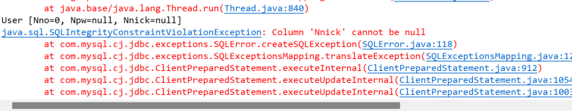
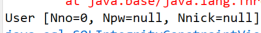
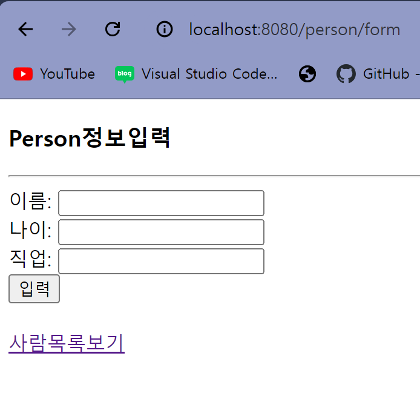
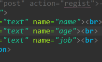
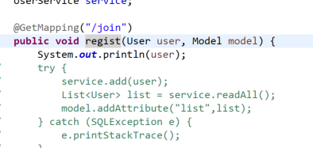
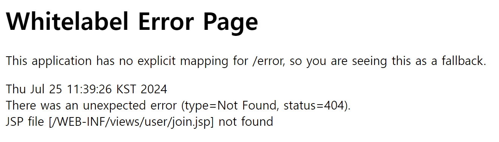
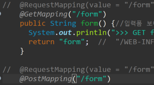
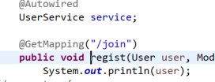
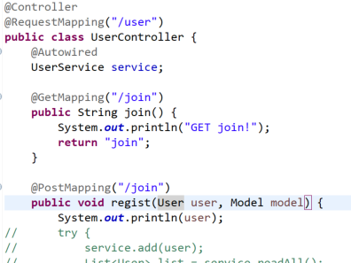
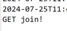

배웠던 추가, 수정, 삭제를 이용해서 미니 프로젝트를 만들려고 DB와 연결중인데 위와 같은 문제가 생겼다.

보니까 

Nnick 컬럼비 null이면 안되는데 null이라 발생하는 듯 하다.. 이것이 좀 당황스러운것이 아직 값을 입력하지도 않고 post를 하지도 았았는데...

다시 주신 것을 살펴보았다.

jsp에서 우선 값을 줄 때 name으로 주는것이 보였고 그래서 내 jsp도 name을 주고 이름을 통일 시켰다. 잘 모를 때는 여러 이름을 사용하지 말고 이름을 통일시키는게 좋다.

또 같은 오류 발생! 우선 USER가 추가만이라도 되었으면 해서

리턴타입을 void로 두고 다시 실행해보기로 했다.

경로를 잘 못 찾는듯 하다. 

그래서 컨트롤러를 다시 살펴봤다.

비교해봤을 때 GetMapping만하고 PostMapping은 안하고 있는 상태였다..

이런 실수를...

바꿔주니 정상적으로 나온다.

