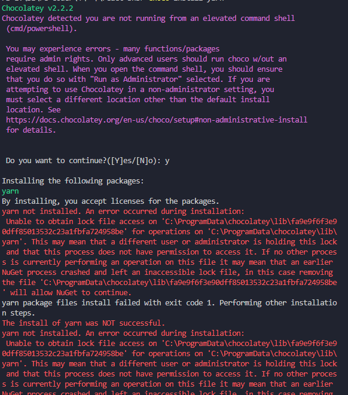
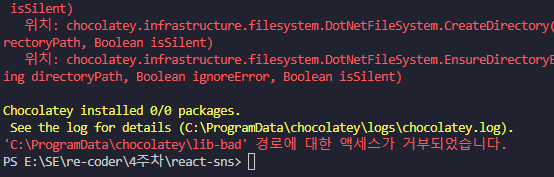
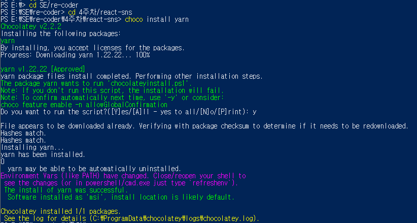
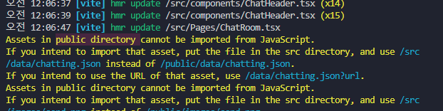

## choco install yarn

yarn을 설치하는 도중 이상한 오류가 발생했다.

이번 주 미션 실행전 `npm install -g yarn`을 실행해서 뭐가 충돌났나 싶어서 삭제하고 다시 해봤는데도 같은 오류가 났다.

그래서 찾아보니 권한 관련 문제가 있는 것 같다.

 

그래서 powershell을 우클릭하고 관리자 권한으로 열고, 다시 choco 명령어를 실행했다.

### 해결

알고보니 4주차를  clone해올때 내가 Fork한곳의 url이 아니라 Fork 대상의 url을 clone하여 권한이 막힌 것이었다.

실수를 주의해야겠다.