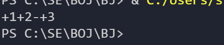

## 조건문의 결합

파이썬에서 조건문에 여러 조건을 결합할 때 `&`연산자를 사용합니다.

그러나 이때 두 조건의 두 변수 타입이 같지 않으면 에러가 발생합니다.

### 왜그럴까?

보통 `&` 는 비트 연산에 사용되므로, 일반적인 조건문에서는 논리 AND `and`를 사용하는 것이 더 적절합니다.

### and vs &

`and`: 논리 AND 연산자로, 두 조건이 모두 참일 때만 참을 반환합니다.

`&`: 비트 AND 연산자로, 두 정수형 값의 비트를 비교하여 1인 비트만 남깁니다. 주로 비트연산에서 사용되어 조건문에서는 각 조건을 boolean 값으로 반환해서 사용합니다.

`두 조건의 비트가 모두 1일 때 실행`

그래서 여러 조건을 결합할 때는 and를 사용하는 것이 좋습니다. 타입이 다르면 문제가 생길 수 있기 때문입니다.

and로 바꿔 실행했을 때는 잘 돌아가는 것을 알 수 있습니다.