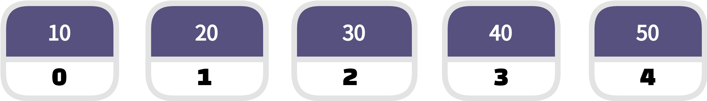
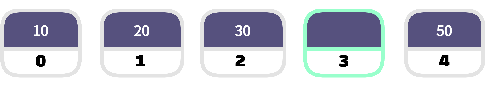
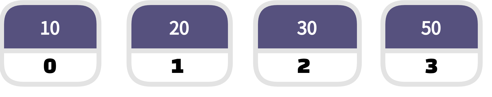
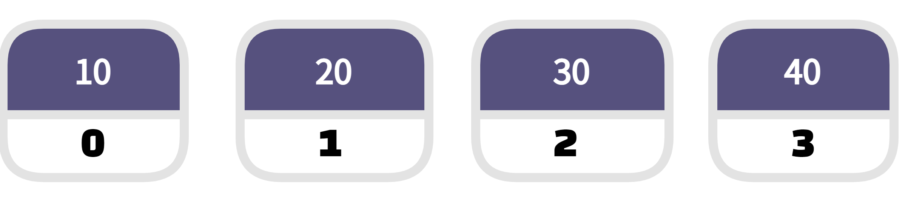
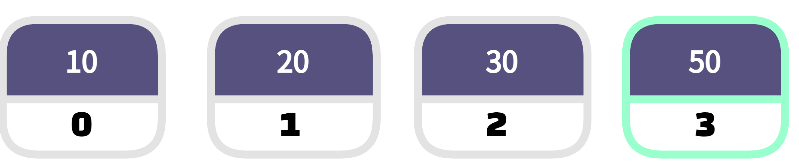
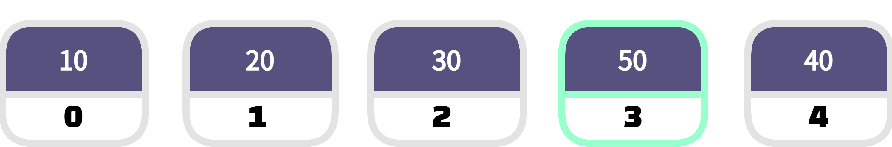

---

title: "[자료구조] 리스트(list)"
layout: single
---

배열은 다수의 데이터를  그룹핑해서 효율적으로 관리할 수 있는 데이터 스트럭쳐입니다. 배열의 가장 큰 특징은 인덱스가 있다는 것입니다. 만약 원하는 데이터의 인덱스를 알고 있다면 빠르게 가져올 수 있습니다. 

인덱스를 이용한 데이터의 조회 속도는 매우 빠릅니다. 하지만 인덱스를 이용해서 데이터를 가져오려면 데이터에 대한 인덱스의 값이 고정되어야 합니다. 

리스트는 배열이 가지고 있는 인덱스라는 장점을 버리고 대신 빈틈없는 데이터의 적재라는 장점을 취한 자료 구조라고 할 수 있습니다.

## 삭제



4번째 엘리먼트인 40을 리스트에서 제외하려면 어떻게 해야할까요?


배열이라면 아래와 같이 40이 없어진 자리가 빈자리로 남아 있을 것입니다. 덕분에 50의 인덱스는 변하지 않았습니다. 
즉, 인덱스가 변하지 않는 고유한 값으로 남아있습니다.

 

<br/>

리스트를 이용하면 아래와 같습니다.



데이터 밀도를 촘촘하게 유지할 수 있게 됩니다. 하지만 50의 인덱스 값은 4에서 3으로 변경되었습니다. 

<span style = "background-color: #cceecc">인덱스를 더 이상 식별자로 사용할 수 없습니다.</span>


## 추가

데이터 추가에 대해서 알아 보겠습니다.



배열에서 인덱스를 유지하면서 40의 자리에 50을 추가하면 아래와 같이 됩니다.



배열에서는 40이 삭제되고 50이 추가 되었습니다.

하지만 30과 40 사이에 값을 추가하는 것이라면 리스트 방식을 사용해야합니다.



리스트에서는 인덱스가 중요하지 않습니다. 리스트 데이터 스트럭쳐의 핵심은 앨리먼트들 간의 순서입니다. 그래서 리스트를 다른 말로 시퀀스(sequence)라고도 부릅니다. 시퀀스는 순서라는 의미입니다.

즉, `순서가 있는 데이터의 모임이 리스트 입니다.`


## 내장된 리스트 

리스트를 직접 구현하는 것도 좋지만, 자신이 사용하고 있는 언어에 이미 리스트가 내장되어 있다면 많은 사람들에 의해 검증되고 처리 속도가 뻐르기 때문에 사용해야 합니다. 그러나 모든 언어가 리스트를 내장하고 있는 것은 아닙니다. 리스트를 제공한다고 해도 그 방식이 언어마다 다릅니다. 

C에는 배열은 있지만 리스트가 없습니다. 비교적 최근에 등장한 언어들은 대부분 기본적으로 리스트를 지원합니다. 

자바스크립트는 배열에 리스트의 기능을 포함하고 있습니다. 

```javascript
numbers = [10, 20, 30, 40, 50]
//인덱스 3의 값을 제거
numbers.splice(3, 1)
for(i = 0; i < numbers.length; i++){
console.log(numbers[i]);
}
```

실행 결과

```javascript
10
20
30
50
```

위 코드에서 중요한  부분은 `numbers.splice(3,1);`입니다.

splice는 배열 numbers의 3번째 인덱스의 엘리먼트를 삭제합니다. 삭제된 엘리먼트가 있던 자리는 뒤의 엘리먼트에 의해서 채워집니다.


즉, 자바스크립트의 배열은 리스트의 기능도 포함하고 있는 것이라고 할 수 있습니다. 만약 각각의 엘리먼트가 고유한 인덱스를 가지고 있게 하려면 `splice`대신에 `numbers[3] = null;` 과 같은 방법을 사용하면 됩니다. 


**파이썬**은 자바스크립트와 비슷한 방법으로 리스트를 지원합니다. 그런데 파이썬에는 배열은 없고 리스트만 있습니다. 동일한 코드를 파이썬으로 작성 하겠습니다.

```pyth
numbers = [10, 20, 30, 40, 50]
numbers.pop(3)
for number in numbers:
	print (number)
```

실행 결과는 자바스크립트와 같습니다.

자바스크립트나 파이썬과 같은 언어를 스크립트 언어라고 부릅니다.


## 자바에서의 리스트

자바에서는 배열과 리스트를 모두 개별적으로 지원합니다.

`int[] numbers = [10, 20, 30, 40, 50];`

int[]은 변수 numbers가 숫자를 엘리먼트로 하는 배열임을 의미합니다. 배열의 원소를 제거하는 것은 쉬운 일이 아닙니다. 자바스크립트의 splice, 파이썬의 pop같은 기능을 제공하지 않기 때문입니다.

대신 자바에서는 리스트라는 이름의  데이터 스트럭쳐를 지원합니다.

```java
/* package whatever; // don't place package name! */
 
import java.util.*;
import java.lang.*;
import java.io.*;
 
/* Name of the class has to be "Main" only if the class is public. */
class Ideone
{
	public static void main (String[] args) throws java.lang.Exception
	{
		ArrayList numbers = new ArrayList();
		numbers.add(10);
		numbers.add(20);
		numbers.add(30);
		numbers.add(40);
		numbers.add(50);
		numbers.remove(3);
		System.out.println(numbers);
	}
}
```

자세히 보시면 이름이 ArrayList 입니다. 이를 바꿔보겠습니다.

```java
/* package whatever; // don't place package name! */
 
import java.util.*;
import java.lang.*;
import java.io.*;
 
/* Name of the class has to be "Main" only if the class is public. */
class Ideone
{
	public static void main (String[] args) throws java.lang.Exception
	{
		LinkedList numbers = new LinkedList();
		numbers.add(10);
		numbers.add(20);
		numbers.add(30);
		numbers.add(40);
		numbers.add(50);
		numbers.remove(3);
		System.out.println(numbers);
	}
}
```

두 코드의 결과는 아래처럼 같습니다.

```java
[10, 20, 30 , 50]
```

두 코드의 차이점은 아래와 같이 다른 코드가 사용되고 있습니다.

LinkedList numbers = new Linked<span style="font-color: red">List</span>();

ArrayList numbers = new Array<span style="font-color: red">List</span>();


