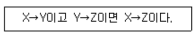
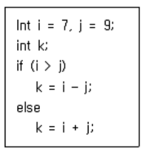

## 1과목: 소프트웨어 설계

### 01

**요구사항 분석 시에 필요한 기술로 가장 거리가 먼 것은?**

- [ ] ① 청취와 인터뷰 질문 기술 
- [ ] ② 분석과 중재기술  
- [ ] ❸ 설계 및 코딩 기술 
- [ ] ④ 관찰 및 모델 작성 기술

---

### 02

**다음 내용이 설명하는 디자인 패턴은?**

{: .notice}

\- 객체를 생성하기 위한 인터페이스를 정의하여 어떤 클래스가 인스턴스화 될 것인지는 서브클래스가 결정하도록 하는 것 - Virtual-Constructor 패턴이라고도 함

- [ ] ① Visitor패턴 
- [ ] ② Observer패턴  
- [ ] ❸ Factory Method 패턴 
- [ ] ④ Bridge 패턴

---

### 03

**럼바우 객체 지향 분석과 거리가 먼 것은?**

- [ ] ① 기능 모델링 
- [ ] ② 동적 모델링  
- [ ] ③ 객체 모델링 
- [ ] ❹ 정적 모델링

----

### 04

**애자일 기법에 대한 설명으로 맞지 않은 것은?**

- [ ] ① 절차와 도구보다 개인과 소통을 중요하게 생각한다.   
- [ ] ❷ 계획에 중점을 두어 변경 대응이 난해하다.   
- [ ] ③ 소프트웨어가 잘 실행되는데 가치를 둔다.   
- [ ] ④ 고객과의 피드백을 중요하게 생각한다. 

---

### 05

**미들웨어 솔루션의 유형에 포함되지 않는 것은?**

- [ ] ① WAS 
- [ ] ❷ Web Server   
- [ ] ③ RPC 
- [ ] ④ ORB

---

### 06

**UML에서 시퀀스 다이어그램의 구성 항목에 해당하지 않는 것은?**

- [ ] ① 생명선 
- [ ] ② 실행  
- [ ] ❸ 확장 
- [ ] ④ 메시지

---

### 07

**객체지향에서 정보 은닉과 가장 밀접한 관계가 있는 것은?**

- [ ]  ❶ Encapsulation 
- [ ] ② Class  
- [ ] ③ Method 
- [ ] ④ Instance

---

### 08

**디자인 패턴 중에서 행위적 패턴에 속하지 않는 것은?**

- [ ] ① 커맨드 (Command) 패턴  
- [ ] ② 옵저버 (Observer) 패턴  
- [ ] ❸ 프로토타입 (Prototype) 패턴 
- [ ] ④ 상태 (State) 패턴

---

### 09

**UI 설계 원칙 중 누구나 쉽게 이해하고 사용할 수 있어야 한 다는 원칙은?**

- [ ] ① 희소성 
- [ ] ② 유연성  
- [ ] ❸ 직관성 
- [ ] ④ 멀티운용성

---

### 10

**코드의 기본 기능으로 거리가 먼 것은?**

- [ ] ❶ 복잡성 
- [ ] ② 표준화   
- [ ] ③ 분류 
- [ ] ④ 식별

---

### 11

**다음 ( ) 안에 들어갈 내용으로 옳은 것은?**

{: .notice}

컴포넌트 설계 시 "( )에 의한 설계"를 따를 경우, 해당 명세에서는 (1) 컴포넌트의 오퍼레이션 사용 전에 참이 되어야 할 선행 조건 (2) 사용 후 만족되어야 할 결과 조건 (3) 오퍼레이션이 실행되는 동안 항상 만족되어야 할 불변조건 등이 포함되어야 한다.

- [ ] ❶ 협약(Contract) 
- [ ] ② 프로토콜(Protocol)   
- [ ] ③ 패턴(Pattern) 
- [ ] ④ 관계(Relation)

---

### 12

**UML에서 활용되는 다이어그램 중, 시스템의 동작을 표현하는 행위(Behavioral) 다이어그램에 해당하지 않는 것은?**

- [ ] ① 유스케이스 다이어그램(Use Case Diagram)   
- [ ] ② 시퀀스 다이어그램(Sequence Diagram)   
- [ ] ③ 활동 다이어그램(Activity Diagram)   
- [ ] ❹ 배치 다이어그램(Deployment Diagram)

---

### 13

**객체 지향 소프트웨어 공학에서 하나 이상의 유사한 객체들을 묶어서 하나의 공통된 특성을 표현한 것은?**

- [ ] ① 트랜지션 
- [ ] ❷ 클래스   
- [ ] ③ 시퀀스 
- [ ] ④ 서브루틴

---

### 14

**아래의 UML 모델에서 '차' 클래스와 각 클래스의 관계로 옳은 것은?**

- [ ] ① 추상화 관계 
- [ ] ② 의존 관계   
- [ ] ❸ 일반화 관계 
- [ ] ④ 그룹 관계

---

### 15

**객체지향 소프트웨어 설계시 디자인 패턴을 구성하는 요소로서 가장 거리가 먼 것은?**

- [ ]  ❶ 개발자이름 
- [ ] ② 문제 및 배경   
- [ ] ③ 사례 
- [ ] ④ 샘플코드

---

### 16

**자료 사전에서 자료의 반복을 의미하는 것은?**

- [ ] ① = 
- [ ] ② ( )   
- [ ] ❸ { } 
- [ ] ④ [ ]

---

### 17

**객체지향 설계 원칙 중, 서브타입(상속받은 하위 클래스)은 어디에서나 자신의 기반타입(상위클래스)으로 교체할 수 있어야 함을 의미하는 원칙은?**

- [ ] ① ISP(Interface Segregation Principle)   
- [ ] ② DIP(Dependency Inversion Principle)   
- [ ] ❸ LSP(Liskov Substitution Principle)   
- [ ] ④ SRP(Single Responsibility Principle)

---

### 18

**자료흐름도(Data Flow Diagram)의 구성요소로 옳은 것은?**

- [ ] ① process, data flow, data store, comment   
- [ ] ❷ process, data flow, data store, terminator   
- [ ] ③ data flow, data store, terminator, data dictionary   
- [ ] ④ process, data store, terminator, mini-spec

---

### 19

**CASE(Computer-Aided Software Engineering)도구에 대한 설명으로 거리가 먼 것은?**

- [ ]  ① 소프트웨어 개발 과정의 일부 또는 전체를 자동화하기 위한 도구이다.   
- [ ] ② 표준화된 개발 환경 구축 및 문서 자동화 기능을 제공한 다.   
- [ ] ③ 작업 과정 및 데이터 공유를 통해 작업자간 커뮤니케이 션을 증대한다.   
- [ ] ❹ 2000년대 이후 소개되었으며, 객체지향 시스템에 한해 효과적으로 활용된다.

---

### 20

**인터페이스 요구 사항 검토 방법에 대한 설명이 옳은 것은?**

- [ ]  ① 리팩토링 : 작성자 이외의 전문 검토 그룹이 요구사항 명세서를 상세히 조사하여 결함, 표준 위배, 문제점 등을 파악   
- [ ] ❷ 동료검토 : 요구 사항 명세서 작성자가 요구 사항 명세 서를 설명하고 이해관계자들이 설명을 들으면서 결함을 발견   
- [ ] ③ 인스펙션 : 자동화된 요구 사항 관리 도구를 이용하여 요구 사항 추적성과 일관성을 검토   
- [ ] ④ CASE 도구 : 검토 자료를 회의 전에 배포해서 사전 검 토한 후 짧은 시간 동안 검토 회의를 진행하면서 결함을 발견

---

## 2과목: 소프트웨어 개발

### 21

**인터페이스 보안을 위해 네트워크 영역에 적용될 수 있는 솔루션과 거리가 먼 것은?**

- [ ] ① IPSec 
- [ ] ② SSL   
- [ ] ❸ SMTP 
- [ ] ④ S-HTTP

----

### 22

**소프트웨어 공학의 기본 원칙이라고 볼 수 없는 것은?**

- [ ] ① 품질 높은 소프트웨어 상품 개발   
- [ ] ② 지속적인 검증 시행   
- [ ] ③ 결과에 대한 명확한 기록 유지   
- [ ] ❹ 최대한 많은 인력 투입

----

### 23

**패키지 소프트웨어의 일반적인 제품 품질 요구사항 및 테스 트를 위한 국제 표준은?**

- [ ] ① ISO/IEC 2196 
- [ ] ② IEEE 19554   
- [ ] ❸ ISO/IEC 12119 
- [ ] ④ ISO/IEC 14959

---

### 24

**다음 중 클린 코드 작성원칙으로 거리가 먼 것은?**

- [ ] ① 누구든지 쉽게 이해하는 코드 작성   
- [ ] ❷ 중복이 최대화된 코드 작성   
- [ ] ③ 다른 모듈에 미치는 영향 최소화   
- [ ] ④ 단순, 명료한 코드 작성

---

### 25

**블랙박스 테스트의 유형으로 틀린 것은?**

- [ ] ① 경계값 분석 
- [ ] ② 오류 예측   
- [ ] ③ 동등 분할 기법 
- [ ] ❹ 조건, 루프 검사

----

### 26

**제어흐름 그래프가 다음과 같을 때 McCabe의 cyclomatic 수는 얼마인가?**

- [ ] ① 3 
- [ ] ❷ 4   
- [ ] ③ 5 
- [ ] ④ 6

---

### 27

**다음 자료에 대하여 선택(Selection) 정렬을 이용하여 오름차순으로 정렬하고자 한다. 3회전 후의 결과로 옳은 것은?**

`37, 14, 17, 40, 35`

- [ ] ① 14, 17, 37, 40, 35 
- [ ] ② 14, 37, 17, 40, 35  
- [ ] ③ 17, 14, 37, 35, 40 
- [ ] ❹ 14, 17, 35, 40, 37

---

### 28

**형상 관리 도구의 주요 기능으로 거리가 먼 것은?**

- [ ] ❶ 정규화(Normalization) 
- [ ] ② 체크인(Check-in)   
- [ ] ③ 체크아웃(Check-out) 
- [ ] ④ 커밋(commit)

---

### 29

**다음 트리를 Preorder 운행법으로 운행할 경우 가장 먼저 탐색되는 것은?**

- [ ]  ❶ A 
- [ ] ② B   
- [ ] ③ D 
- [ ] ④ G

---

### 30

**소프트웨어 품질 목표 중 주어진 시간동안 주어진 기능을 오류없이 수행하는 정도를 나타내는 것은?**

- [ ] ① 직관성 
- [ ] ② 사용 용이성   
- [ ] ❸ 신뢰성 
- [ ] ④ 이식성

---

### 31

**알고리즘 설계 기법으로 거리가 먼 것은?**

- [ ] ① Divide and Conquer 
- [ ] ② Greedy   
- [ ] ❸ Static Block 
- [ ] ④ Backtracking

---

### 32

**제품 소프트웨어의 형상 관리 역할로 틀린 것은?**

- [ ] ① 형상 관리를 통해 이전 리버전이나 버전에 대한 정보에 접근 가능하여 배포본 관리에 유용   
- [ ] ② 불필요한 사용자의 소스 수정 제한   
- [ ] ❸ 프로젝트 개발비용을 효율적으로 관리 
- [ ] ④ 동일한 프로젝트에 대해 여러 개발자 동시 개발 가능

---

### 33

**제품 소프트웨어 패키징 도구 활용 시 고려사항이 아닌 것 은?**

- [ ] ① 제품 소프트웨어의 종류에 적합한 암호화 알고리즘을 고 려한다.   
- [ ] ② 추가로 다양한 이기종 연동을 고려한다.   
- [ ] ③ 사용자 편의성을 위한 복잡성 및 비효율성 문제를 고려 한다.   
- [ ] ❹ 내부 콘텐츠에 대한 보안은 고려하지 않는다.

---

### 34

**디지털 저작권 관리(DRM) 기술과 거리가 먼 것은?**

- [ ] ① 콘텐츠 암호화 및 키 관리  
- [ ] ② 콘텐츠 식별체계 표현   
- [ ] ❸ 콘텐츠 오류 감지 및 복구  
- [ ] ④ 라이센스 발급 및 관리

---

### 35

**물리데이터 저장소의 파티션 설계에서 파티션 유형으로 옳 지 않은 것은?**

- [ ] ① 범위분할(Range Partitioning)   
- [ ] ② 해시분할(Hash Partitioning)   
- [ ] ③ 조합분할(Composite Partitioning)   
- [ ] ❹ 유닛분할(Unit Partitioning)

---

### 36

**다음이 설명하는 애플리케이션 통합 테스트 유형은?**

{: .notice}

\- 깊이 우선 방식 또는 너비 우선 방식이 있다. - 상위 컴포넌트를 테스트 하고 점층적으로 하위 컴포넌트를 테스트 한다. - 하위 컴포넌트 개발이 완료되지 않은 경우 스텁(Stub)을 사용하기도 한다.

---

### 37

**인터페이스 구현시 사용하는 기술 중 다음 내용이 설명하는 것은?**

`JavaScript를 사용한 비동기 통신기술로 클라이언트와 서버간에 XML데이터를 주고 받는 기술`

- [ ] ① Procedure 
- [ ] ② Trigger   
- [ ] ③ Greedy 
- [ ] ❹ AJAX

---

### 38

**소프트웨어 재공학이 소프트웨어의 재개발에 비해 갖는 장점으로 거리가 먼 것은?**

- [ ] ① 위험부담 감소   
- [ ] ② 비용 절감   
- [ ] ③ 시스템 명세의 오류억제   
- [ ] ❹ 개발시간의 증가

---

### 39

**알파, 베타 테스트와 가장 밀접한 연관이 있는 테스트 단계 는?**

- [ ] ① 단위 테스트 
- [ ] ❷ 인수 테스트   
- [ ] ③ 통합 테스트 
- [ ] ④ 시스템 테스트

---

### 40

**다음 트리의 차수(degree)는?**

- [ ] ① 2 
- [ ] ❷ 3   
- [ ] ③ 4 
- [ ] ④ 5

---

### 3과목: 데이터베이스 구축

### 41

**릴레이션 R의 모든 결정자(determinant)가 후보키이면 그 릴레이션 R은 어떤 정규형에 속하는가?**

- [ ] ① 제 1 정규형 
- [ ] ② 제 2 정규형   
- [ ] ❸ 보이스/코드 정규형 
- [ ] ④ 제 4 정규형

---

### 42

**다음 관계형 데이터 모델에 대한 설명으로 옳은 것은?**

| 고객ID | 고객이름 | 거주도시 |
| ------ | -------- | -------- |
| S1     | 홍길동   | 서울     |
| S2     | 이정재   | 인천     |
| S3     | 신보라   | 인천     |
| S4     | 김흥국   | 서울     |
| S5     | 도요새   | 용인     |

- [ ] ① relation 3개, attribute 3개, tuple 5개   
- [ ] ② relation 3개, attribute 5개, tuple 3개   
- [ ] ③ relation 1개, attribute 5개, tuple 3개   
- [ ] ❹ relation 1개, attribute 3개, tuple 5개

---

### 43

**Commit과 Rollback 명령어에 의해 보장 받는 트랜잭션의 특성은?**

- [ ] ① 병행성 
- [ ] ② 보안성   
- [ ] ❸ 원자성 
- [ ] ④ 로그

---

### 44

**관계 데이터베이스인 테이블 R1에 대한 아래 SQL 문의 실행결과로 옳은 것은?**

- [ ] 
- [ ] 
- [ ] 
- [ ] 

---

### 45

**DCL(Data Control Language) 명령어가 아닌 것은?**

- [ ] ① COMMIT 
- [ ] ② ROLLBACK   
- [ ] ③ GRANT 
- [ ] ❹ SELECT

---

### 46

**병행제어 기법 중 로킹에 대한 설명으로 옳지 않은 것은?**

- [ ] ① 로킹의 대상이 되는 객체의 크기를 로킹 단위라고 한다.   
- [ ] ② 데이터베이스, 파일, 레코드 등은 로킹 단위가 될 수 있 다.   
- [ ] ③ 로킹의 단위가 작아지면 로킹 오버헤드가 증가한다.   
- [ ] ❹ 로킹의 단위가 커지면 데이터베이스 공유도가 증가한다

---

### 47

**관계 데이터모델의 무결성 제약 중 기본키 값의 속성 값이 널(Null)값이 아닌 원자 값을 갖는 성질은?**

- [ ] ❶ 개체 무결성 
- [ ] ② 참조 무결성   
- [ ] ③ 도메인 무결성 
- [ ] ④ 튜플의 유일성

---

### 48

**뷰(View)의 장점이 아닌 것은?**

- [ ] ❶ 뷰 자체로 인덱스를 가짐 
- [ ] ② 데이터 보안 용이   
- [ ] ③ 논리적 독립성 제공   
- [ ] ④ 사용자 데이터 관리 용이

----

### 49

**분산 데이터베이스의 투명성(Transparency)에 해당 하지 않는 것은?**

- [ ] ① Location Transparency 
- [ ] ② Replication Transparency   
- [ ] ③ Failure Transparency 
- [ ] ❹ Media Access Transparency

----

### 50

**정규화의 목적으로 옳지 않은 것은?**

- [ ] ① 어떠한 릴레이션이라도 데이터베이스 내에서 표현 가능하게 만든다.   
- [ ] ② 데이터 삽입시 릴레이션을 재구성할 필요성을 줄인다.   
- [ ] ❸ 중복을 배제하여 삽입, 삭제, 갱신 이상의 발생을 야기한다.   
- [ ] ④ 효과적인 검색 알고리즘을 생성할 수 있다.

---

### 51

**다음에 해당하는 함수 종속의 추론 규칙은?**

- [ ] ① 분해 규칙 
- [ ] ❷ 이행 규칙   
- [ ] ③ 반사 규칙 
- [ ] ④ 결합 규칙

---

### 52

**다음 R과 S 두 릴레이션에 대한 Division 연산의 수행 결과는?**

- [ ] 
- [ ] 
- [ ] 
- [ ] 

---

### 53

**player 테이블에는 player_name, team_id, height 컬럼이 존재한다. 아래 SQL문에서 문법적 오류가 있는 부분은?**

- [ ] ① (1) 
- [ ] ② (2)   
- [ ] ③ (3) 
- [ ] ❹ (4)

---

### 54

**데이터베이스 로그(log)를 필요로 하는 회복 기법은?**

- [ ] ❶ 즉각 갱신 기법 
- [ ] ② 대수적 코딩 방법   
- [ ] ③ 타임 스탬프 기법 
- [ ] ④ 폴딩 기법

---

### 55

**DML(Data Manipulation Language) 명령어가 아닌 것은?**

- [ ] ① INSERT 
- [ ] ② UPDATE   
- [ ] ❸ ALTER 
- [ ] ④ DELETE

---

### 56

**다음과 같이 위쪽 릴레이션을 아래쪽 릴레이션으로 정규화 를 하였을 때 어떤 정규화 작업을 한 것인가?**

- [ ] ❶ 제1정규형 
- [ ] ② 제2정규형   
- [ ] ③ 제3정규형 
- [ ] ④ 제4정규형

---

### 57

**관계대수의 순수관계 연산자가 아닌 것은?**

- [ ] ① Select 
- [ ] ❷ Cartesian Product   
- [ ] ③ Division 
- [ ] ④ Project

---

### 58

**다음 중 SQL의 집계 함수(aggregation function)가 아닌 것 은?**

- [ ] ① AVG 
- [ ] ② COUNT   
- [ ] ③ SUM 
- [ ] ❹ CREATE

---

### 59

**릴레이션 조작 시 데이터들이 불필요하게 중복되어 예기치 않게 발생하는 곤란한 현상을 의미하는 것은?**

- [ ] ① normalization 
- [ ] ② rollback   
- [ ] ③ cardinality 
- [ ] ❹ anomaly

---

### 60

**릴레이션에 대한 설명으로 거리가 먼 것은?**

- [ ] ① 튜플들의 삽입, 삭제 등의 작업으로 인해 릴레이션은 시 간에 따라 변한다.   
- [ ] ② 한 릴레이션에 포함된 튜플들은 모두 상이하다.   
- [ ] ③ 애트리뷰트는 논리적으로 쪼갤 수 없는 원자값으로 저장 한다.   
- [ ] ❹ 한 릴레이션에 포함된 튜플 사이에는 순서가 있다

---

## 4과목: 프로그래밍 언어 활용

### 61

**다음 자바 프로그램 조건문에 대해 삼항 조건 연산자를 사 용하여 옳게 나타낸 것은?**

- [ ] ❶ int i = 7, j = 9;  int k;  k = (i＞j)?(i – j):(i + j);   
- [ ] ② int i = 7, j = 9;  int k;  k = (i＜j)?(i – j):(i + j);   
- [ ] ③ int i = 7, j = 9;  int k;  k = (i＞j)?(i + j):(i - j);   
- [ ] ④ int i = 7, j = 9;  int k;  k = (i＜j)?(i + j):(i - j);

---

### 62

**다음 내용이 설명하는 소프트웨어 취약점은?**

- [ ] ① FTP 바운스 공격 
- [ ] ② SQL 삽입   
- [ ] ❸ 버퍼 오버플로 
- [ ] ④ 디렉토리 접근 공격

---

### 63

**다음 중 bash 쉘 스크립트에서 사용할 수 있는 제어문이 아닌 것은?**

- [ ]  ① if 
- [ ] ② for   
- [ ] ❸ repeat_do 
- [ ] ④ while

----

### 64

**IPv6에 대한 설명으로 틀린 것은?**

- [ ] ❶ 32비트의 주소체계를 사용한다.   
- [ ] ② 멀티미디어의 실시간 처리가 가능하다.   
- [ ] ③ IPv4보다 보안성이 강화되었다.   
- [ ] ④ 자동으로 네트워크 환경구성이 가능하다.

---

### 65

**효과적인 모듈 설계를 위한 유의사항으로 거리가 먼 것은?**

- [ ] ① 모듈간의 결합도를 약하게 하면 모듈 독립성이 향상된다.   
- [ ] ② 복잡도와 중복성을 줄이고 일관성을 유지시킨다.   
- [ ] ❸ 모듈의 기능은 예측이 가능해야 하며 지나치게 제한적 이여야 한다.   
- [ ] ④ 유지보수가 용이해야 한다.

---

### 66

**HRN 방식으로 스케줄링 할 경우, 입력된 작업이 다음과 같을 때 처리되는 작업 순서로 옳은 것은?**

- [ ] ① A→B→C→D 
- [ ] ② A→C→B→D   
- [ ] ❸ D→B→C→A 
- [ ] ④ D→A→B→C

----

### 67

**운영체제에 대한 설명으로 거리가 먼 것은?**

- [ ] ① 다중 사용자와 다중 응용프로그램 환경하에서 자원의 현 재 상태를 파악하고 자원 분배를 위한 스케줄링을 담당 한다.   
- [ ] ② CPU, 메모리 공간, 기억 장치, 입출력 장치 등의 자원을 관리한다.   
- [ ] ❸ 운영체제의 종류로는 매크로 프로세서, 어셈블러, 컴파일 러 등이 있다.   
- [ ] ④ 입출력 장치와 사용자 프로그램을 제어한다. 

---

### 68

**배치 프로그램의 필수 요소에 대한 설명으로 틀린 것은?**

- [ ] ① 자동화는 심각한 오류 상황 외에는 사용자의 개입 없이 동작해야 한다.   
- [ ] ② 안정성은 어떤 문제가 생겼는지, 언제 발생했는지 등을 추적할 수 있어야 한다.   
- [ ] ③ 대용량 데이터는 대용량의 데이터를 처리할 수 있어야 한다.   
- [ ] ❹ 무결성은 주어진 시간 내에 처리를 완료할 수 있어야 하 고, 동시에 동작하고 있는 다른 애플리케이션을 방해하 지 말아야 한다.

----

### 69

**TCP 프로토콜에 대한 설명으로 거리가 먼 것은?**

- [ ] ① 신뢰성이 있는 연결 지향형 전달 서비스이다.   
- [ ] ❷ 기본 헤더 크기는 100byte이고 160byte까지 확장 가능 하다.   
- [ ] ③ 스트림 전송 기능을 제공한다.   
- [ ] ④ 순서제어, 오류제어, 흐름제어 기능을 제공한다.

----

### 70

**다음이 설명하는 응집도의 유형은?**

- [ ] ① 기능적 응집도 
- [ ] ② 우연적 응집도   
- [ ] ③ 논리적 응집도 
- [ ] ❹ 절차적 응집도

----

### 71

**OSI-7Layer에서 링크의 설정과 유지 및 종료를 담당하며, 노드간의 오류제어와 흐름제어 기능을 수행하는 계층은?**

- [ ] ❶ 데이터링크 계층 
- [ ] ② 물리 계층   
- [ ] ③ 세션 계층 
- [ ] ④ 응용 계층

----

### 72

**다음 중 가장 결합도가 강한 것은?**

- [ ] ① data coupling 
- [ ] ② stamp coupling   
- [ ] ❸ common coupling 
- [ ] ④ control coupling

---

### 73

**메모리 관리 기법 중 Worst fit 방법을 사용할 경우 10K 크기의 프로그램 실행을 위해서는 어느 부분에 할당되는가?**

- [ ] ① NO.2 
- [ ] ② NO.3   
- [ ] ③ NO.4 
- [ ] ❹ NO.5

---

### 74

**200.1.1.0/24 네트워크를 FLSM 방식을 이용하여 10개의 Subnet으로 나누고 ip subnet-zero를 적용했다. 이때 서브네팅된 네트워크 중 10번째 네트워크의 broadcast IP주소는?**

- [ ] ❶ 200.1.1.159 
- [ ] ② 201.1.5.175   
- [ ] ③ 202.1.11.254 
- [ ] ④ 203.1.255.245

---

### 75

**다음은 사용자로부터 입력받은 문자열에서 처음과 끝의 3글자를 추출한 후 합쳐서 출력하는 파이썬 코드에서 ㉠에 들어갈 내용은?**

- [ ] ① string[1:3] + string[-3:] 
- [ ] ② string[:3] + string[-3:-1]   
- [ ] ❸ string[0:3] + string[-3:] 
- [ ] ④ string[0:] + string[:-1]

---

### 76

**파이썬의 변수 작성 규칙 설명으로 옳지 않은 것은?**

- [ ] ① 첫 자리에 숫자를 사용할 수 없다.   
- [ ] ② 영문 대문자/소문자, 숫자, 밑줄(_)의 사용이 가능하다.   
- [ ] ❸ 변수 이름의 중간에 공백을 사용할 수 있다.   
- [ ] ④ 이미 사용되고 있는 예약어는 사용할 수 없다.

---

### 77

**어떤 모듈이 다른 모듈의 내부 논리 조직을 제어하기 위한 목적으로 제어신호를 이용하여 통신하는 경우이며, 하위 모듈에서 상위 모듈로 제어신호가 이동하여 상위 모듈에게 처리 명령을 부여하는 권리 전도현상이 발생하게 되는 결합도는?**

- [ ] ① data coupling 
- [ ] ② stamp coupling   
- [ ] ❸ control coupling 
- [ ] ④ common coupling

---

### 78

**다음 C 프로그램의 결과 값은?**

- [ ] ① 15 
- [ ] ② 19   
- [ ] ❸ 25 
- [ ] ④ 27

---

### 79

**UNIX에서 새로운 프로세스를 생성하는 명령어는?**

- [ ] ① ls 
- [ ] ② cat   
- [ ] ❸ fork 
- [ ] ④ chmod

---

### 80

**C언어에서 정수 자료형으로 옳은 것은?**

- [ ] ❶ int 
- [ ] ② float   
- [ ] ③ char 
- [ ] ④ double

---

### 5과목: 정보시스템 구축관리

### 81

**물리적인 사물과 컴퓨터에 동일하게 표현되는 가상의 모델 로 실제 물리적인 자산 대신 소프트웨어로 가상화함으로써 실제 자산의 특성에 대한 정확한 정보를 얻을 수 있고, 자 산 최적화, 돌발사고 최소화, 생산성 증가 등 설계부터 제 조, 서비스에 이르는 모든 과정의 효율성을 향상시킬 수 있 는 모델은?**

- [ ] ① 최적화 
- [ ] ② 실행 시간   
- [ ] ❸ 디지털 트윈 
- [ ] ④ N-Screen

----

### 82

**정보보안의 3대 요소에 해당하지 않는 것은?**

- [ ] ① 기밀성 
- [ ] ❷ 휘발성   
- [ ] ③ 무결성 
- [ ] ④ 가용성

---

### 83

**다음 빈칸에 알맞은 기술은**

- [ ] ① Quantum Key Distribution 
- [ ] ② Digital Rights Management   
- [ ] ③ Grayware 
- [ ] ❹ Mashup

---

### 84

**기능점수(Functional Point)모형에서 비용산정에 이용되는 요소가 아닌 것은?**

- [ ] ❶ 클래스 인터페이스 
- [ ] ② 명령어(사용자 질의수)   
- [ ] ③ 데이터파일 
- [ ] ④ 출력보고서

---

### 85

**블록 암호화 방식이 아닌 것은?**

- [ ] ① DES 
- [ ] ❷ RC4   
- [ ] ③ AES 
- [ ] ④ SEED

---

### 86

**Putnam 모형을 기초로 해서 만든 자동화 추정 도구는?**

- [ ] ① SQLR/30 
- [ ] ❷ SLIM   
- [ ] ③ MESH 
- [ ] ④ NFV

---

### 87

**큰 숫자를 소인수 분해하기 어렵다는 기반 하에 1978년 MIT에 의해 제안된 공개키 암호화 알고리즘은?**

- [ ] ① DES 
- [ ] ② ARIA   
- [ ] ③ SEED 
- [ ] ❹ RSA

---

### 88

**COCOMO 모델의 프로젝트 유형으로 거리가 먼 것은?**

- [ ] ① Organic 
- [ ] ② Semi-detached   
- [ ] ③ Embedded 
- [ ] ❹ Sequential

---

### 89

**빅데이터 분석 기술 중 대량의 데이터를 분석하여 데이터 속에 내재되어 있는 변수 사이의 상호관례를 규명하여 일정한 패턴을 찾아내는 기법은?**

- [ ] ❶ Data Mining 
- [ ] ② Wm-Bus   
- [ ] ③ Digital Twin 
- [ ] ④ Zigbee

---

### 90

**기존 무선 랜의 한계 극복을 위해 등장하였으며, 대규모 디바이스의 네트워크 생성에 최적화되어 차세대 이동통신, 홈네트워킹, 공공 안전 등의 특수목적을 위한 새로운 방식의 네트워크 기술을 의미하는 것은?**

- [ ] ① Software Defined Perimeter 
- [ ] ② Virtual Private Network   
- [ ] ③ Local Area Network 
- [ ] ❹ Mesh Network

---

### 91

**DDoS 공격과 연관이 있는 공격 방법은?**

- [ ] ① Secure shell 
- [ ] ❷ Tribe Flood Network   
- [ ] ③ Nimda 
- [ ] ④ Deadlock

---

### 92

**CPM 네트워크가 다음과 같을 때 임계경로의 소요기일은?**

- [ ] ① 10일 
- [ ] ② 12일   
- [ ] ❸ 14일 
- [ ] ④ 16일

---

### 93

**RIP(Routing Information Protocol)에 대한 설명으로 틀린 것은?**

- [ ] ① 거리 벡터 라우팅 프로토콜이라고도 한다.   
- [ ] ② 소규모 네트워크 환경에 적합하다.   
- [ ] ❸ 최대 홉 카운트를 115홉 이하로 한정하고 있다.   
- [ ] ④ 최단경로탐색에는 Bellman-Ford 알고리즘을 사용한다.

---

### 94

**소프트웨어 생명주기 모형 중 고전적 생명주기 모형으로 선형 순차적 모델이라고도 하며, 타당성 검토, 계획, 요구사항 분석, 구현, 테스트, 유지보수의 단계를 통해 소프트웨어를 개발하는 모형은?**

- [ ] ❶ 폭포수 모형 
- [ ] ② 애자일 모형   
- [ ] ③ 컴포넌트 기반 방법론 
- [ ] ④ 6GT 모형

---

### 95

**소프트웨어 개발 모델 중 나선형 모델의 4가지 주요 활동이 순서대로 나열된 것은?**

- [ ] ① Ⓐ-Ⓑ-Ⓓ-Ⓒ 순으로 반복   
- [ ] ❷ Ⓐ-Ⓓ-Ⓒ-Ⓑ 순으로 반복   
- [ ] ③ Ⓐ-Ⓑ-Ⓒ-Ⓓ 순으로 반복   
- [ ] ④ Ⓐ-Ⓒ-Ⓑ-Ⓓ 순으로 반복

---

### 96

**전자 칩과 같은 소프트웨어 부품, 즉 블록(모듈)을 만들어서 끼워 맞추는 방법으로 소프트웨어를 완성시키는 재사용 방 법은?**

- [ ] ❶ 합성 중심 
- [ ] ② 생성 중심   
- [ ] ③ 분리 중심 
- [ ] ④ 구조 중심

---

### 97

**다음 JAVA코드에서 밑줄로 표시된 부분에는 어떤 보안 약 점이 존재하는가? (단, key는 암호화 키를 저장하는 변수이 다.)**

- [ ] ① 무결성 검사 없는 코드 다운로드   
- [ ] ② 중요 자원에 대한 잘못된 권한 설정   
- [ ] ❸ 하드코드된 암호화 키 사용   
- [ ] ④ 적절한 인증없는 중요 기능 허용

---

### 98

**소프트웨어 개발 표준 중 소프트웨어 품질 및 생산성 향상 을 위해 소프트웨어 프로세스를 평가 및 개선하는 국제 표 준은?**

- [ ] ① SCRUM 
- [ ] ② ISO/IEC 12509   
- [ ] ❸ SPICE 
- [ ] ④ CASE

---

### 99

**실무적으로 검증된 개발보안 방법론 중 하나로써 SW보안의 모범 사례를 SDLC(Software Development Life Cycle)에 통합한 소프트웨어 개발 보안 생명주기 방법론은?**

- [ ] ① CLASP 
- [ ] ② CWE   
- [ ] ③ PIMS 
- [ ] ❹ Seven Touchpoints

---

### 100

**다음 LAN의 네트워크 토폴로지는?**

- [ ] ❶ 버스형 
- [ ] ② 성형   
- [ ] ③ 링형 
- [ ] ④ 그물형